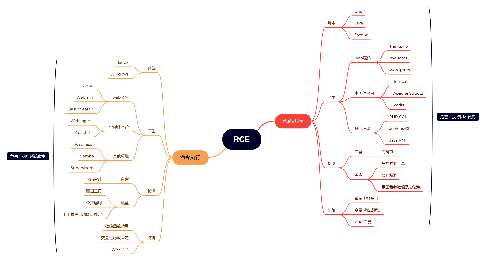

# RCE 代码及命令执行漏洞



## 代码执行RCE漏洞

接收的变量，被当作代码进行执行。

## 命令执行RCE漏洞

接收的变量被当作系统命令执行

## 漏洞形成的条件

1. 可控变量
2. 漏洞函数

## 相应漏洞分析实战

### PHP代码分析

```php
echo `xxx`; // 在php中xxx被当作命令来执行。
```


### 命令注入执行分析

这个题目也可以在浏览器中禁用JavaScript，完成。


### Webmin未经身份验证的远程代码执行

进入下方的`url`地址中`/password_change.cgi`使用POST方式进行提交，其中user是不存在的用户名，在old处可以进行命令的执行


## POC与EXP的区别

`poc`是验证，`exp`是利用