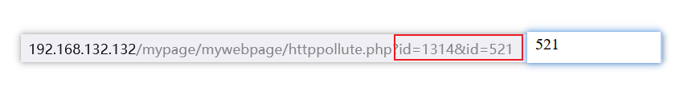

# HTTP污染

HTTP参数污染（HTTP Parameter Pollution）简称HPP，由于HTTP协议允许同名参数的存在，同时后台处理机制对同名参数处理方式不当，造成参数污染。



接受的是第二个参数。

```http
GET /mypage/mywebpage/httppollute.php?id=1&id=2 HTTP/1.1
Host: 192.168.132.132
User-Agent: Mozilla/5.0 (Windows NT 10.0; Win64; x64; rv:106.0) Gecko/20100101 Firefox/106.0
Accept: text/html,application/xhtml+xml,application/xml;q=0.9,image/avif,image/webp,*/*;q=0.8
Accept-Language: zh-CN,zh;q=0.8,zh-TW;q=0.7,zh-HK;q=0.5,en-US;q=0.3,en;q=0.2
Accept-Encoding: gzip, deflate
Connection: close
Upgrade-Insecure-Requests: 1
```

由上面获取到了HTTP数据包，我们可以看到HPP发生在查询参数中，由于每一个参数都是使用`&`隔开的，所以我们传递参数的时候就传递了两个`id`值，这时候CGI就会选择性的接受相应的参数，具体看一下列表。

## 参数列表

|     Web环境      |        参数获取函数         |        获取到的参数         |
| :--------------: | :-------------------------: | :-------------------------: |
|    PHP/Apache    |        $_GET["par"]         |            last             |
|    JSP/Tomcat    | request.getParameter("par") |            first            |
| Perl(CGI)/Apache |        Param(""par)         |            first            |
|  Python/Apache   |       getvalue("par")       |          ALL(List)          |
|   ASP.NET/IIS    | request.QueryString("par")  | ALL(comma-delimited string) |

还有许多，剩下的去网上查看。

### 修复

1. 对用户输入数据的参数的格式进行验证。
2. 在WAF或其他网关设备（比如IPS）在检查URL时，对同一个参数被多次赋值的情况进行特殊处理
3. 在代码层面，编写WEB程序时，要通过合理的`$_GET`方法获取URL中的参数值，而尝试获取web服务器返回给程序的其他值时要慎重处理。