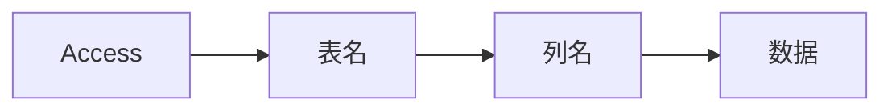
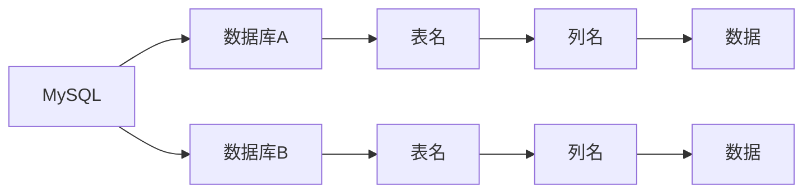

# 其他数据库注入

数据库的种类有很多：

Access，MsSQL，MongoDB，PostGreSql，SQLLite，Oracle，SyBase，等等。

每个数据库的功能不一样，要根据相应数据库的功能进行注入。

常见的数据库中，只有Access数据库与其他的不一样，剩下的都一样。

每个数据库有部分的功能是一样的，也有一些是不一样的，要根据情况进行判断。

数据库的注入特点：

数据库架构组成，数据库高权限操作。

常见的数据库注入工具：SqlMap，NoSQLAttack，Pangolin等

## Access数据库

Access一般与ASP结合，Access数据库创建的文件是.mdb文件，一般存放在网站的根目录下面，没有所谓的数据库这个概念，进而Access不存在所谓的跨库注入。但是其他的数据库，例如：MySQL数据库等则存在跨库注入

Access中没有相应文件的读写等等。导致攻击方式不同。Access中的功能不一样。比较单一。

Access数据库结构



其他数据库结构，以MySQL为例



Access数据库与其他的数据库是不一样的。因为他没有数据库的名字。

Access中没有information_schema这个数据库，所以直接order by猜列数，然后获取相应的数据即可。

```sql
www.myblog.com/news.asp?id = 1 order by 4 
www.myblog.com/news.asp?id = 1 union select 1,username,3,password,4 from admin
```

这样的话，就有一个问题你是怎么知道数据库的列名，还有相应的数据表名的，这里是直接猜出来的，但是不能一直猜啊，所以我们就有一个更好的办法。

### 偏移注入

Access使用偏移注入：解决列名获取不到的情况

解决表名或者列名获取不到的情况：查看登录框源代码的表单值或观察URL特征等也可以针对表或列获取获取不到的情况。

```sql
www.mypage.com/mytest.asp?id=1 order by 4 # 1. 偏移注入
www.mypage.com/mytest.asp?id=1 union select 1,2,3,4 from admin # 这是第二步，剩下的去网上查吧
```

## MSSQL数据库

不同的注入，有高权限与低权限之分。（注入思路）获取不同的权限，权限决定了你的功能是否能够被执行。

权限的高低决定了，你执行的功能。

MSSQL数据库获取到高权限之后可以有那些操作：

###### 获取信息

Version（数据库的版本），Db Name（数据库的名字），Server Name（服务的名字），System User(系统的名字)，Current User（创建者的名字），Privilege（权限，最高是sysadmin权限，也就是sa权限，类似于MySQL的ROOT），Databases（数据库列表，可以进行跨库注入），Driver（数据库的安装路径）

###### 获取数据

###### 执行命令

执行命令时，使用`type C:\\Inetpub\\key.txt`这个命令，为什么要用`\\`，是因为防止转移。

###### 写文件

在写文件的时候有时候会写入失败，写入失败的原因：

1. 权限的问题
2. 有WAF，这个比较少
3. 没有这个功能，可能是系统的管理员将这个功能给删除了，需要自己安装。

###### 注册表操作

###### 文件管理

###### 下载文件

###### 远程数据转储

###### MSSQL原始数据执行

### 手工注入

如何手工注入，自己去网上找答案，与MySQL类似。

参考博客：https://www.cnblogs.com/xishaonian/p/6173644.html

## Oracle数据库

Oracle数据库获取到相应的高权限之后可以执行的操作。

###### 获取数据库信息

###### 获取数据

###### oracle远程数据转储

###### Oracle Qucery

###### Oracle OS Command

###### 文件读取

### 如何手工注入

遇到了都是直接去网上查

## MongoDB数据库

MongoDB的查询文档方式与其他数据库略有不同，当进行条件查询的时候，Mysql是使用where语句，MongoDB是使用键值对的方式进行查询的。

MongoDB数据库的核心就是键值对

```sql
select * from users ({'id':'1'})
# /new_list.php?id=1'});return ({title:1,content:'2 注入语句可以这样写
select * from users ({'id':'1'});return ({title:1,content:'2'}) # 执行完成之后将field返回出来
```

如何注入

例子：

1. `id=1'`单引号注入报错

2. 闭合语句，查看所有集合

   ```sql
   # /news_list.php?id=1'});return ({title:tojson(db.getCollectionName()),2:'1
   select * from users ({'id':'1'})
   select * from users ({'id':'1'});return ({title:tojson(db.getCollectionName()),2:'1'})          
   ```

3. 查看指定集合的数据

   ```sql
   # /news_list.php?id=1'});return ({title:tojson(db.getCollectionName()),2:'1
   select * from users({'id':'1'})
   select * from users({'id':'1'});return ({title:tojson(db.Authority_confidential.find()[0]),2:'1'})
   ```
   
   [0]代表第一条数据，可递增。

解析为什么要使用toJson这个函数

```php
$cars = array("Volvo","BMW","Typora");
echo $cars; // 对于PHP来说这个是在网页上输出是Array
var_dump($cars); // 需要使用var_dump这个函数进行数据的遍历，才能够在网页上显示出完整的数据
// 所以对toJson也是一样的，需要使用toJson这个函数对数据进行相应的解析，才能够显示
```
