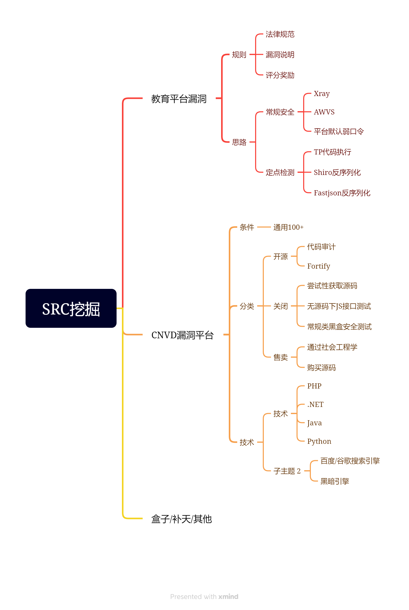

# CNVD-SRC挖掘



## 如何寻找对应源码进行安全测试

开源：各大源码站下载代码审计

闭源：Fofa搜索尝试获取源码审计或黑盒测试

售卖：套路社工获取源码或购买源码审计或黑盒测试

确定无源码的情况下，可利用JS文件寻找测试接口（较传统信息收集多一个方面）

## 部分web源码获取

常见的Web源码泄漏漏洞及其利用参考：

Web源码泄露的漏洞：

1. **git 源码泄露**

   Git是一个开源的分布式版本控制系统，在执行`git init`初始化目录的时候，会在当前目录下自动创建一个`.git`目录，用来记录代码的变更记录等。发布代码的时候，如果没有把`.git`这个目录删除，就直接发布到了服务器上，攻击者就可以通过它来恢复源代码。

   漏洞利用工具：`GitHack`

   github项目地址：`https://github.com/lijiejie/GitHack`

   用法示例：

   GitHack.py `http://www.openssl.org/.git/`

   修复建议：删除.git目录或者修改中间件配置进行对.git隐藏文件夹的访问。

2. **SVN 源码泄露**

   SVN是一个开放源代码的版本控制系统。在使用SVN管理本地代码过程中，会自动生成一个名为.svn的隐藏文件夹，其中包含重要的源代码信息。网站管理员在发布代码时，没有使用`导出`功能，而是直接复制代码文件夹到WEB服务器上，这就使.svn隐藏文件夹被暴露于外网环境，可以利用.svn/entries文件，获取到服务器源码。

   漏洞利用工具：Seay SVN漏洞利用工具

   修复建议：删除web目录中所有.svn隐藏文件夹，开发人员在使用SVN时，严格使用导出功能，禁止直接复制代码。

3. **hg源码泄漏**

   `Mercurial`是一种轻量级分布式版本控制系统，使用 `hg init`的时候会生成`.hg`。

   漏洞利用工具：`dvcs-ripper`

   github项目地址：https://github.com/kost/dvcs-ripper

   用法示例：

   ```
   rip-hg.pl -v -u http://www.example.com/.hg/
   ```

4. **CVS泄露**

   CVS是一个C/S系统，多个开发人员通过一个中心版本控制系统来记录文件版本，从而达到保证文件同步的目的。

   主要是针对 CVS/Root以及CVS/Entries目录，直接就可以看到泄露的信息。

   ```
   http://url/CVS/Root 返回根信息
   http://url/CVS/Entries 返回所有文件的结构
   ```

   漏洞利用工具：`dvcs-ripper`

   github项目地址：https://github.com/kost/dvcs-ripper.git

   运行示例:

   ```
   rip-cvs.pl -v -u http://www.example.com/CVS/
   ```

5. **Bazaar/bzr泄露**

   bzr也是个版本控制工具，虽然不是很热门，但它也是多平台支持，并且有不错的图形界面。

   运行示例：

   ```
   rip-bzr.pl -v -u http://www.example.com/.bzr/
   ```

6. **网站备份压缩文件**

   管理员将网站源代码备份在Web目录下，攻击者通过猜解文件路径，下载备份文件，导致源代码泄露。

   常见的备份文件后缀：

   - .rar
   - .zip
   - .7z
   - .tar.gz
   - .bak
   - .txt
   - .old
   - .temp

   漏洞利用工具：御剑，或者其他目录扫描工具。

7. **WEB-INF/web.xml 泄露**

   这个主要针对Java项目的。

   `WEB-INF`是Java的WEB应用的安全目录，如果想在页面中直接访问其中的文件，必须通过web.xml文件对要访问的文件进行相应映射才能访问。

   `WEB-INF` 主要包含一下文件或目录：

   ```
   WEB-INF/web.xml : Web应用程序配置文件, 描述了servlet和其他的应用组件配置及命名规则.
   WEB-INF/database.properties : 数据库配置文件
   WEB-INF/classes/ : 一般用来存放Java类文件(.class)
   WEB-INF/lib/ : 用来存放打包好的库(.jar)
   WEB-INF/src/ : 用来放源代码(.asp和.php等)
   ```

   通过找到 web.xml 文件，推断 class 文件的路径，最后直接 class 文件，再通过反编译 class 文件，得到网站源码。

8. **DS_Store 文件泄露**

   .DS_Store是Mac下Finder用来保存如何展示 `文件/文件夹` 的数据文件，每个文件夹下对应一个。

   如果将.DS_Store上传部署到服务器，可能造成文件目录结构泄漏，特别是备份文件、源代码文件。

   漏洞利用工具：

   github项目地址：https://github.com/lijiejie/ds_store_exp

   用法示例：

   ```
   ds_store_exp.py http://hd.zj.qq.com/themes/galaxyw/.DS_Store
   ```

9. **SWP 文件泄露**

   swp即swap文件，在编辑文件时产生的临时文件，它是隐藏文件，如果程序正常退出，临时文件自动删除，如果意外退出就会保留，文件名为 .filename.swp。

   漏洞利用：直接访问.swp文件，下载回来后删掉末尾的.swp，获得源码文件。

10. **GitHub源码泄漏**

    GitHub是一个面向开源及私有软件项目的托管平台，很多人喜欢把自己的代码上传到平台托管。

    攻击者通过关键词进行搜索，可以找到关于目标站点的敏感信息，甚至可以下载网站源码。

    类似的代码托管平台还有很多，人才是最大的漏洞。

    ```
    https://github.com/search?q=smtp+user+@qq.com&type=code
    ```

## 开源项目

直接代码审计：思路很重要，要猥琐。

## 某闭源审计或黑盒配合引擎实现通用

这种是公开的项目，但是没有源码：需要我们进行反编译，例如`.NET`需要使用`.NET`反编译工具`dnSpy`对生成的dll文件进行反编译，在进行审计。

## 某售卖审计或黑盒配合引擎实现通用

通用步骤：

1. 尝试性获取源码

2. 类似java或.net编译类文件反编译源码-dnspy,idea

3. 无源码的情况下使用JS接口数据提交测试模拟-jsdinder,手工，扫描

   使用jsfinder工具，扫描js文件，爬取系统中的一些地址、接口，从而获取更多信息，扩大测试范围（可能用js进行交互）

   或者使用GetJS工具，但是工具总会有错误的，最好还是人工的去寻找。