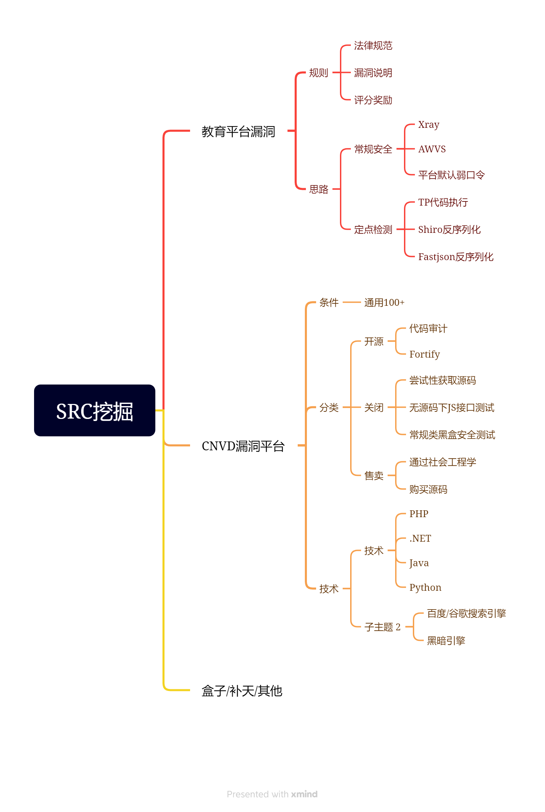
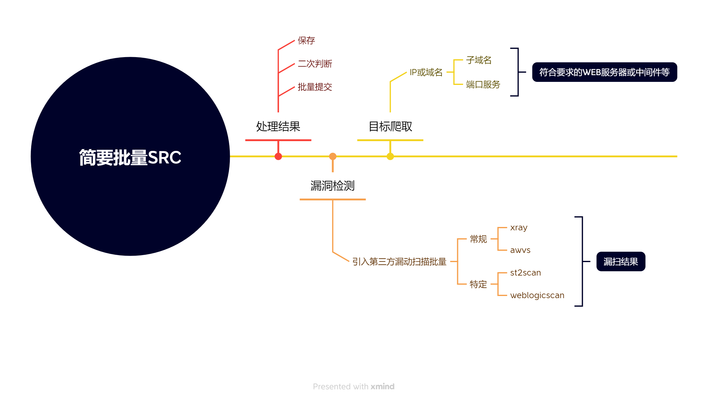
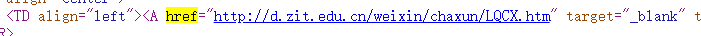
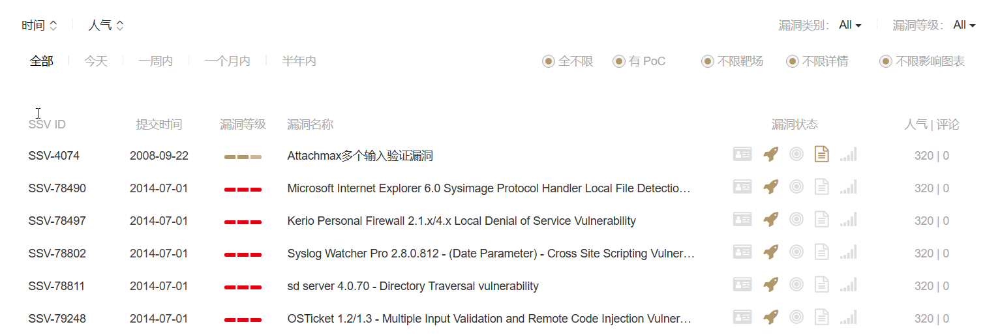
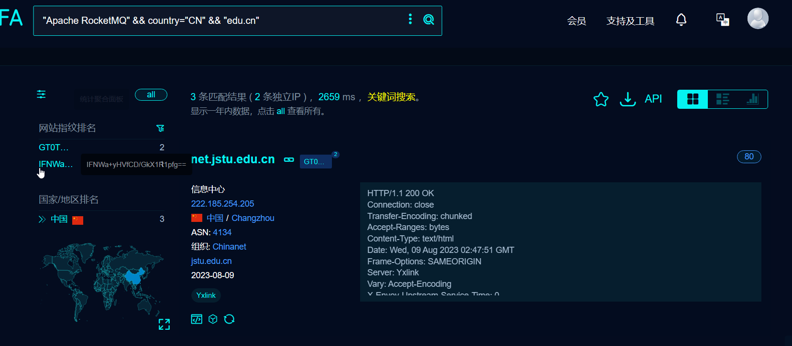
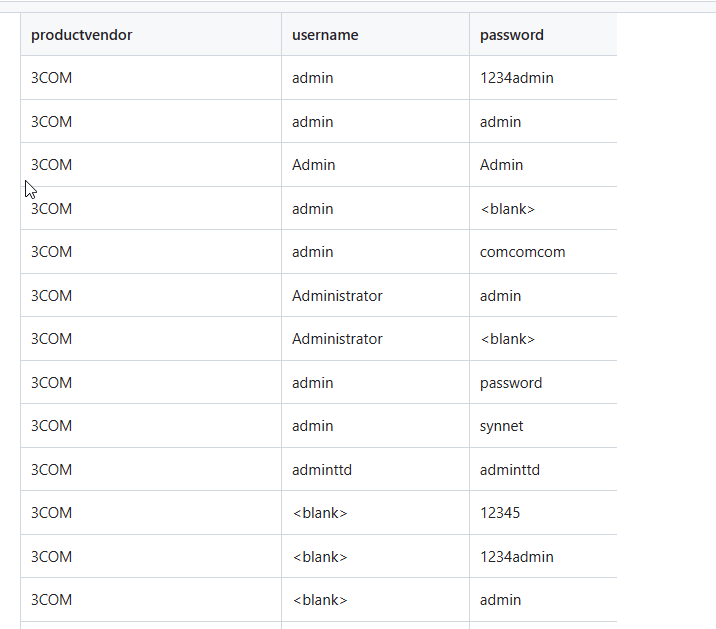

# 教育平台SRC

## 常规安全SRC的思路

1. 教育src的学校名称爬取
2. fofa搜索学校名称获取学校子域名，这种方式获取的域名是最多的。
3. Xray进行批量检测

## python爬取

1. 教育src的学校名称

## fofa查询

将获取学校名称在fofa上搜索（会获取到学校很多的子域名），这种方式获取的域名是最多的。

缺点：有一些并不是学校，也就是搜索的不精准。

当然，也可以直接用域名关键字，可以将域名都爬取下来。

## 子域名搜索

查看源代码，可以编写Python爬虫对页面内的子域名进行搜索。

## 挖掘漏洞

获取到子域名信息，接下来对子域名信息进行批量Xray扫描（注意：用扫描器扫edusrc有风险）

xray直接扫src存在风险，可以和brupsuite联动进行被动扫描，通常我们在进行web扫描漏洞时候，都是使用各种扫描器输入网址乱扫一通。这种方式虽然大众化，但存在许许多多的缺点

被动式扫描web漏洞，在我们进行手动浏览网页的过程中，使用burp抓包，并能对浏览过的网页进行漏洞扫描。所以我们需要：

1. burp插件passive-scan-client
2. 一个被动扫描器（一般是是xray）

## 总结

如果要进行批量eduSRC的挖掘，可以直接在fofa上进行爬取子域名的IP

如果要对一个学校或者固定的几个学校（容易拿证书）进行挖掘，就可以先对教育SRC上的学校名称进行爬取，然后再对固定学校名字，按照学校名字进行子域名爬取（对于edusec网站的爬取可以有效的降低风险，毕竟之前有人提交过这个学校的漏洞）

**定点检测SRC的思路**

思路：Python-Fofa-Exploit联动定点批量自动化

在知道创宇seebug（https://www.seebug.org/）上找到一个最新的有POC的漏洞，对POC二次开发使之可以批量测试。比如[Apache RocketMQ NameServer远程代码执行漏洞(CVE-2023-37582)](https://www.seebug.org/vuldb/ssvid-99722)

我们要找的是存在poc的漏洞

这里有个问题：seebug平台上的poc很多都不是网站层面的漏洞

我们可以先进行爬取，首先，进行对于不是通过网站层面的poc进行筛选，其次，对于不适合edu网站的漏洞进行筛选。

对POC二次开发使之可以批量测试。比如[Apache RocketMQ NameServer远程代码执行漏洞(CVE-2023-37582)](https://www.seebug.org/vuldb/ssvid-99722)

在fofa上搜索使用该软件的教育行业网站，找到多个edu网站使用了Apache。

对这些网站进行批量的poc测试（编写python脚本）

思路：通过get/post构造poc去验证漏洞，然后根据返回的状态码和返回url的html页面的关键字进行判断

也可以去网上，将最近的漏洞详情下载下来，写python脚本，批量检测。

edusec的法律规定：

不要用awvs批量扫描，容易进去（尽量不要用扫描工具扫），最好自己写poc自动化验证。

## Python-Fofa-平台默认口令安全批量自动化

列出来大部分设备的默认口令：`https://github.com/ihebski/DefaultCreds-cheat-sheet`

