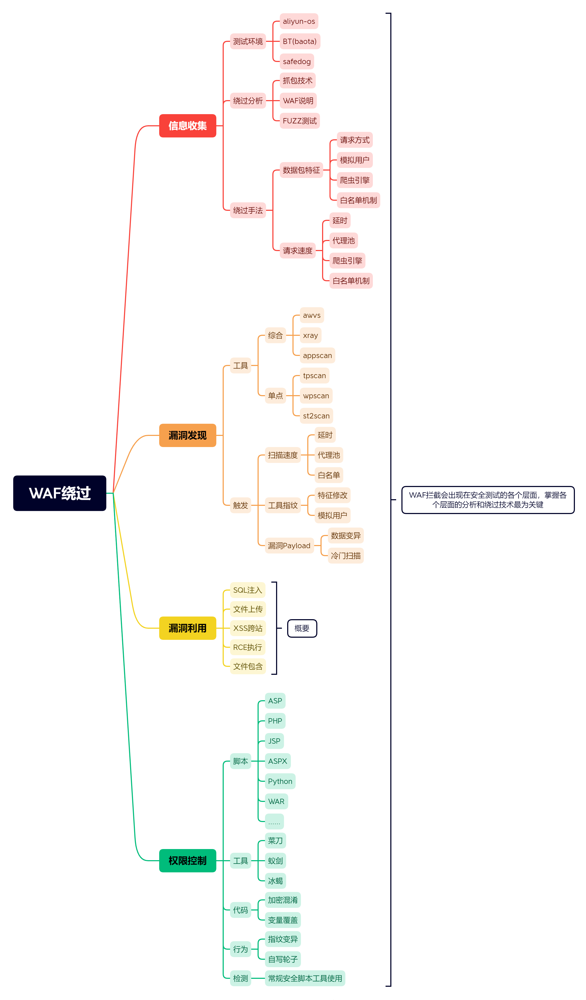
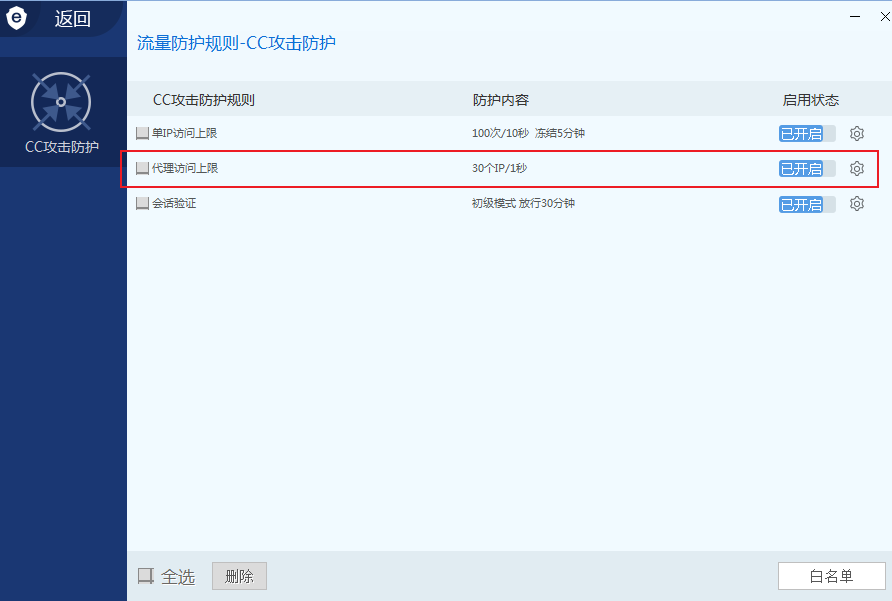

# WAF绕过信息收集与反爬虫延时代理



## 安全狗

在安全狗没有开CC的时候，使用目录扫描工具是可以扫描出来的，当安全狗开启了CC之后，如果你在进行目录扫描的话，就会直接拦截，会阻止你继续访问。

被拦截的解决办法

1. 使用延时

2. 使用搜索引擎的请求头，但是对于有一些waf来说网站的请求头不能使用。

3. 可以自己编写相应的脚本进行解决。

   ```python
   import requests
   import time
   
   headers = { 'Accept':'text/html,application/xhtml+xml,application/xml;q=0.9,image/webp,image/apng,*/*;q=0.8,application/signed-exchange;v=b3;q=0.9',
       'Accept-Encoding': 'gzip, deflate, br',
       'Accept-Language': 'zh-CN,zh;q=0.9,en;q=0.8,en-GB;q=0.7,en-US;q=0.6',
       'Cache-Control': 'max-age=0',
       'Connection': 'keep-alive',
       'Cookie': 'PHPSESSID=4d6f9bc8de5e7456fd24d60d2dfd5e5a',
       'sec-ch-ua': '"Chromium";v="92", " Not A;Brand";v="99", "Microsoft Edge";v="92"',
       'sec-ch-ua-mobile': '?0',
       'Sec-Fetch-Dest': 'document',
       'Sec-Fetch-Mode': 'navigate',
       'Sec-Fetch-Site': 'none',
       'Sec-Fetch-User': '?1',
       'Upgrade-Insecure-Requests': '1',
       'User-Agent': 'Mozilla/5.0 (compatible; Baiduspider-render/2.0; +http://www.baidu.com/search/spider.html)'
   }
   
   for paths in open('php_b.txt', encoding='utf-8'):
       url = "http://127.0.0.1/pikachu"
       paths = paths.replace('\n', '')
       urls = url + paths
       proxy = {
           'http': '127.0.0.1:7777'
       }
       try:
           code = requests.get(urls, headers=headers, proxies=proxy).status_code
           # time.sleep(3)
           print(urls + '|' + str(code))
       except Exception as err:
           print('connect error')
           time.sleep(3)
   ```

4. 可以使用http代理池解决问题，还有一种变化ip：在数据包里面添加x-forwarded-for（x-forwarded-for原理，比如在一些投票网站，可以通过爆破x-forwarded-for的值来设置多个代理，进而变化ip（但是明显安全狗不是检测的这里））

5. 检测ip代理，一般是CC防护，但是使用代理，扫描目录，大概率是可行的。或者将代理形成一个字典，不断的for循环代理ip来绕过。

   

6. 尽量不要请求恶意文件。优化字典。

7. 将恶意文件进行变异，如文件上传漏洞一样，加上`.`或者空格 

## Aliyun

阿里云-无法模拟搜索引擎爬虫绕过，只能采用`代理池`或者`延时`。

一般访问频率过快，站点直接就访问不了，一个小时后才可以访问。

## BT(宝塔)

一般是代理池，或者延时。

 
