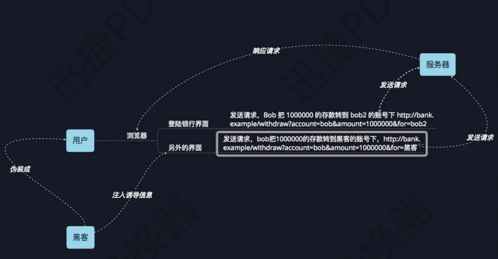
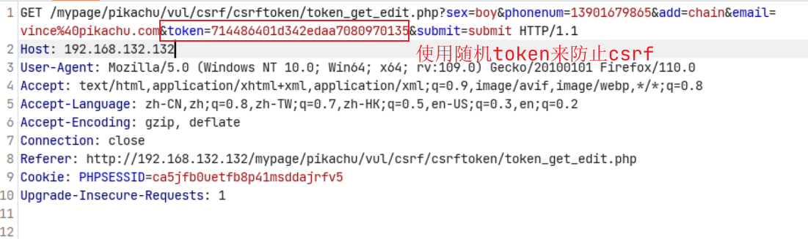

# CSRF漏洞跨站请求伪造

## 原理

必须是在授权登录的状态下，才能完成CSRF，主要是用来修改信息的。



假设某一网站后台添加用户的数据包为：

`www.127.0.0.1.com/adduser.php?user=admin&password=123456`

而在攻击者自己的博客中`www.hacker.com`的首页文件中有这么一行代码`<script src="http://www.hacker.com/user=root&password=root"></script>`管理员在登录状态下访问这个url地址。将自动添加一个管理员。

来源检测，同源策略：是否同一域名

## 使用案例

### pikachu

在自己的电脑中写入一个html文件，文件中写入如下代码，让攻击者去访问这个文件，从而造成攻击，当然直接让攻击者去访问src中的内容，也是可以的，这样攻击完成了。可以修改登录者的信息。

```javascript
<script src="伪造的url地址"></script>
```

## 防御方案

1. 当用户发送重要的请求时需要输入原始密码

2. 设置随机 Token

   每次的token不一样，攻击者构造恶意的链接也不一样，导致无法攻击成功，只有token的保护是最好的，其余的防御都有可能被绕过。

   

3. 检验 referer 来源，请求时判断请求链接是否为当前管理员正在使用的页面（管理员在编辑文章，

   黑客发来恶意的修改密码链接，因为修改密码页面管理员并没有在操作，所以攻击失败）

4. 设置验证码

5. 限制请求方式只能为 POST