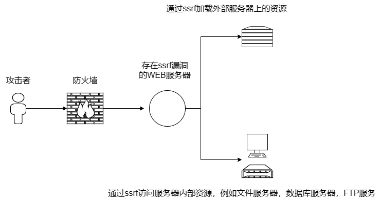
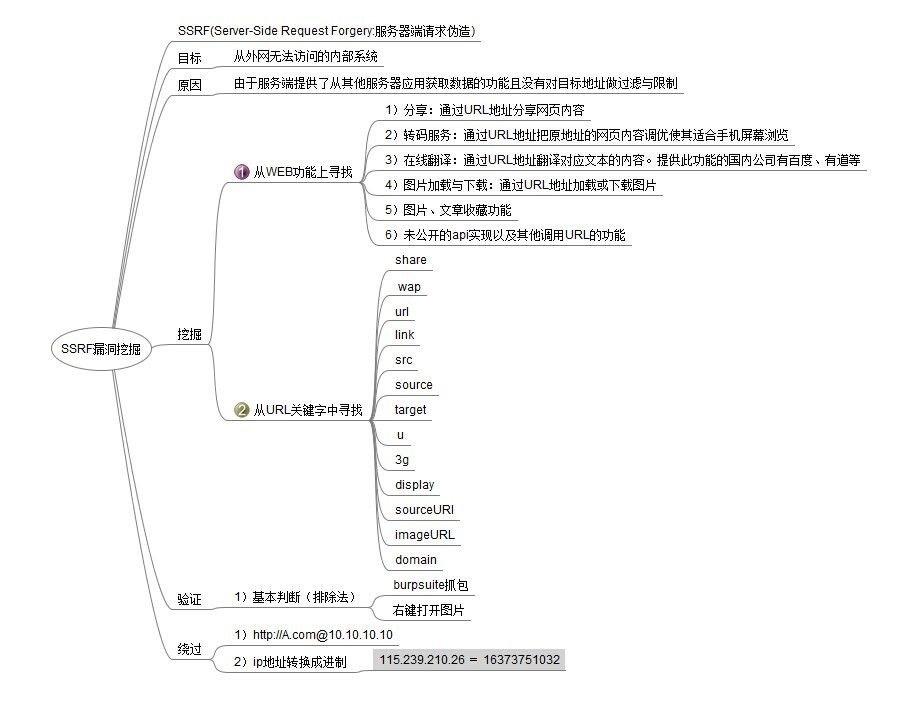

# SSRF

SSRF（Server-Side Request Forgery） 即服务端请求伪造。

伪造一个服务端请求，也即是说攻击者伪造服务端的请求发起攻击，攻击者借由服务端为跳板来攻击目标系统。

## SSRF原理



## SSRF漏洞检测



## 漏洞攻击

端口扫描，指纹识别，漏洞利用，内网探针等。

各个协议调用探针：http，file，dict，ftp，gopher。

```url
http://127.0.0.1/phpmyadmin/
file:///D:/www.txt
dict://127.0.0.1:3306/info
ftp://127.0.0.1:21
```

## 防御

1. WAF。
2. 统一错误信息,避免用户可以根据错误信息来判断远程服务器的端口状态。
