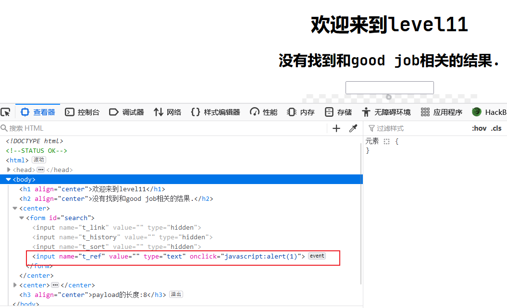

# XSS-Labs通关手册

## 第一关


## 第二关

实体化标签函数

```php
htmlspecialchars() // 把预定义的字符 "<" （小于）和 ">" （大于）转换为 HTML 实体：
```


## 第三关

这个只需要闭合一下标签。


除了点击事件还有鼠标移动事件等等。

```javascript
onmouseover=alert(/xss/)
```

## 第四关


## 第五关


## 第六关


## 第七关


## 第八关

这个使用到了Unicode编码。


## 第九关


## 第十关


## 第十一关



这一关明显是Referer提交，绕过。


请求从哪里来

CSRF：跨站点脚本攻击

XSS：跨站脚本攻击

SSRF：跨站请求伪造

跟注入一样，也是有post，get，user-agent，等等的XSS插的方式。