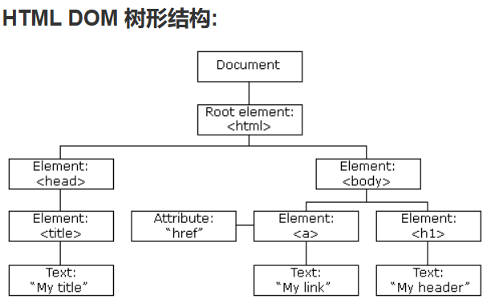

# 跨站原理分类与攻击手法

控制页面的内容才是跨站

判断跨站是否成功

1. 浏览器版本或者内核，决定跨站漏洞能否执行，就算有漏洞对于有些浏览器也是无法执行的
2. 对方的浏览器可能会有过滤因素

## XSS 跨站漏洞分类

1. 反射：将JavaScript代码插入在某一个页面中，然后构造相应页面的访问链接，让对方去访问这个链接，从而完成攻击。

2. 存储：将JavaScript代码存储起来（数据库中），只要访问者打开含有跨站脚本的页面，都会区执行相应的代码，完成攻击。

3. DOM：与反射性类似，但是这种攻击是存在与JavaScript代码中的。

   

## 危害等级

XSS漏洞由于攻击者需要很多的条件才能够实现XSS。

1. 需要被攻击者打开某一个链接。
2. 对方浏览器不能阻止
3. 对方要登录，有保存登录的信息。
4. 要有XSS漏洞。

正因为有这么多的条件才能够触发该漏洞，所以说XSS的漏洞不是太严重。

有用户交互的地方都是可以攻击的。

## XSS主要攻击方式

获取Cookie和Session

什么是Cookie和Session：用户凭据，通过凭据可以判断对方身份信息。

`cookie`存储本地，存活时间较长，一般是小中型网站使用。（盗取Cookie）

`session`会话，存储服务器，存活时间较短，一般是大型网站使用。（会话劫持）

有时候你劫持到Cookie也无法登录，这时候，配合读取phpinfo等源码信息，来获取更加主要的信息，加入到Cookie中就可以了。

自己也可以写JavaScript代码来进行相应Cookie或者Session的获取，就是把相应的XSS替换为自己的链接即可。

## Http-Only绕过

注意：Http-Only只是影响通过XSS漏洞获取Cookie，不影响XSS漏洞的执行。

通过XSS漏洞获取后台权限有两种方法

1. 通过XSS获取Cookie

   但是如果对方服务器打开了Http-Only就不能获取相应的Cookie了。这时候就需要获取相应的表单

2. 直接账号密码登录

   这种有两种方式：

   1. 保存读取：浏览器读取帐号密码。
   2. 未保存读取：表单劫持，需要xss产生登录地址，需要将XSS写入到表单提交的地方，然后通过JavaScript发送到相应的服务器中。

