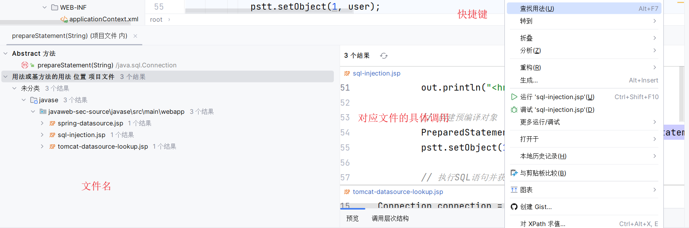

# Java审计注入


# 基础知识

## HttpServletRequest常用方法

```java
getParameter(String name); // 获取请求中的参数，该参数是由name指定的
getParameterValues(String name); // 返回请求中的参数值，该参数值是由name指定的
getAttributeNames(); // 返回当前请求的所有属性的名字集合
getAttribute(String name); // 返回name指定的属性值
getRealPath(String path); // 获取Web资源目录。
getCookies(); // 返回客户端发送的Cookie
getSession(); // 返回和客户端相关的session，如果没有给客户端分配session，则返回null
getInputStream(); // 获取请求的输入流中的数据
getReader(); // 获取请求体的数据流
getMethod(); // 获取发送请求的方式，如get、post
getParameterNames(); // 获取请求中所有参数的名字
getRemoteAddr(); // 获取客户端的IP地址
getRemoteHost(); // 获取客户端的名字
getServerPath(); // 获取请求的文件的路径
```

## HttpServletResponse常用方法

```java
getWriter(); // 获取响应打印流对象
getOutputStream(); // 获取响应流对象
addCookie(Cookie cookie); // 将指定的Cookie加入到当前的响应中
addHeader(String name,String value); // 将指定的名字和值加入到响应的头信息中
sendError(int sc); // 使用指定状态码发送一个错误到客户端
sendRedirect(String location); // 发送一个临时的响应到客户端
setDateHeader(String name,long date); // 将给出的名字和日期设置响应的头部
setHeader(String name,String value); // 将给出的名字和值设置响应的头部
setStatus(int sc); // 给当前响应设置状态码
setContentType(String ContentType); // 设置响应的MIME类型
```

## JavaWeb项目运行流程

首先，将项目部署到服务器，由客户端发起请求，将请求发送到`tomcat`的监听端口。

通过端口进入`tomcat`，再由`tomcat`将携带的请求信息移交给`web`项目。

正式进入`JavaWeb`项目，要解读`web.xml`配置文件，将依据文件的配置决定进入哪一个页面或者`servlet`。

读取`tomcat`通用的`conf/web.xml`，然后再读取web应用程序中的`WEB-INF/web.xml`

路径总结：

`浏览器 => tomcat服务器 => web.xml => listener => filter => sevlet`


## web.xml的解读

```xml
<web-App>   

	<display-name></display-name> <!--定义了WEB应用的名字-->   

	<description></description> <!--声明WEB应用的描述信息-->  

	<context-param></context-param> <!--context-param元素声明应用范围内的初始化参数。-->   

	<filter></filter> <!--过滤器元素将一个名字与一个实现javax.servlet.Filter接口的类相关联。-->   

	<filter-mApping></filter-mApping> <!--一旦命名了一个过滤器，就要利用filter-mApping元素把它与一个或多个servlet或JSP页面相关联。-->

	<listener></listener> <!--servlet API的版本2.3增加了对事件监听程序的支持，事件监听程序在建立、修改和删除会话或servlet环境时得到通知.Listener元素指出事件监听程序类。-->    

	<servlet></servlet> <!--在向servlet或JSP页面制定初始化参数或定制URL时，必须首先命名servlet或JSP页面。Servlet元素就是用来完成此项任务的。   -->

	<servlet-mApping></servlet-mApping> <!--服务器一般为servlet提供一个缺省的URL：http://host/webAppPrefix/servlet/ServletName。 但是，常常会更改这个URL，以便servlet可以访问初始化参数或更容易地处理相对URL。在更改缺省URL时，使用servlet-mApping元素。-->

	<session-config></session-config> <!--如果某个会话在一定时间内未被访问，服务器可以抛弃它以节省内存,可通过使用HttpSession的setMaxInactiveInterval方法明确设置单个会话对象的超时值，或者可利用session-config元素制定缺省超时值。-->   

	<mime-mApping></mime-mApping> <!--如果Web应用具有想到特殊的文件，希望能保证给他们分配特定的MIME类型，则mime-mApping元素提供这种保证。-->

	<welcome-file-list></welcome-file-list> <!--指示服务器在收到引用一个目录名而不是文件名的URL时，使用哪个文件。--> 

	<error-page></error-page> <!--在返回特定HTTP状态代码时，或者特定类型的异常被抛出时，能够制定将要显示的页面。 -->  

	<taglib></taglib> <!--对标记库描述符文件（Tag Libraryu Descriptor file）指定别名。此功能使你能够更改TLD文件的位置，而不用编辑使用这些文件的JSP页面。--> 

	<resource-env-ref></resource-env-ref> <!--声明与资源相关的一个管理对象。-->

	<resource-ref></resource-ref> <!--声明一个资源工厂使用的外部资源。-->

	<security-constraint></security-constraint> <!--制定应该保护的URL。它与login-config元素联合使用  -->

	<login-config></login-config> <!--指定服务器应该怎样给试图访问受保护页面的用户授权。它与sercurity-constraint元素联合使用。-->

	<security-role></security-role> <!--给出安全角色的一个列表，这些角色将出现在servlet元素内的security-role-ref元素的role-name子元素中。分别地声明角色可使高级IDE处理安全信息更为容易。--> 

	<env-entry></env-entry> <!--声明Web应用的环境项。-->

	<ejb-ref></ejb-ref> <!--声明一个EJB的主目录的引用。-->

	<ejb-local-ref></ejb-local-ref> <!--声明一个EJB的本地主目录的应用。-->  

</web-App>
```

## 审计的思路

确定框架：通过以下3种方式确定框架：

1. 看web.xml

2. 看导入的jar包或pom.xml

3. 看配置文件

Struts2配置文件：struts.xml

Spring配置文件：ApplicationContext.xml

Spring MVC配置文件：spring-mvc.xml

Hibernate配置文件：Hibernate.cfg.xml

Mybatis配置文件：mybatis-config.xml

查询是否存在过滤器

通过查看web.xml文件，确定是否配置相关过滤器。

## 审计方法

1. 根据业务功能审计

   优点：明确程序的架构以及业务逻辑，明确数据流向，可以从获取参数-->表现层-->业务层-->持久层，通读源码

   缺点：耗费时间

2. 根据敏感函数审计

   优点：可以快速高效的挖出想要的漏洞，判断敏感函数上下文，追踪参数源头

   缺点：覆盖不了逻辑漏洞，不了解程序的基本框架。

# 注入学习

## JavaWeb-SEC注入学习

进入靶场。


找到`sql-injection.jsp`文件

定义了一个参数user，是通过get的方式进行传参的。

然后拼接参数查询MySQL数据库的用户表。


然后拼接SQL语句，对SQL语句进行预编译，执行预编译后的SQL语句，并且返回结果（数组rs）。

对rs的键对应的值进行遍历输出。

```java
// 输出SQL语句执行结果
while (rs.next()) {
    out.println("<tr>");
    // 获取SQL语句中查询的字段值
    out.println("<td>" + rs.getObject("host") + "</td>");
    out.println("<td>" + rs.getObject("user") + "</td>");
    out.println("<tr/>");
}
```

漏洞产生原因：

写法不规范，SQL语句应该按照预编译要求去拼接使用，而不是直接使用不去拼接，要执行`PreparedStatement`对应的`set`方法，结合占位符去使用。

测试`order by`，这里有回显。

在sql注入时经常利用`order by`子句进行快速猜解表中的列数，通过修改`order by`参数值依据回显情况来判断具体表中包含的列数。


因为查询出来的表只有两列，所以说，我们进行`order by`排序的时候，最多就只能排序两列。

通过union查询爆出列。


注入，显示版本和数据库。


使用预编译防止SQL注入。

```java
String sql = "select host,user from mysql.user where user = ? ";
```


但是在注入的时候，就会出现错误了。

**预编译原理**

在使用预编译机制的时候，会把所有的`'`，前面都加上`/`，这样就导致了SQL注入的失败，通过预编译机制还可以减少SQL语句的编译次数，给SQL语句的执行提高性能。


占位符原理：先将SQL发送到数据库（留下参数位），插入参数，再执行。


### 代码审计技巧

在文件中查找`Ctrl+Shift+F`，搜索`select`关键字。


函数的定位：查找用法（ALT+F7）。



## Ofcms后台SQL注入-全局搜索关键字


