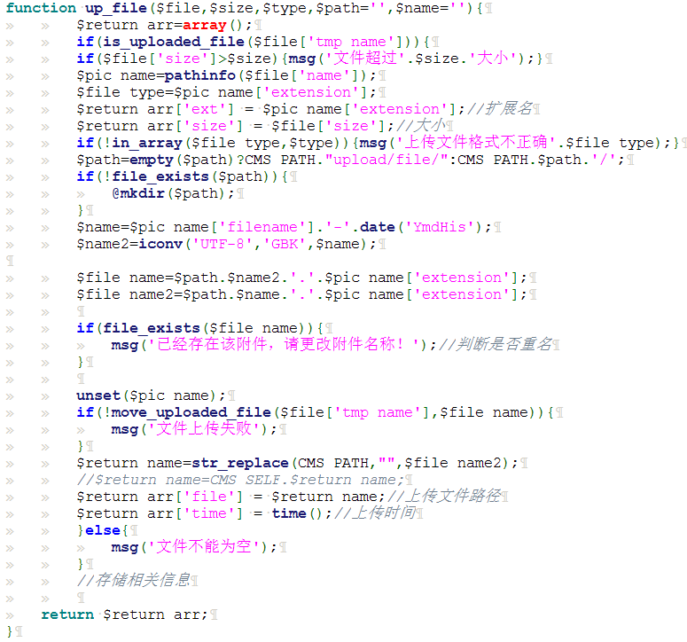
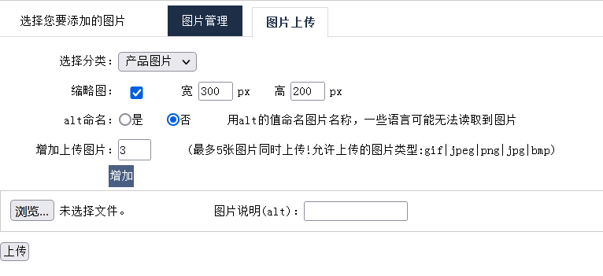
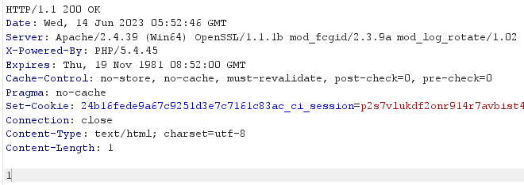
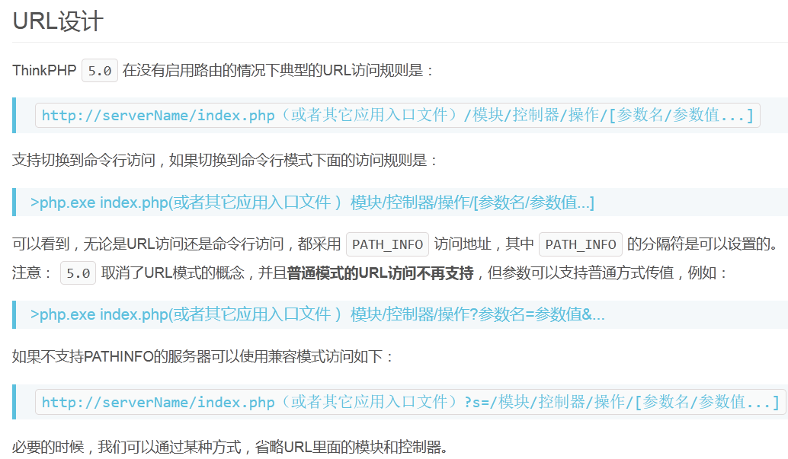
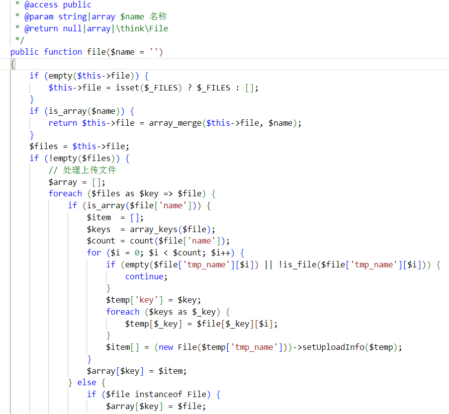

# PHP代码审计MVC类


## 关键字搜索：(函数，键字，全局变量等)

文件上传的相关函数：move_uploaded_file 等

文件上传的关键字：在写上传的时候会有注释，如 `//上传`

全局变量$_FILES

```php
$_FILES['myFile']['name'] // 客户端文件的原名称。
$_FILES['myFile']['type'] // 文件的 MIME 类型，需要浏览器提供该信息的支持，例如"image/gif"。
$_FILES['myFile']['size'] // 已上传文件的大小，单位为字节。
$_FILES['myFile']['tmp_name'] // 文件被上传后在服务端储存的临时文件名，一般是系统默认。可以在 php.ini 的 upload_tmp_dir 指定，但 用 putenv() 函数设置是不起作用的。
$_FILES['myFile']['error'] // 和该文件上传相关的错误代码。['error'] 是在 PHP 4.2.0 版本中增加的。下面是它的说明：(它们在 PHP 4.3.0 之后变成了 PHP 常量。) 
```

应用功能抓包：（任何可能存在上传的应用功能点），前台会员中心，后台新闻添加等可能存在上传的地方

### Beescms 无框架后台任意文件上传

1. 进入靶场

   首页

   

   后端

   

2. 进行全局搜索

   全局搜索`$_FILES`，但是没有发现内容，所以我们搜索`_FILES`。

   

   点击其中一个查看（这里是一个文件上传的处理过程）

   

   浏览器访问该文件

   

   上传一个doc文件抓包分析看传递的参数

   

   传递的参数：文件说明：file_info和uppic，传递的表单名为up

   

   

   在源代码里面查找这两个参数，出现下面的文件上传的代码段

   如果uppic的参数存在，就传递表单名up

   `fl_html`里面将传递的字符串利用`htmlspecialchars`将特殊字符转换为 HTML 实体

   fl_html的实现。

   ```php
   function fl_html($str){
   	return htmlspecialchars($str);
   }
   ```

   explode 使用一个字符串分割另一个字符串，这里将`$_type_file`以`|`分割，前面有有一个`$_type_file`函数，将允许的文件格式以|分割）

   

   $_sys文件是一个数组，包含上传文件的大小，和文件类型

   

   is_uploaded_file()函数检查指定的文件是否是通过 HTTP POST 上传的。如果文件是通过 HTTP POST 上传的返回 TRUE，可以用来确保恶意的用户无法欺骗脚本去访问本不能访问的文件。

   `$_FILES['up']['tmp_name']`是is_uploaded_file()要检查的文件，up是要上传的表单名，tmp_name变量中的值就是文件在Web服务器中临时存储的位置（上传文件的临时保存文件）

   确定文件的大小限度（这里是系统设置的值）

   up_file处理上传的文件，并且验证是否符合上传标准

   

   根据up_file返回值（返回的字典形式）确定文件的路径、扩展名、大小、时间

   最后在进行数据库的插入操作

   

   定位函数up_file（进行相关的验证）

   传递了三个参数：表单名，文件大小，文件类型

   确定文件的大小不超过系统设置的文件大小

   pathinfo() 函数以数组的形式返回关于上传的文件路径信息，如：

   ```php
   <?php
   $patharray = pathinfo("/myweb/test.php");
   echo $patharray[dirname]; // /myweb
   echo $patharray[basename]; // test.php
   echo $patharray[extension]; // php
   echo $patharray[filename]; // test
   ?>
   pathinfo() // 函数以数组的形式返回关于文件路径的信息。
   返回的数组元素如下：
   [dirname]: 目录路径
   [basename]: 文件名
   [extension]: 文件后缀名
   [filename]: 不包含后缀的文件名
   ```

   查看上传的文件的后缀名是不是在系统规定的后缀里面

   判断path=""的话，就上传到upload/file/路径下（如果path没传参的话默认为空，有参数的话就是参数值）

   file_exists检查文件或者目录是否存在，不存在就创建目录

   再根据时间戳生成文件名

   

   这里的关键就是绕过pathinfo函数，让php文件的格式的能够最后检测

   在PHP的在线编辑平台测试（这里没办法绕过，匹配的最后一个） 

   

   抓包用%00截断尝试绕过（%00要解码）

   

   发现没有上传成功（这个地方绕过不了）

   

3. 更换一个$_FILES函数存在的文件（admin_pic_upload.php）

   

   抓包分析（这里上传了很多个变量，好几个表单名，）应该是图片的长宽高等等

   

   这里是处理传递的参数

   `intval`获取变量的整数值，判断图片宽度是否为空，是就用系统设置的值，不是就用传递的参数取整数（其它变量类似）

   `foreach`语法结构提供了遍历数组的简单方式，仅能够应用于数组和对象。每次循环中，当前单元的值被赋给数组 `$v`

   

   `$_FILES`是一个预定义的数组，用来获取通过 POST 方法上传文件的相关信息。如果为单个文件上传，那么 `$_FILES` 为二维数组；如果为多个文件上传，那么 `$_FILES` 为三维数组。

   这里将数组里面的值再传递了一下。

   可以看到，处理图片上传的函数是up_img，还传递了一个数组，因该是允许上传文件的格式，定点查询这里函数

   

   is_uploaded_file() 函数检查指定的文件是否是通过 HTTP POST 上传的。如果文件是通过 HTTP POST 上传的，该函数返回 TRUE。

   判断图片的的大小

   pathinfo() 函数以数组的形式返回关于文件路径的信息。[dirname]: 目录路径；[basename]: 文件名；[extension]: 文件后缀名；[filename]: 不包含后缀的文件名（注意：这里没有检测[extension]，之前检测了这里是无法绕过的）

   比对文件的类型是不是在允许上传的类型里面（只检测了$file['type']，也就是mime类型）

   然后构造文件路径名，并且比对是否重复

   

   rand(1,10000)函数为在1-10000产生的随机数

   直接上传文件，判断pic_alt是否为空来对比判断，如果为空，就采取路径+时间戳+随机数+.+文件后缀名方式命名

   将临时文件上传到设置路径上

   抓包修改文件类型

   

   在上传目录查看，然后在略缩图的地方点击就进入了，php的脚本页面。

   

   

## MVC 开发框架类

### Finecms 基于前台 MVC 任意文件上传

1. 进入靶场

   发现会员中心

   

   对头像上传进行抓包分析（上传test.jpg文件，这是一个基于MVC的框架的网站）

   

2. 查找数据包访问的index文件

   没有看到接受参数如`s,c`等等参数的传递和处理

   典型的MVC的框架，即核心代码没有在指向文件里面，需要查看入口文件

   这里的入口文件：FCPPATH(后面有一个fineCMS的目录)和WEBPATH（这里感觉有点像定义全局变量的意思，只是定义的路径）

   包含了init.php文件(FCPPATH为定义的路径)
   
   
   
   点击fineCMS的目录（发现init.php文件和三个文件夹）
   
   
   
   查看init.php文件（system目录下就是框架的代码，dayrui是二次开发的代码） 
   
   
   
   根据路由规则匹配参数（也就是传递参数的规则） 
   
   
   
   s对应目录，c对应文件名，m对应方法
   
   
   
   在MVC框架内的controller中，查找member目录，文件名为account，函数为upload（一般核心代码都在控制器里面） 
   
   
   
   在controllers文件夹下查找account.php文件下的upload方法
   
   post传参，然后用将空替换为+，赋值为file
   
   preg_match：执行匹配正则表达式preg_match( string $pattern,   string $subject,  array &$matches) pattern要搜索的模式，字符串类型。 subject
   
   输入字符串。 matches如果提供了参数matches，它将被填充为搜索结果。 $matches[0]将包含完整模式匹配到的文本， $matches[1] 将包含第一个捕获子组匹配到的文本，以此类推。
   
   这里[0]是全部的数据，[1]是data，[2]是png（文件后缀名），[3]是base64 
   
   
   
   将file进行正则式匹配，取第三个（这里应该是文件的路径+文件后缀名）
   
   然后将传参的值进行替换，解码，写入新文件（在这里没有存在任何的过滤）
   
   
   
   然后写入文件之后，再进行的过滤
   
   
   
   直接上传文件，返回1
   
   
   
   文件查看（发现了四张图片）
   
   
   
   将目录文件删除，修改数据包的文件头为PHP格式
   
   
   
   返回报错（应该是后面的验证没有通过） 
   
   
   
   但是文件夹有第一个文件的php
   
   
   
3. 总结

   业务功能分析->会员中心->上传图像->跟踪代码->逻辑判断

   存在逻辑漏洞，即先上传，后验证

## Thinkphp 框架

### Cltphp 基于前台 TP5 框架任意文件上传

1. thinkphp是以MVC框架开发的一个框架。

   ThinkPHP5的入口文件：

   入口文件主要完成：

   - 定义框架路径、项目路径（可选）
   - 定义系统相关常量（可选）
   - 载入框架入口文件（必须）

   5.0默认的应用入口文件位于`public/index.php`，内容如下：

   ```php
   // 定义应用目录
   define('APP_PATH', __DIR__ . '/../application/');
   // 加载框架引导文件
   require __DIR__ . '/../thinkphp/start.php';
   ```

2. 进入靶场

   

   如何判断thinkphp：

   url输错路径，会在页脚显示thinkphp的框架

   

   在源代码的thinkphp目录下查看readme文件。

   

   打开根目录的index.php文件（发现入口）

   这里定义了应用、插件、框架的目录全局变量

   

   进入会员中心的头像上传

   

   上传图片，抓包分析

   这里的上传的路径/user/upFiles/upload在源代码中并不存在。

   

   查看thinkPHP5.0的官方开发手册（架构=>url访问）

   

   这里user相当于目录，upFiles相当于文件名，upload相当于方法。

   找到相应的文件上传目录（在APP目录中寻找，注意：核心代码一定是在控制器下面）

   

   查看upload方法

   将request（自定义函数）的数据给file函数

   array_keys返回包含数组中所有键名的一个新数组

   将上传的临时文件移动到上传目录下（漏洞检测在move函数）

   getSaveName()函数获取文件的上传名

   绕过思路：根据info的值来进行检测上传成功，但是下面没有验证。可以伪造info的值（因为move函数中的check函数要调用才会取检测）

   `file()`函数处理上传文件（在框架内调用的几乎没有漏洞） 

   

   move函数移动文件（thinkphp自带的验证在check函数）（这里是核心绕过点！！！！！！！！） 

   

   

   定位过滤函数check

   发现检测了大小，类型，后缀，图像文件等等 

   

   直接上传PHP文件，发现报错，这里是前端的js验证（这里的致命错误应该是move函数没有调用到check函数）

   

   抓包修改绕过

   

   上传成功。

3. 总结

   thinkphp的框架很安全，但是开发者的写法如果不按照标准规定来，那么验证的时候很可能就是自己的代码验证，从而产生了安全漏洞。

   绕过思路：1.看开发者写法规范性；2.针对thinkphp框架本身安全分析
