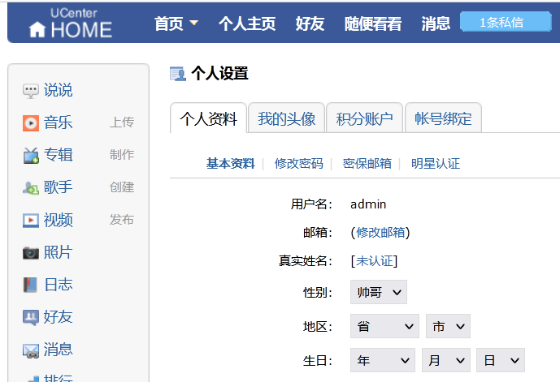
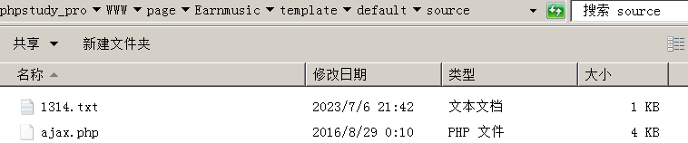

# PHP代码审计RCE


## 相关知识基本原理

1. 基础漏洞

   注入漏洞关键字：

   `select`，`insert`，`update`，`mysql_query`，`mysqli`等。

   文件上传：

   `$_FILES`，`type="file"`，上传，`move_uploaded_file()`等

   XSS 跨站：

   `print`，`print_r`，`echo`，`sprintf`，`die`，`var_dump`，`var_export`等。

   文件包含：

   `include`，`include_once`，`require`，`require_once`等。

   代码执行：

   `eval`，`assert`，`preg_replace`，`call_user_func`，`call_user_func_array`等。

   命令执行：

   `system` ，`exec shell_exec`，`passthru`， `pcntl_exec` ，`popen proc_open`，``。

   变量覆盖：

   `extract()`，`parse_str()`，`importrequestvariables()`，`$$`等。

   反序列化：

   `serialize()`，`unserialize()` ，`__construct __`，`destruct`等。

   其他漏洞：

   `unlink()` ，`file_get_contents()` ，`show_source()` `file()`，`fopen()`等。

2. 通用关键字：

   `$_GET`，`$_POST`，`$_REQUEST`，`$_FILES`，`$_SERVER`等。

   功能点或关键字分析可能存在漏洞

   抓包或搜索关键字找到代码出处及对应文件

   追踪过滤或接受的数据函数，寻找触发此函数或代码的地方进行触发测试

## 案例：

### xhcms-无框架-文件包含，跨站-搜索或应用-include

#### xhcms跨站


源代码全局搜索echo

这里发现很多，优先看非后台的文件，而且输出的为变量，不是固定值


选择contact.php进行查看

这里输出了数组navs的一个name键值


全文追踪数组navs，发现这是MySQL执行语句的返回

对代码进行总结分析，下面输出了数组navs的name键的值和content键的值。

```php+HTML
$navs = mysql_fetch_array($resul);
<title><?php echo $navs['name']?> - <?php echo $pages.$info['name']?></title>
<div class="bt">当前位置：<?php echo $navs['name']?></div>
<?php echo $navs['content']?>
```

可以发现resul是变量$llink的查表的结果

变量$llink是get传参r的结果

这里要找的XSS的输出漏洞，虽然可以构造r,但是数据库查询的语句不可能构成XSS的攻击语句()

这里可能存在SQL注入，但是addslashes() 函数返回在预定义字符之前添加反斜杠的字符串。预定义字符是：单引号（'）；双引号（"）；反斜杠（\）；NULL

要绕过addslashes() 函数，只有二次注入，但是这里没有update和insert，所以不存在漏洞


`addslashes()` 函数绕过还是有很多方法


再看看`page`参数，这里只对预定义字符反斜杠，因为`url`传递的参数中有反斜杠，但是这个过滤是针对sql注入的，不是很针对XSS


查看一下`$pages`有没有输出（发现这里输出了）


尝试访问（发现这里的路由规则，不允许用户直接进行访问）


在根目录的index.php文件中，定义了访问规则

接受传参添加转义的文件名，访问files目录下对应的文件

这里构造：r=contact

```php
<?php
//单一入口模式
error_reporting(0); //关闭错误显示
$file=addslashes($_GET['r']); //接收文件名
$action=$file==''?'index':$file; //判断为空或者等于index
include('files/'.$action.'.php'); //载入相应文件
?>
```

浏览器访问（发现留言板）


测试page=1314，发现显示的地方：`index.php?r=contact&page=1314`。


构造XSS的payload：`r=contact&page=<script>alert(1)</script>`


从功能点来看，留言板可能存在XSS，但是一般CMS都会检测这里，很少会存在漏洞。

#### xhcms-无框架-文件包含漏洞

搜索关键字include

注意：include要包含的变量，而不是固定值（这里的文件包含有后缀名的限制，限制为PHP文件）

这里有两种方法绕过： 

```php+HTML
<?php
//单一入口模式
error_reporting(0); //关闭错误显示
$file=addslashes($_GET['r']); //接收文件名
$action=$file==''?'index':$file; //判断为空或者等于index
include('files/'.$action.'.php'); //载入相应文件
?>
```

1.%00截断，条件：魔术引号关闭，php版本<5.3.4

2.长度截断，条件：windows点号>256;linux点号>4096

读取files目录下创建内容为phpinfo的1314.txt.php的文件


跨目录访问www目录下的phpinfo.php文件


### earmusic-无框架-文件下载-搜索或应用功能-down

1. 进入靶场，观察功能

   1. 这里从会员中心的功能可能存在的漏洞：
      1. 音乐下载存在文件下载漏洞；
      2. 头像和音乐上传存在文件上传漏洞；
      3. 个人信息修改可能存在SQL注入漏洞；
      4. 日志，页脚可能存在XSS漏洞；
      5. 查看调用的api可能存在一些其他漏洞；
      6. 查看数据包传输格式等等
   2. 根据网站的功能，取猜测可能存在的漏洞：
      1. 偏向社交，注入、XSS多一点；
      2. 音乐下载，文件下载、上传漏洞多；
   3. 这里文件下载漏洞挖掘的两种思路：
      1. 根据文件下载的功能测试
      2. 搜索文件下载的相关函数和关键字然后抓包分析

   

   先上传一个音乐，测试有没有下载漏洞（这里是通过注册用户上传的，但是我发现不能够上传电脑上的MP3文件，就上传的文字） 

   

   这种音乐网站，主要测试文件上传和文件下载漏洞

   

   这里漏洞发现可以分为两个方面：

   1. 一方面在源代码里面搜索关键函数、关键字发现。
   2. 另一方面可以从网站的功能点去分析到对应代码。

   点击下载，抓包发现没有传输什么数据（可能是文件的属性为空）

   

   

   点击下载文件，发现下载地址为：`网站根目录/template/default/source/audio.php?id=1`，访问发现可以下载。

   

   查看该路径的源代码

   这里的传参的id通过SafeRequest函数过滤，原理是魔术引号或者转义（因此不太可能存在注入漏洞）

   将id值代替查询语句，查询音乐表中的id值，返回一个键值对（也就是表）

   先通过键值对中in_gade键的值判断用户的权限，在判断用户的登录状态（前面的都是用户的验证），如果=1，就需要VIP才能下载，如果=2，就需要购买才能下载，数据库里面是3

   

   到数据库进行查找（这里发现上传音乐的音频地址，就是数据库的in_audio）

   

   查找到进行文件下载的代码，在数据库里面`in_audio`是文件的路径。

   相当于直接访问目录文件，但是测试了一下，路径写`C://1314.txt`，并不会在C盘创建`1314.txt`文件，下载的文件也为空；自己在C盘创建，可以下载但是，下载的内容与txt文件中的内容不一致（这里的`in_audio`是上传音乐的路径，但是在代码审计里面在数据库中，需要去查询）

   `get_header()`函数取得服务器响应一个 HTTP 请求所发送的所有头信息（在这里是上传的文件在服务器的路径）

   `array_key_exists`函数检查数组里是否有指定的键名或索引，（这里是检查键名 "content-length" 是否存在于所获取的要下载的文件的头部中）

   

   全局搜索在哪里用了in_audio函数。

   

   发现在上传音乐的地方，SafeRequest过滤传参，unescape函数解码经过url编码的编码的参数。

   

   checkrename函数检测文件是否存在（这里应该是文件上传的检测机制）

   如果文件是添加，且符合匹配规则，就将file字符串中的tmp（这里应该是临时文件）替换为dir(也就是attachment的路径) 

   

   这里我们要需要知道在哪里使用了ajax.php文件（猜测是上传音乐这里）

   点击上传音乐进行抓包。

   

   在ajax.php的文件传参构造成键值对，插入数据库。

   

   注意，这里的music表是数据库的prefix_music表，在配置文件中写好。

   

   在`ajax`的目录下，构造`1314.txt`文件，写入：1314520521。

   

   通过音乐上传

   

   管理员审核通过

   

   下载成功了，但是内容不是构造的文件

   

   构造进行跨站下载

   

   进行下载

   

   如果说这里这里对`../`进行了过滤，绕过方法，如果过滤`/`，可以采用`/`。

   

2. 总结：

   通过应用分析或搜索关键词、关键函数判断可能存在文件下载操作。

   抓包分析下载地址找到对应代码块，文件下载地址由`$file`控制。

   `$file`从数据库查询语句得知，追踪那里可更新或更改此类数据。

   尝试修改发现过滤，追踪过滤机制分析绕过，采用全路径地址绕过

3. 代码审计步骤：

   功能点或关键字分析可能存在漏洞。

   抓包或搜索关键字找到代码出处及对应文件。

   追踪过滤或接受的数据函数，寻找触发此函数或代码的地方进行触发测试。

### zzzcms-无框架-文件删除

1. 文件删除漏洞

   文件删除一般用于白盒审计，而且必须是cms之类的网站，可以删除install.lock文件。

   一般情况下，一个网站的安装，通过install.lock来判断是否安装（是否初次安装） ,如果没有这个文件，则这个WEB系统需要从新安装。

   

   

   

   

   

   
