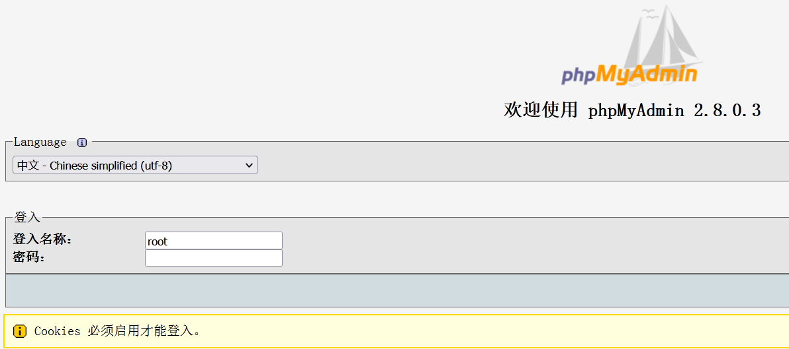
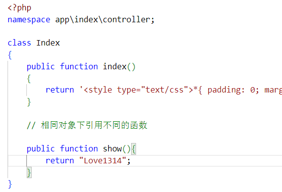

# ThinkPHP5或无框架变量覆盖与反序列化


## Metinfo-无框架-变量覆盖-自动审计或搜索

### 自动审计

1. 进入靶场

   
   
   点击自动审计，可以结合来fortify进行审计，这里发现疑似变量覆盖漏洞，对于漏洞的筛选，最好是在程序的配置性文件中，因为很多函数执行时，都会调用配置性文件。
   
   
   
   变量覆盖漏洞的函数`extract()`；`parse_str()`；`import`；`request`；`variables()`；`$$`等
   
   全局搜索`$$`时，发现很多选项，优先看配置文件。
   
   
   
   查找到`$$`出现的位置。
   
   `foreach`函数：遍历给定的数组。每次循环中，当前单元的值被赋给 $value 并且数组内部的指针向前移一步（因此下一次循环中将会得到下一个单元）。
   
   这里相当于两个循环的`for`循环，第一个`request`分别循环三种传参方法
   
   第二个循环，当前单元的键名也会在每次循环中被赋给变量`$key`（也就是循环的序号），`value`为接受的数组的遍历值然后再将`value`的值过滤后赋值给$_key(之前的变量key)
   
   总之，就是通过get，post，cookie接受数据，进行变量覆盖。
   
   所以：
   
   这个代码段的含义：三种方式传参的值都可以接受，比如这里`GET`接受`test`
   
   `foreach($_GET as $_key=>$_value)`
   
   `get`传参`test=111`，相当于数组`{"test":"111"}`
   
   那么`$_key=test;$_value=111`，而`$_value`的过滤类似于魔术引号的过滤，加`//`只对注入防范有用，这里对1314不起作用
   
   这里就会将`$test=$_value=1314`
   
   
   
   查看哪里包含了common.inc.php文件（发现包括首页等等都包括了该文件）
   
   
   
   在`index.php`写入测试语句，并且首页查看（这里在首页没有查看到）
   
   注意：首页的代码不是在index里面，而是执行的包含文件：template里面的前端页面。
   
   
   
   也就是说在包含文件的HTML文件里面修改才行。
   
   
   
   由于index.HTML被index.php包含执行，要在前端显示，就修改HTML文件，输出变量test和上面的数组index。
   
   
   
   查看源代码发现index数组被输出，test变量没有输出
   
   test变量没有输出的原因是：index.html被包含执行在test变量赋值的前面，对于HTML来说，test变量并没有被赋值。
   
   
   
   将`test`变量放到包含文件`template`的上方，在`index.html`文件中写入：`echo $test;`
   
   
   
   
   
   发现首页有输出。
   
   
   
   get传参变量test=1314。
   
   
   
   注意：在`index.php`文件中，`test`变量的赋值一定要在包含文件`common.inc.php`的上方，不然`test`变量的值不会改变。
   
   总结：在`index`文件包含`common.inc.php`文件，传参就会执行`common.inc.php`文件中变量覆盖漏洞，进而改变了原有变量的值。

### 文件包含

例如：`include $filename;`我们将`$filename`覆盖掉，覆盖为我们上传的包含一句话的JPG图片，让图片以PHP的格式执行，或者txt文件，让其以php的格式运行。

条件：存在文件包含（要找那种包含的变量的文件），存在变量覆盖文件（要包含`common.inc.php`文件）

搜索文件包含漏洞的关键函数：`include`，`include_once`，`require require_once` 等。


比如，这里只有变量，但是没有包含`变量覆盖漏洞`的文件就不行（但是也不一定，因为说不定module.php包含了common.inc.php，或者它包含的文件包含了common.inc.php等等） 


打开modul文件查看，发现包含了`common.inc.php`。


由于这个CMS网站没有文件上传的地方，就直接在about目录下创建`1314.txt`。


查看原来`module`的赋值条件。

通过判断`fmofule`的值，当`fmofule=7`并且变量`list`为空时，`module`就等于`$modulefname[$mdle][$mdtp]`

这里我们只需要确定`module`有赋值，然后我们去覆盖他就行，不用确定`module`的值。


访问存在文件包含漏洞的目录`about/index.php`。

传递参数构造`payload`：`http://localhost/page/metinfo/about/index.php?fmodule=7&module=1314.txt`。


如果`fmodule=5`，发现不能访问，这里的原因是要判定在`mdle=2,3,4,5,6`；`fmudule==mdle`，如果不想等的话，就会跳转404，就比较麻烦。


## phpmydmin-无框架-反序列化

进入靶场



搜索反序列化关键函数：`serialize()`，`unserialize()`，`__construct`， `__destruct` 等，发现两处。


传参数不为空，并且变量`action`不等于`clear`，就调用反序列化函数。


 反序列化时，会促发的魔术方法（在对象里面的方法）

### 反序列化关键字

```php
__wakeup() // 使用 unserialize 时触发
__sleep() // 使用 serialize 时触发
__destruct() // 对象被销毁时触发
__call() // 在对象上下文中调用不可访问的方法时触发
__callStatic() // 在静态上下文中调用不可访问的方法时触发
__get() // 用于从不可访问的属性读取数据
__set() // 用于将数据写入不可访问的属性
__isset() // 在不可访问的属性上调用 isset()或 empty()触发
__unset() // 在不可访问的属性上使用 unset()时触发
__toString() // 把类当作字符串使用时触发
__invoke() // 当脚本尝试将对象调用为函数时触发
```

查找反序列的对象。


找到这个类的定义


使用`unserialize`时触发`__wakeup()`方法，在这个类中里面搜索`__wakeup`（对于对象的创建和销毁也会触发）

简单分析：

getSource获取配置，filemtime() 函数返回文件内容的上次修改时间。若成功，以`Unix`时间戳形式返回文件内容的上次修改时间。如果失败，则返回 FALSE。这里是检测源码的目前时间和返回的时间戳不等。（或者是默认源码的修改）

在满足这几个条件中的一个之后，将setting变量赋值为一个数组，加载load和checkSystem方法。


load方法，根据判断`file_get_contents`是否存在来进行代码执行，`file_get_contents()`将整个文件读取为字符串。


trim() 函数移除字符串两侧的空白字符或其他预定义字符。


implode() 函数返回由数组元素组合成的字符串。

因此，这里是执行getSource的配置文件代码。

getSource是返回目前的配置文件。


总结：

调用反序列函数，会调用创建对象的类中的wakeup方法，进而调用代码执行getSource（注意：这个getSource是对象的方法）

因此，我们要利用这个漏洞有两点：

1. 满足调用反序列化函数的条件
2. 满足`__wakeup`方法里面`load`的条件（从这里构造payload）

查看本来的`getSource()`的值是多少，输出`getSource()`方法。


构造`payload`调用反序列化，要求`configuration`和`action`变量，而这两个变量都是`post`传参的值。

`unserialize`会对`configuration`反序列化，因此`configuration`变量的参数是序列化之后的东西。


根据PHP反序列化构造Payload：`action=test&configuration=O:10:"PMA_Config":1:{s:6:"source",s:11:"c:/1314.txt";}`。

只有`configuration`是传递反序列化数据的参数。

在原本的类中，`source`默认为空，这里调用反序列化之后，会给`source`赋值，`source= c:/1314.txt`，`getSource`会返回`source`给`s`,然后打印输出。


根据以上的Payload进行访问，成功。


## Thinkphp5-有框架-搭建使用入口访问调试SQL

### ThinkPHP的目录结构


其中的application是应用的目录


### THinkPHP的入口文件

入口文件主要完成：

- 定义框架路径、项目路径（可选）
- 定义系统相关常量（可选）
- 载入框架入口文件（必须）

应用入口文件位于`public/index.php`中。

应用目录在application目录下，并且包含thinkphp目录下的代码

这段代码的作用就是定义应用目录APP_PATH和加载ThinkPHP框架的入口文件。

```php
// 定义应用目录
define('APP_PATH', __DIR__ . '/../application/');
// 加载框架引导文件
require __DIR__ . '/../thinkphp/start.php';
```

首页加载的文件是在application目录下的。


打开ThinkPHP框架的首页。


### url访问的方法

`http://serverName/index.php（或者其它应用入口文件）/模块/控制器/操作/[参数名/参数值...]`

注意：`ThinkPHP5.0`取消了`URL`模式的概念，并且**普通模式的URL访问不再支持**，但参数可以支持普通方式传值，例如：`http://serverName/index.php（或者其它应用入口文件）模块/控制器/操作?参数名=参数值&...`

（比如上面的index.php文件就是：application目录下的index目录（模块），index.php文件（控制器），index()方法（操作）），所以完整的URL就是：`http://localhost/tp5.0/public/index.php/index/index/index`。

### 简易开发测试

在application的index文件里面写入函数



访问show方法，访问这个方法的URL是：`http://localhost/tp5.0/public/index.php/index/index/show`。


自己编写代码，不使用ThinkPHP5的官方写法，创建Test类继承Controller类。

```php
<?php
    namespace app/index\controller;
    use think\Controller;
    use think\Db;

    class Test extends Controller{
        public function sqltest(){
            echo "SQL-Test";
        }

        public function testsqlin(){
            // 自写数据库查询存在注入
            $id = $_GET['x'];
            $sql = "select * from injection.users where id=$id";
            echo $sql."<br>";
            $conn = mysqli_connect("127.0.0.1","root","root");
            $result = mysqli_query($conn, $sql);
            if (mysqli_num_rows($result) > 0) {
                // 输出数据
                while($row = mysqli_fetch_assoc($result)) {
                    echo "id: " . $row["id"]. " name: " . $row["name"]. " password: " . $row["password"]. "<br>";
                }
            }
            mysqli_close($conn);
        }

    }
?>
```

访问该文件。


ThinkPHP5框架自带的查询语句，这是官方的写法是有过滤的，要使用官方的ThinkPHP写法，要先配置数据库配置文件。


```php
public function thinksqlin(){
	$id = $_GET['x'];
    // 使用官方的写法
    $result = Db::table("users") -> where('id',$id)->find();
    var_dump($result);
}
```

有了运行结果，打开数据库监控，发现没有监控到SQL语句的执行。


开启调试模式。


同时也要开启数据库的调试模式。


访问浏览器，发现SQL查询语句被执行。


进行注入尝试，发现没有注入成功（存在自带过滤）。


### 总结

如果发现ThinkPHP框架，可能存在以下思路：

如果按照ThinkPHP官方去写，就是ThinkPHP的框架漏洞。

如果虽然存在ThinkPHP框架，但是没有利用框架，就是常规的审计思路。

对一个Thinkphp框架源码审计，可以搜索select，看看有没有按照thinkphp框架的要求，去写SQL语句（也可以是insert，update等等）。

##  Thinkphp的版本查看

通过url的报错查看ThinkPHP的版本。


readme文件查看（在thinkphp目录下也存在readme文件）。


## thinkPHP的框架漏洞利用

1. 利用工具如thinkphpgetshell

2. 查看网上的历史版本的漏洞
