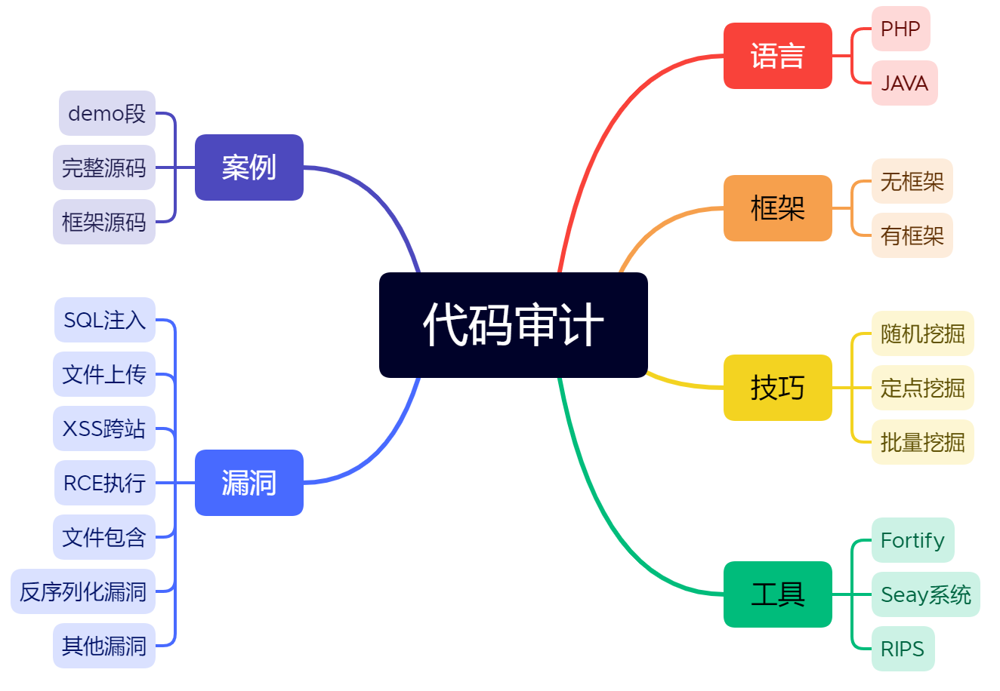

# 无框架PHP代码审计



## 挖掘思路总结

### 定点挖掘关键字总结

1. 可控变量，变量接受get，post，request传参（这里可以是数据库查询的id，切换用户的uid，也可以是切换的文件filename（文件下载，文件包含，文件删除等等），也可以是网页翻页的页码等等（这里通常是base64加密，或者以XML格式，wsdl传输类型等等，或者需要抓包才能发现） 
2. 特定函数：
   1. 输出print/echo；
   2. 数据库操作；
   3. 代码/命令执行；
   4. 文件包含/下载/删除等等
3. 代码审计方法：搜索特定的关键字寻找特定的漏洞。
   1. 如搜索echo/print寻找XSS漏洞
   2. 搜索eval寻找代码执行漏洞
   3. 搜索$_ GET $_ POST尝试挖掘的就是安全漏洞 
   4. `select`，`insert`，`update`，`sql执行语句`，寻找sql注漏洞

### 定点挖掘功能点总结

如果我需要挖掘文件上传漏洞，就在（会员中心，个人头像设置）的功能位置，抓包分析找到源码中特定的文件代码段，进行文件上传代码段挖掘

### 拓展（视漏洞而定进行挖掘）

在挖掘SQL注入，进行数据库监控，监控当前页面和数据库交互过程（当前页面刷新执行的SQL语句）

断点调试：访问页面对应代码进行断点调试（执行过程的先后顺序，调用文件列表等）


## 简易SQL注入代码段分析挖掘思路

首先包含数据库配置文件

```php
<?php
// including the Mysql connect parameters.
// 包含数据库配置文件，在执行之前先连接数据库
include("../sql-connections/sql-connect.php");
// 关闭所有PHP错误报告
error_reporting(0);
```

在SQL-connect.php文件中，先包含db-creds.inc(也就是配置文件，里面包含数据库的端口，密码，数据库名等等) 

```php
<?php
//including the Mysql connect parameters.
include("../sql-connections/db-creds.inc");
```

然后尝试连接本地数据库

```php
@$con = mysql_connect($host,$dbuser,$dbpass);
```

如果没连上，就输出MySQL连接错误和MySQL的连接报错

切换到连接的数据库中所需要的数据库名（@在PHP中用作错误控制操作符。当表达式附加@符号时，将忽略该表达式可能生成的错误消息），或者输出连接数据库错误

```php
// Check connection
if (!$con)
{
    echo "Failed to connect to MySQL: " . mysql_error();
}
@mysql_select_db($dbname,$con) or die ( "Unable to connect to the database: $dbname");
```

get传参，不为空就赋值给变量id，然后在文件中写入ID:变量id

```php
if(isset($_GET['id']))
{
$id=$_GET['id'];
```

进行数据库查询语句查询（根据id查询用户名），将执行的结构赋值给result

mysql_fetch_array() 从结果集中取得一行作为关联数组，除了将数据以数字索引方式储存在数组中之外，还可以将数据作为关联索引储存，用字段名作为键名。    

输出返回的键值对的的值

```php
$sql="SELECT * FROM users WHERE id=$id LIMIT 0,1";

$result=mysql_query($sql);
$row = mysql_fetch_array($result);
if($row)
	{
  	echo "<font size='5' color= '#99FF00'>";
  	echo 'Your Login name:'. $row['username'];
  	echo "<br>";
  	echo 'Your Password:' .$row['password'];
  	echo "</font>";
  	}
	else 
	{
	echo '<font color= "#FFFF00">';
	print_r(mysql_error());
	echo "</font>";  
	}
}
```

## 实例

### QQ业务图标点亮系统挖掘-数据库监控追踪

进入靶场


查找关键字select（全局搜索），这里没有搜索到单纯的select关键字，而是将select封装成类名的形式，或者写入函数（所以有些搜索不到）


注意不要区分大小写，这里要筛选的是传递的参数是变量的语句，也就是不要写死了的查询语句，找到有变量的语句，这里有三条语句。


点击查看第一条语句（这里进行数据的查询语句，并且`sj`函数返回的值为`mysql_fetch_array()`，而这个函数是`mysql_fetch_row()` 的扩展版本。除了将数据以数字索引方式储存在数组中之外，还可以将数据作为关联索引储存，用字段名作为键名。

这里的function.php全部是定义的函数方法的集合，本身并没有调用函数 


对ywX进行全局搜索，看在哪里调用这个函数（这里有两个文件调用了，在function.php和v144.php，function.php就是刚才的文件，可以先不看，点击调用了函数又传参的）


查看v144.php文件，这里是通过判断get的id差数据表，然后返回的值来执行相应的步骤


网页访问v144.php，发现不能直接访问，应该有验证。


发现验证代码（这里是检验的代码）

`in_array()` 函数搜索数组中是否存在指定的值，查询域名是否在`sohuquan`里面。

`$_SERVER['HTTP_HOST']`为获取当前访问的域名，`array()`是创建一个数组

`$_SERVER["HTTP_REFERER"]`获取来源的网站，这里也就是说，如果来源的网站不是在这个`HTTP_HOST`域名内，就不允许访问

这里是取的url的`/`分隔成数组去掉`http://`的第一部分，如`http://127.0.0.1:8888/php/v144.php`，就是1`27.0.0.1:8888`


修改logo的超链接（点击淡然点图标系统就会跳转目的网站）


这里抓包修改referer也可以，这里的跳转不是原网站的直接跳转，而是点击原网站的超链接才会有referer的记录，如果要用SQLmap跑的话，需要自定义数据包的header中的referer。


通过对`v144.php`文件的源代码进行分析，发现可以构造传参的值，`api=ok&id=1&p=1&u=1`。

```php
if($_GET['api']=="ok"){
    
 if($_GET['u']=="" || $_GET['p']=="" || $_GET['id']==""){
    
    EXIT("请输入完整");
    
}
```

发现SQL语句被执行（而且yWx($ID)函数被执行了三次），而且id是变量，因此存在注入点。


查看数据库的yw表，存在id,m,areaId,goodstId,x五个列。


进一步查看（这里是无回显的注入，可以测试盲注）


使用延迟来测试（应为被执行了三次，延迟了三秒多，可以确认存在注入点） 


### 74CMS人才招聘系统挖掘

源码自带过滤机制，规模，优秀的CMS对传递的参数都有过滤机制。


过滤机制查找（一般在common的文件中，因为每个传参的地方都需要引用）

这里在include/common.inc.php文件中，都使用了addslashes_deep过滤

传统的过滤函数addslashes()返回在预定义字符之前添加反斜杠的字符串

预定义字符是：

- 单引号（'）
- 双引号（"）
- 反斜杠（\）
- NULL

提示：该函数可用于为存储在数据库中的字符串以及数据库查询语句准备字符串。

随意打开一个文件，都发现包含common.inc.php文件，只要传参，都会有过滤（不为空，转义） 

```php
if (!empty($_GET))
{
    $_GET  = addslashes_deep($_GET);
}
if (!empty($_POST))
{
	$_POST = addslashes_deep($_POST);
}
$_COOKIE   = addslashes_deep($_COOKIE);
$_REQUEST  = addslashes_deep($_REQUEST);
```

`addslashes_deep()`函数在include/common.fun.php文件中定义。

addslashes_deep过滤，回调函数addslashes时，只对数据的值进行转义，所以如果使用者在此过程中引用数组的键进行特定处理时，存在`$key`注入风险。addslashes_deep函数，使其同时对键值进行转义，或者使用时明确不引用键内容。

1. 先判断addslashes_deep函数，先判断不为空

2. 再判断魔术引号开没开，如果没打开，就用addslashes过滤，在套用mystrip_tags过滤一次，如果开了，就直接调用strip_tags()函数，mystrip_tags函数的过滤（替代关键字）

strip_tags()函数尝试返回给定的字符串 str 去除空字符、HTML 和 PHP 标记后的结果。它使用与函数 fgetss() 一样的机制去除标记。

```php
function addslashes_deep($value)
{
    if (empty($value))
    {
        return $value;
    }
    else
    {
		if (!get_magic_quotes_gpc())
		{
        // array_map()：返回数组每个元素应用callback函数之后的数组。
        // array_map()将$value传递给addslashes_deep()函数,这个函数是callback函数
		$value=is_array($value) ? array_map('addslashes_deep', $value) : mystrip_tags(addslashes($value));
		}
		else
		{
		$value=is_array($value) ? array_map('addslashes_deep', $value) : mystrip_tags($value);
		}
		return $value;
    }
}
function mystrip_tags($string)
{
	$string = str_replace(array('&amp;', '&quot;', '&lt;', '&gt;'), array('&', '"', '<', '>'), $string);
	$string = strip_tags($string);
	return $string;
}
```

如果魔术引号开启，这里就变成了绕过魔术引号的注入，如何绕过魔术引号：

1. 宽字节注入
2. 二次注入

二次注入原理（条件：必须要insert和update）：

注册用户：insert name union select'，

过滤name union select /',

进入数据库还原为name union select'来绕过转义注入和魔术引号

修改用户：update name union select' 条件=用户名是谁xiaodi ' union select update注入


有了上面的知识，只有找到了insert和update出现的地方，才有可能存在注入。

根据个人中心的功能点，发现可能存在二次注入有两个地方

一是创建建立和更新建立；二是创建账号和修改个人资料，但是个人资料只能修改密码无法修改用户名，因此排除2选择1


开启MySQL监控，填写建立的基本信息后查看

此时数据库的语句，虽然满足二次注入的条件，先插入后更新，但是此时更新的语句不符合（和我们填写的数据无关）


查找到对应的跳转代码


那么继续。

填完基本信息之后，下一步，根据填写简历界面url，打开看文件，搜索make2，找到对应的代码


打开对应的页面


对数据库进行监控，填写的选项被数字代替了（我们无法改变），继续。


进入到第三步


更新，发现此时我们填写的数据，在查询语句中。但是还是不符合二次注入条件

只更新，没有插入！

我们必须要找到

- 变量可控
- 插入数据   更新数据


继续填写信息


跟踪数据库


发现有插入和更新，且我们填写的数据在语句中。

那么就开始绕过，继续添加信息，保存。

payload（fullname 是被反引号括起来的）

```
aa',`fullname`=user()#
```


相应的代码如下：


修改教育经历的代码：


更新数据库监控，可以看到，插入语句中  `aa'`  是被转义了，更新语句没有被转意


返回查看简历，可以看到注入成功了。


