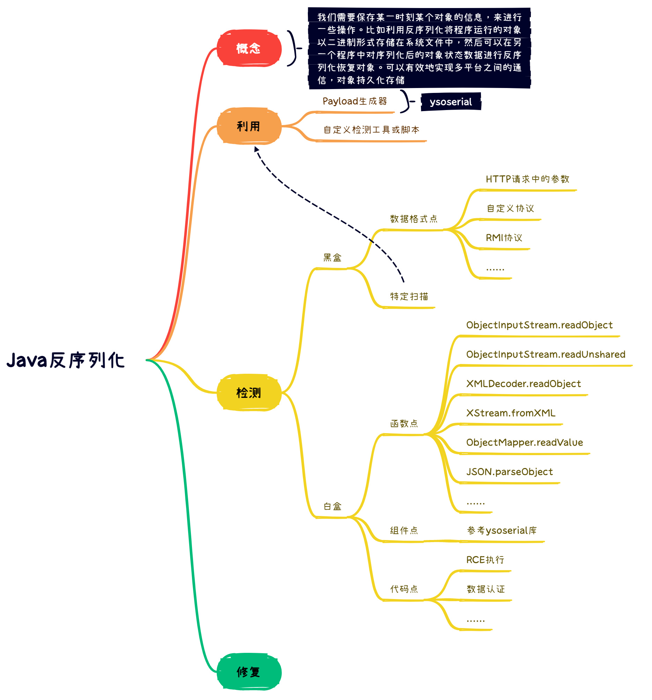

# JAVA反序列话漏洞



## 序列化

序列化 (Serialization)：将对象的状态信息转换为可以存储或传输的形式的过程。在序列化期间，对象将其当前状态写入到临时或持久性存储区。

## 反序列化

反序列化：从存储区中读取该数据，并将其还原为对象的过程，称为反序列化。

## Java中的API实现

位置： `Java.io.ObjectOutputStream`，`java.io.ObjectlnputStream`

```java
序列化：ObjectOutputStream类->write0bject()
注：该方法对参数指定的obj对象进行序列化，把字节序列写到一个目标输出流中按Java的标准约定是给文件一个.ser扩展名
```

```java
反序列化：ObjectInputStream类->read0bject()
注:该方法从一个源输入流中读取字节序列,再把它们反序列化为一个对象,并将其返回。
```


