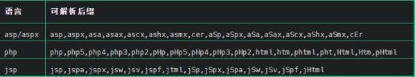

# 安全狗绕过文件上传

上传参数名解析：明确哪些东西能修改？

```http
Content-Disposition：一般可更改
name：表单参数值，不能更改
filename：文件名，可以更改
Content-Type：文件 MIME，视情况更改
```

## 常见绕过方法

### 符号变异

`'` 与`"`可以在HTTP数据包中进行相互的转换，不对其引号进行闭合，即可绕过。


### 数据截断

`%00`截断或者换行都可以绕过安全狗。

这种方法与分块传输的方式十分的相似。


## 文件上传安全修复方案

后端验证：采用服务端验证模式

后缀检测：基于黑名单，白名单过滤

MIME 检测：基于上传自带类型检测

内容检测：文件头，完整性检测

自带函数过滤：参考 uploadlabs 函数

自定义函数过滤：function check_file()


