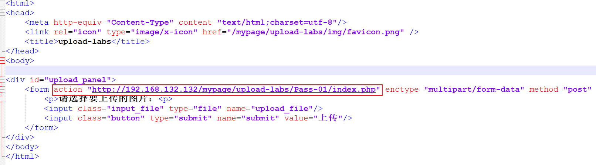

# 文件上传基础以及过滤

上传的文件的时候，可以上传不同的文件，通过在文件中写入不同的语言脚本，让服务器去执行，进而可以获取网站执行的webshell。也就是说通过文件上传可以拿到webshell

虽然说SQL注入也可以写文件，但是一般是获取数据库的数据。

文件上传的危害比较大。直接控制服务器。可以直接拿到权限，服务器提权，内网权限

进入后台，不一定拿到网站权限，后台拿Webshell，才相当于拿到网站权限

## 文件上传路径如何查找以及判断？

1. 黑盒测试：

   不知道相应的网站的信息，需要自己去寻找，比如：目录扫描，或者浏览器搜索，上传图片等等。

2. 白盒测试：

   代码分析。查找相应代码分析除出文件上传的地方以及相应的漏洞。

## 补充

本地JS是无法抓包的，因为服务端没有给相应，就没有数据的通信，所以无法抓包。

对于JavaScript验证的文件格式的有两种处理办法。

1. 在浏览器中禁用JavaScript然后上传，但是这个有一个问题，就是如果说这个JS还执行的有其他操作，那么这个JS禁用后，其他的操作也会错误。

2. 使用BurpSuite抓包，然后将jpg之类的后缀，修改为php之类的脚本后缀，但是这种可能抓不到数据包，如果说这个网站是纯JS写的上传与保存你就抓不到数据包。

3. 将网站的代码保存为一个html文件，在form表单中写入属性`action`，将值修改为对应的网页服务器的本来的上传地址（在网络中进行查看），然后删除相应的JavaScript就可以实现绕过了。

   

注意：

对文件上传按照上传图片进行分析，你上传的是jpg，那么你看到的就是jpg文件，你是php文件，你看到的就是php文件，如果你想jpg解析为php需要配合文件解析漏洞。

在没有解析漏洞的时候，上传什么格式就是解析什么格式，运行什么脚本，图片就是图片。

因为有解析漏洞的存在有时候导致你上传图片也会解析为相应的脚本。

文件上传不仅仅会受到相应代码上的过滤，也会收到相应漏洞的影响。

## 文件上传的基本方法

文件上传，不仅仅可以存在在代码层面，也有中间件的漏洞，例如CVE，代码问题是代码，中间件是中间件，CMS的问题，编辑器的问题。

### 判断编辑器

如何判断对方使用的是什么编辑器？

1. 目录扫描，看编辑器指纹。
2. 进入网站后台查看。

常见的编辑器有`fckeditor`，`ewebeditor`，`ckeditor`，等等。详情查看编辑器漏洞手册。
