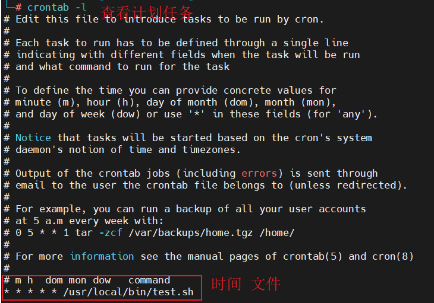
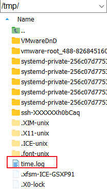

# Linux计划任务

设置计划任务

```bash
crontab -e # 设置计划任务,通过编辑vim来设置。
crontab -l # 查看计划任务
```



计划任务的时间设置。

```
*    *    *    *    *
-    -    -    -    -
|    |    |    |    |
|    |    |    |    +----- 星期中星期几 (0 - 6) (星期天 为0)
|    |    |    +---------- 月份 (1 - 12) 
|    |    +--------------- 一个月中的第几天 (1 - 31)
|    +-------------------- 小时 (0 - 23)
+------------------------- 分钟 (0 - 59)
```

