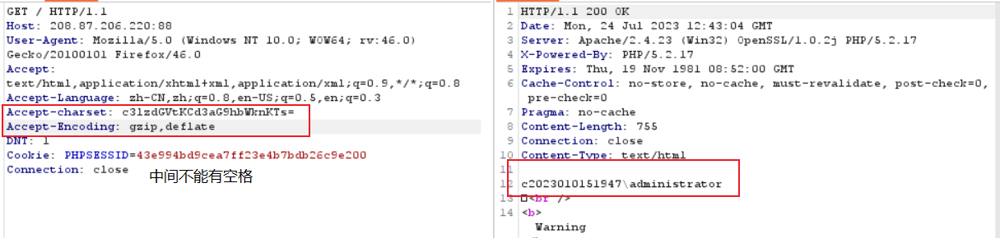

# 网站后台权限获取

## 基础知识

**权限提升的意义：**

相关的操作被拒绝无法实现的时候就会涉及到权限提升。

**具体的权限，与对应提升的方法**

后台权限，网站权限，数据库权限，接口权限，系统权限，域控权限等

1. 后台权限：

   获取方式：爆破，注入猜解，弱口令等获取的账号密码配合登录

   一般网站或应用后台只能操作应用的界面内容，数据，图片等信息，无法操作程序的源代码或服务器上的资源文件等。（如后台功能存在文件操作的话也可以操作文件数据）

2. 网站权限：

   获取方式：爆破，注入猜解，弱口令等获取的账号密码配合登录

   查看或修改程序源代码，可以进行网站或应用的配置文件读取（接口配置信息，数据库配置信息等），还能收集服务器操作系统相关的信息，为后续系统提权做准备。

3. 数据库权限：

   获取方式：源码或配置文件泄露，也可能是网站权限webshell进行的数据库配置文件读取获得。

   操作数据库的权限，数据库的增删改等

4. 接口权限：

   获取方式：（邮件，短信，支付，第三方登录等）

   后台或网站权限的获取途径：后台（修改配置信息功能点），网站权限（查看的配置文件获取），具体可以操作的事情有很多。

## 实战

### 站帮主CMS

进入靶场

源代码搜索文件上传的函数`upload`。

配合业务功能进行抓包测试（在栏目发布这里发现上传图片的地方）

上传图片后抓包。

查看源代码。

查看post的数据包，发现了文件上传的数据包，并且找到了上传的路径。

打开这个路径，发现上传成功。

打开文件

注：上传文件的时候，可以将参数filename=1，就不会更改命名。

当然，在模板中心也可以上传文件。

总结从后台获取权限的思路：

1. 如果知道是CMS的程序，可以下载源代码，并且在网上搜已知漏洞

   CMS程序的识别：页面的页脚，网站上的CMS识别，关键url，进入管理员后台（有些页脚隐藏了CMS）

2. 查看后台的功能，如内容的发布可能会有文件上传漏洞，头像更改，模板管理可以直接上传文件，或者写入代码，后台文件的读取，SQL的执行，网站的备份，敏感文件的读取，组合其它漏洞进行利用（功能越多，成功的几率越大）

### PHPStudy中间件权限提升

进入靶场，通过fofa寻找一个`Server: Apache/2.4.23 (Win32) OpenSSL/1.0.2j PHP/5.2.17`，这个是PHPStudy的一个标识。

抓取数据包，查看中间件。

构造数据包访问（注意：要有PHP文件指向才行），在网上寻找资料。

找到Payload：`Accept-charset: c3lzdGVtKCd3aG9hbWknKTs=`，其中`c3lzdGVtKCd3aG9hbWknKTs=`是`system('whoami');`的`base64`编码，这个payload也可以写成`echo system('whoami');`的`base64`编码。

### GlassFish中间件

通过Fofa等搜索引擎去搜索。

`java`语言中会把`%c0%ae`解析为`\uC0AE`，最后转义为`ASCCII`字符的`.`（点）。利用`%c0%ae%c0%ae/%c0%ae%c0%ae/%c0%ae%c0%ae/`来向上跳转，达到目录穿越、任意文件读取的效果。

构造payload：`https://your-ip:4848/theme/META-INF/%c0%ae%c0%ae/%c0%ae%c0%ae/%c0%ae%c0%ae/%c0%ae%c0%ae/%c0%ae%c0%ae/%c0%ae%c0%ae/%c0%ae%c0%ae/%c0%ae%c0%ae/%c0%ae%c0%ae/%c0%ae%c0%ae/etc/passwd`

这里可以读取文件，为后续文件进行铺垫。

## 总结

漏洞产生的原因多层面：操作系统，中间件，网站，后台，数据库，第三方插件等等

内网渗透中主机权限的获取：

1. 网站
2. 数据库

