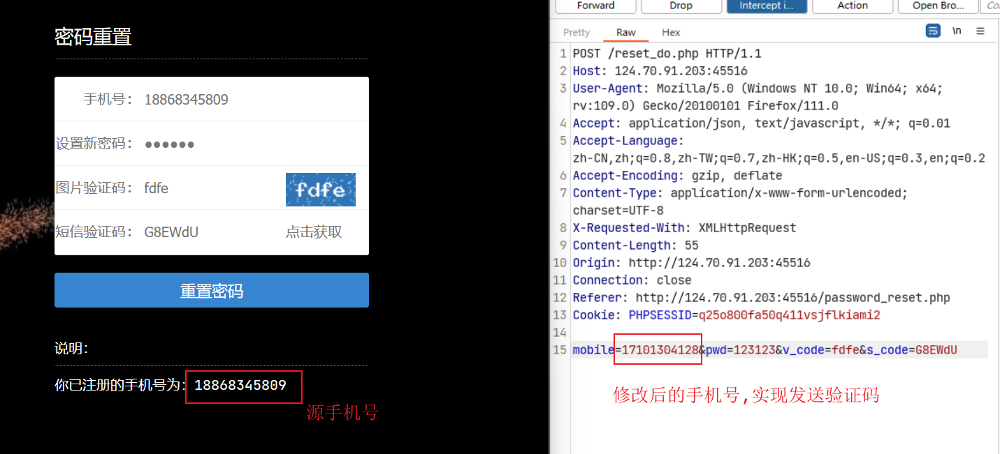

# 找回机制及接口爆破

## 找回重置机制

### 客户端回显

会将验证码在数据包中

### Response 状态值

根据状态值，回显找回密码，类似于本地JS验证，如果是服务器端验证的话，就不能完成。

### 验证码爆破

对可能出现的验证码，进行爆破，如果有图片验证码，验证码每刷新一次页面就会变化等等的，还需要绕过。

### 找回流程绕过

一般密码的找回流程是：

1. 发送验证码

2. 验证

3. 修改密码

步骤1-3，绕过2，直接修改密码。

#### 常见的修改密码方式

第一个页面：输入手机号，验证码

第二个页面：修改密码。

如果说这两个页面放在一个页面上就会有绕过验证码的问题。

## 接口调用乱用

### 短信轰炸

攻击者收集了大量网站发短信的API，只需要输入手机号，就会调用API发送短信。类似与自己注册一样。

### 来电轰炸

与短信轰炸一个道理。