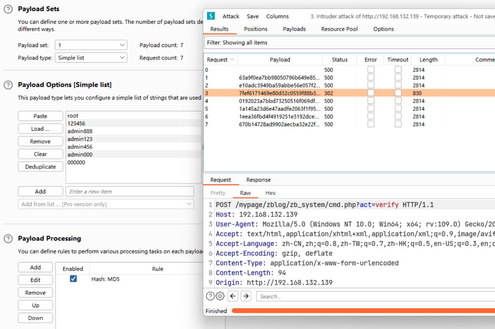
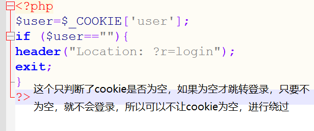
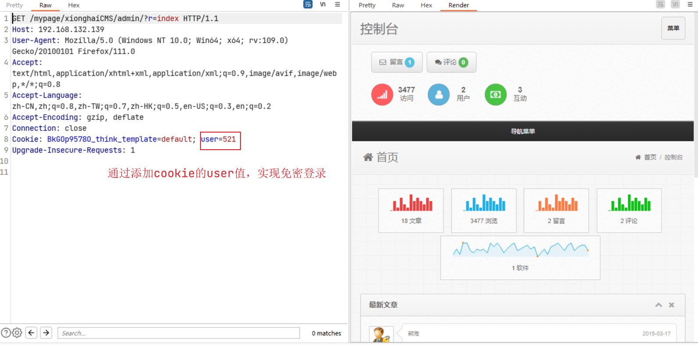

# 支付数据篡改

## 登录应用功能点安全问题

### 登录点暴力破解与HTTP/HTTPS 传输

http与https的区别

http一般情况下是没有加密的，可以直接暴力破解

https在传输数据的过程中一般是密文，如果要暴力破解需要对其字典进行加密后在暴力破解。

https与http是否加密都不是绝对的。http也有可能是对密码加密的，https也有可能对密码不加密。



### Cookie脆弱点验证

对于Cookie没有源码，要找脆弱值，是非常困难的



通过BurpSuite修改数据包，加入任意Cookie，实现免密登录。



## 数据篡改安全问题

### 电商网站的数据修改。

商品购买流程：选择商品和数量-选择支付及配送方式-生成订单编号-订单支付选择-完成支付

常见篡改参数：商品编号ID，购买价格，购买数量，支付方式，订单号，支付状态，商品名字等

常见修改方法：替换支付，重复支付，最小额支付，负数支付，溢出支付，优惠券支付等

修改支付接口，为自己的，实现给自己打钱。

```
index.php?s=/wap/pay/wchatQrcodePay 微信支付
index.php?s=/wap/pay/alipay 支付宝支付
index.php?s=http://www.love.com/alipay 调用其他的支付接口
pay_name=$_GET['s'];
```

### 防范方法

1. 使用token

2. 数据包的唯一性

3. 存储到数据库里，安全的做法：以数据库的数据值为准