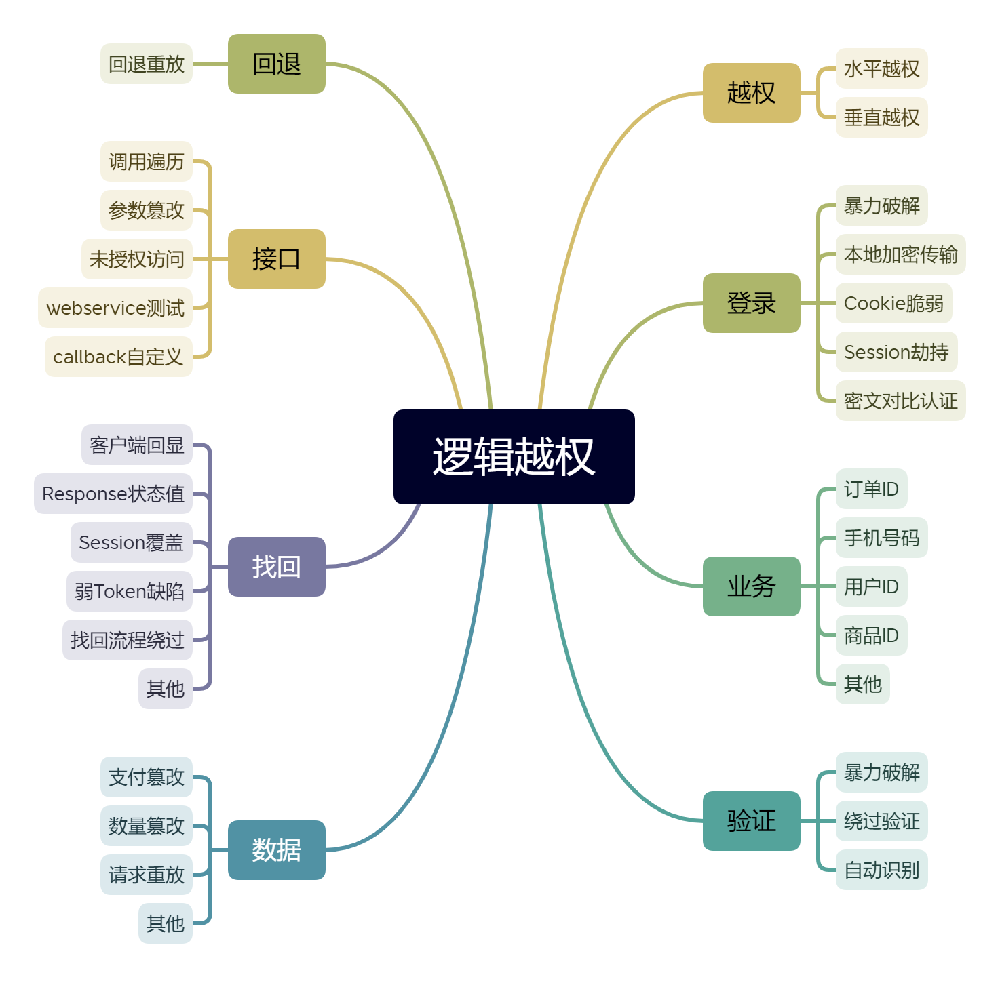
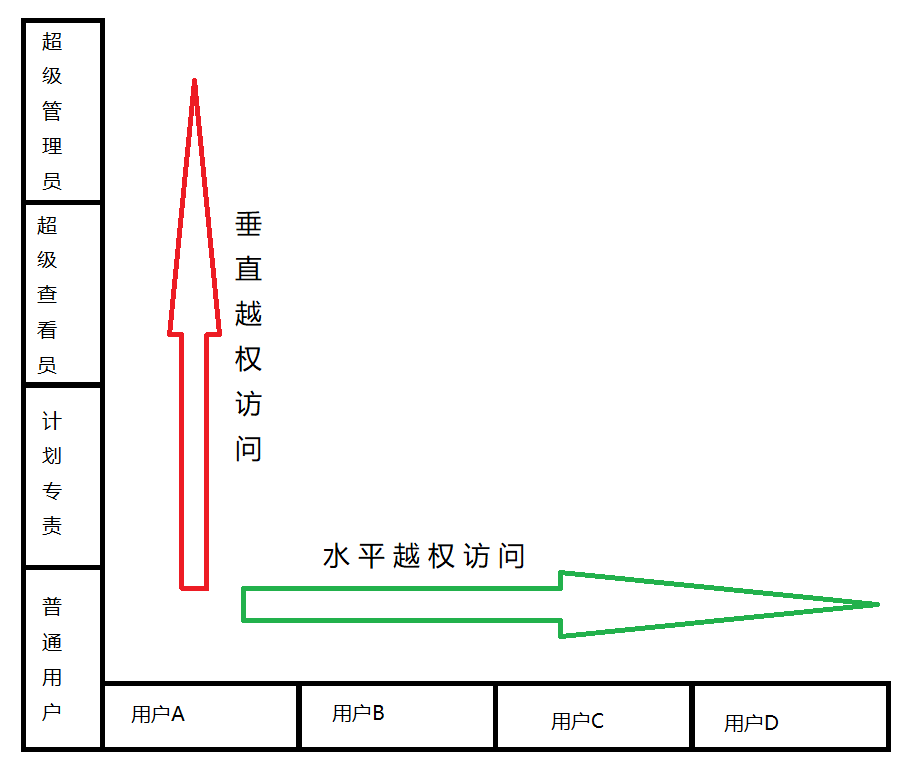
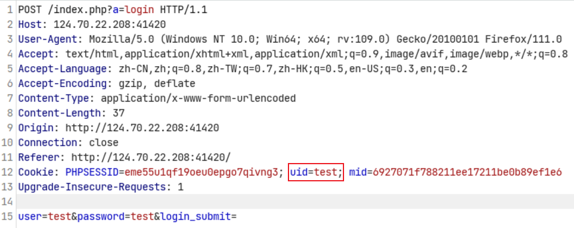
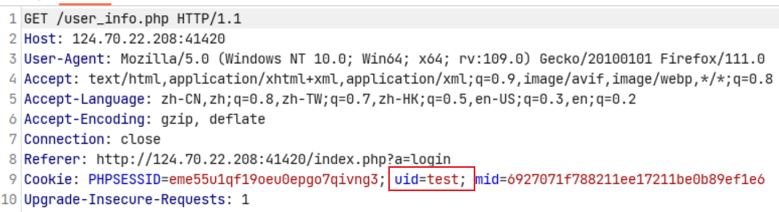
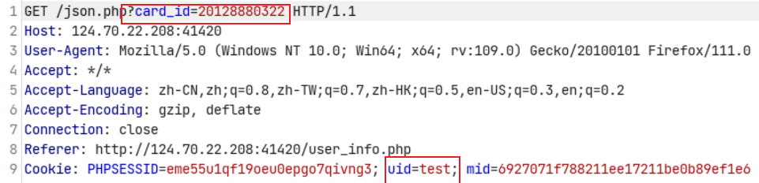
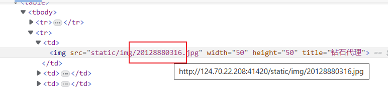
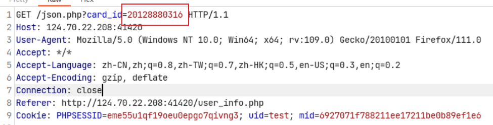
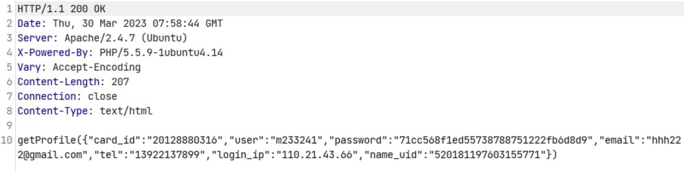

# 水平与垂直越权

## 水平越权

通过更换的某个 ID 之类的身份标识，从而使 A 账号获取（修改、删除等）B 账号数据。

## 垂直越权

使用低权限身份的账号，发送高权限账号才能有的请求，获得其高权限的操作。

### 添加用户

前提条件：获取添加用户的数据包

怎么来的数据包？

1. 普通用户前端有操作界面可以抓取数据包
2. 通过网站源码本地搭建自己去模拟
3. 忙猜

## 未授权访问

通过删除请求中的认证信息后重放该请求，依旧可以访问或者完成操作。

## 原理

### 前端安全造成

判断用户等级后，代码界面部分进行可选显示

### 后端安全造成

数据库

user表(管理员和普通用户同表)

| id   | username | password | usertype |
| ---- | -------- | -------- | -------- |
| 1    | admin    | 123456   | 1        |
| 2    | user     | 123456   | 2        |

登录用户admin或user时，代码是如何验证这个级别？（usertype 判断，组编号/用户类型编号）

如果在访问数据包中有传输用户的编号、用户组编号或类型编号的时候，那么尝试对这个值进行修

改，就是测试越权漏洞的基本。

## 修复防御方案

1. 前后端同时对用户输入信息进行校验，双重验证机制

2. 调用功能前验证用户是否有权限调用相关功能

3. 执行关键操作前必须验证用户身份，验证用户是否具备操作数据的权限

4. 直接对象引用的加密资源 ID，防止攻击者枚举 ID，敏感数据特殊化处理

5. 永远不要相信来自用户的输入，对于可控参数进行严格的检查与过滤

## 案例

### 身份认证失效漏洞实战

通过抓包分析，uid与我们的登录名是一样的，但是这个uid在本次的关卡中没有太大的关系。

继续发包，我们发现有一个`card_id`是可以进行修改的。

通过查看题目的图片，发现要登录用户的图片的id就是`card_id`，对其进行修改。

获取到相应的服务器相应的数据，拿到`password`，然后对其MD5进行解密，拿到要登陆用户的密码，可以使用用户名和密码登录账户后拿到flag。

