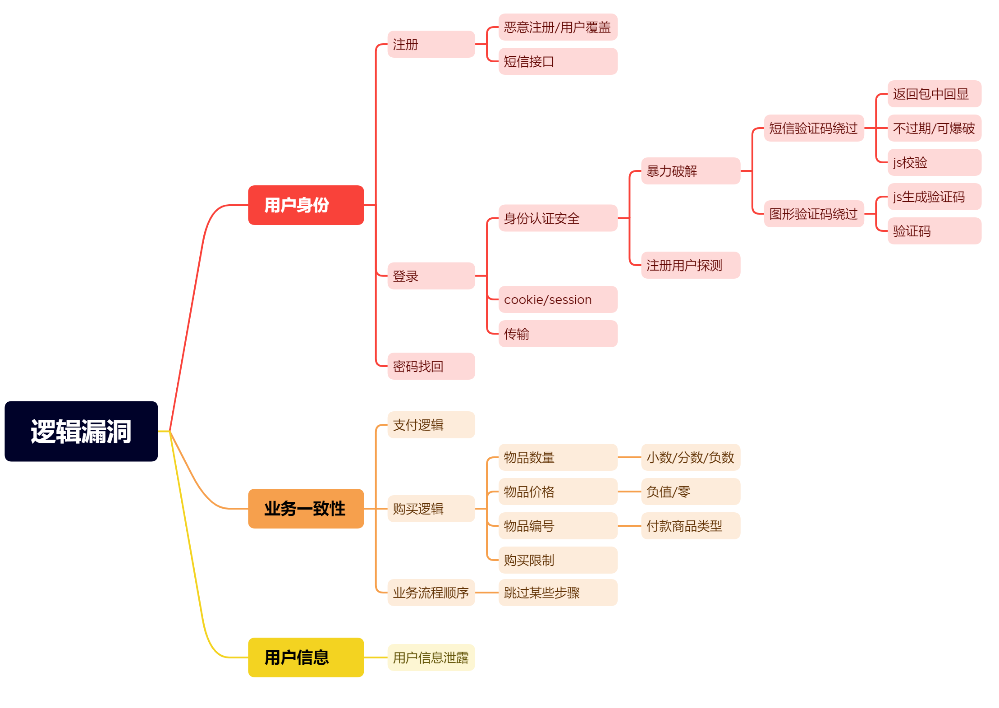

# 验证码与Token及接口




## 验证码安全

分类：图片，手机或邮箱，语音，视频，操作等

原理：验证生成或验证过程中的逻辑问题

危害：账户权限泄漏，短信轰炸，遍历，任意用户操作等

漏洞：客户端回显(已讲)，验证码复用，验证码爆破(已讲)，绕过等

### 服务端验证

服务端可能出现验证码，验证一次的问题，可以利用这个属性，对相应信息进行爆破。

如何判断，发现无论如何修改账号密码都不会是验证码发生改变。

以第一次正确的验证码为基础进行爆破，这是逻辑安全问题。


### 客户端验证

绕过客户端验证码有两种方法：

1. 本地禁用JavaScript

   

2. 通过BurpSuite对服务器相应的抓取，删除相应的JavaScript代码

   

   

## token安全

token存在的意义就是在数据包中验证数据包的唯一性，防止对数据包进行爆破。

token爆破，token客户端回显等

因为token的存在是没有办法爆破的，但是有可能对方会将token回显到浏览器中，我们可以借助这个对token进行爆破。

客户端访问服务器, 服务器返回一个签名的token给客户端, 服务器和客户端各自保存token。

以后每次请求服务器都会携带token

token的主要作用:

1. 防止表单重复提交
2. 身份验证

第一次请求的token是showtime，下一次token也是showtime

### 实例

对数据包进行抓取，拿到Token。


我们发现，服务器给的token就是下一次客户端访问服务器时的token。


我们只需要拿到服务器给的token，就可以对用户名密码进行爆破。使用BurpSuite将数据包发送到Intruder中，然后就按照下面的方式进行选择。


这样就完成了对含有token的网站的爆破。

## 接口安全问题

UID 等遍历

水平越权

```
index.php?uid=21 // 我们可以通过输入不同的uid对不同的用户进行访问，这就实现了水平越权，每一个用户对应了一个不同的uid
```


