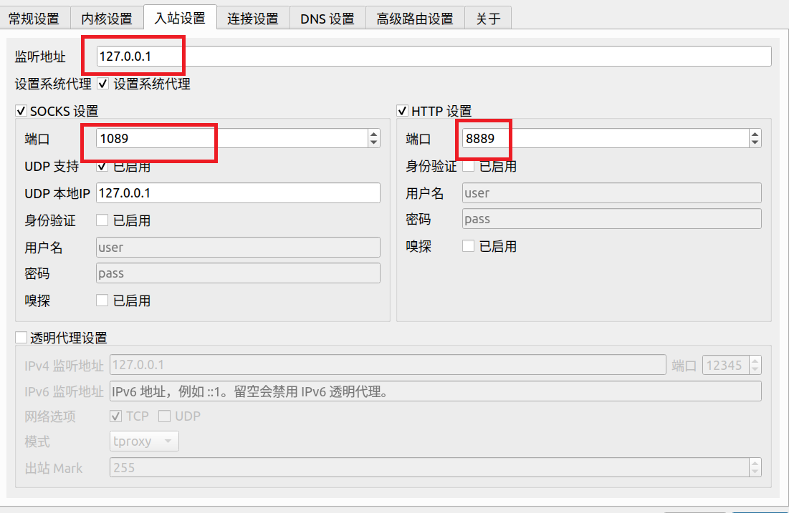

# Linux配置Qv2ray代理

## 下载v2ray-core

下载v2ray-core这是Qv2ray的核心，选择对应的版本，根据Qv2ray的提示放到对应的目录中


https://github.com/v2ray/v2ray-core/releases/

## 下载Qv2ray

安装Qv2ray，找到对应的版本下载即可

https://github.com/Qv2ray/Qv2ray/releases/

### 添加订阅


根据首选项里面的入站设置，去配置系统的网络代理




这样就实现了网络的代理。

## 查看代理的IP地址

在浏览器中输入：http://ipv4.icanhazip.com/

当然也可以使用curl来判断代理的IP地址

但是这只是实现了网络的代理，如果你使用PING命令去PING外网的话，是PING不同的，如何ping，参看下面

## 实现代理PING

下载

```
sudo apt install httping
sudo apt install proxychains
```

修改proxychains的配置文件

```
sudo nvim /etc/proxychains.conf
```

```
# socks4        127.0.0.1 9050 注释掉
http 127.0.0.1 8889 添加上去
```

这时候就不要使用PING命令了

```
proxychains httping www.google.com
```
