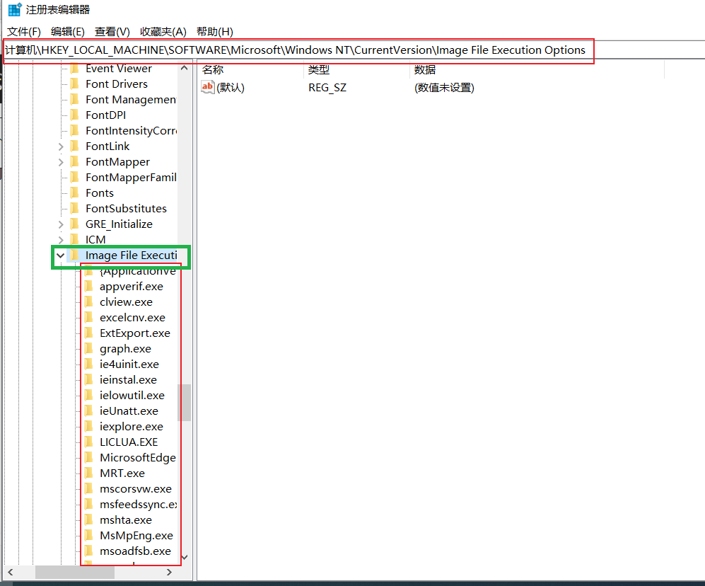
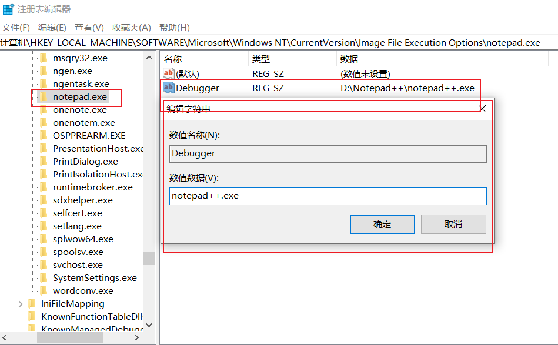

# 镜像劫持

## 映像劫持（IFEO）持久化

通过修改指定注册表项实现程序的劫持，即运行指定程序实际上运行的是我们自己的后门程序。

### 原理

一个程序要被运行时，会先检查注册表，如果有指定程序并且开启了 Debugger，那么会优先执行Debugger指定的程序，这样也就造成了映像劫持。

## 修改注册表实现映像劫持

注册表位置

```
HKEY_LOCAL_MACHINE\SOFTWARE\Microsoft\Windows NT\CurrentVersion\Image File Execution Options
```

打开注册表：`regedit`



这个注册表项有很多以exe文件命名的表项，我们可以通过修改这些表项打到劫持的效果。

也可以自己添加一个指定的exe表项实现劫持。

例如：在这个表中添加一个notepad.exe的项，然后新建字符串值，写入Debugger，数值名称是劫持之后你要运行的程序(这个程序在Windows10中必须在环境变量中，具体为什么是这样我也不清楚，不能写绝对路径)

