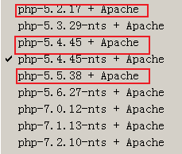
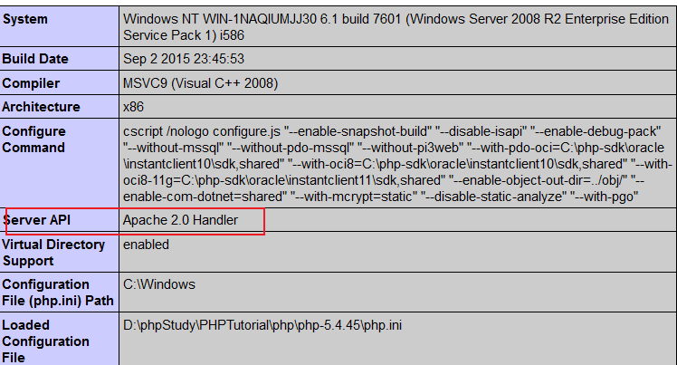

# Apache与PHP的配置

## PHP和apache的关系

目前来说，网站页面主要分为静态页面和动态页面，纯静态页面组成的网站现在相对比较少见，大型网站一般使用的是动态网站建站技术，还有一部分网站是静态网页与动态网页共存。

1. 访问静态网页的过程：

   当用户请求如`https://www.baidu.com/index.html`页面时，Apache服务器收到用户的访问请求后，在它管理的文档目录中找到并打开相应的html文件（如index.html），将文件内容响应给客户端浏览器（即用户）。浏览器收到Web服务器的响应后，接收并下载服务器端的html静态代码，然后浏览器解读代码，最终将网页呈现出来。

2. 访问动态网站的过程：

   当用户请求如`https://www.baidu.com/index.php`动态页面时，Apache服务器本身不能处理php动态语言脚本文件，就寻找并委托PHP应用服务器来处理。Apache服务器将用户请求访问的php文件（如index.php）文件交给PHP应用服务器。PHP应用服务器接收php文件（如index.php），打开并解释php文件，最终翻译成html静态代码，再将html静态代码交还给Apache服务器，Apache服务器将接收到的html静态代码输出到客户端浏览器（即用户）。

### PHP与apache的连接方式

那php和apache如何连接了，这里得看下他们之间的连接方式，方式有以下几种

#### apche2-module

把 php 当做 apache 的一个模块，实际上 php 就相当于 apache 中的一个 dll 或一个 so 文件，即其相当于php内嵌于apache中。

phpstudy 的`非nts`模式就是默认以 module 方式连接的

#### CGI 模式

此时 **php 是一个独立的进程比如 php-cgi.exe，web 服务器也是一个独立的进程比如 apache.exe**，然后当 Web 服务器监听到 HTTP 请求时，会去调用 php-cgi 进程，他们之间通过 cgi 协议，服务器把请求内容转换成 php-cgi 能读懂的协议数据传递给 cgi 进程，cgi 进程拿到内容就会去解析对应 php 文件，得到的返回结果在返回给 web 服务器，最后 web 服务器返回到客户端，但随着网络技术的发展，CGI 方式的缺点也越来越突出。每次客户端请求都需要建立和销毁进程。因为 HTTP 要生成一个动态页面，系统就必须启动一个新的进程以运行 CGI 程序，不断地 fork 是一项很消耗时间和资源的工作

#### FastCGI 模式

此时php和apache也都是一个独立的进程。fastcgi 本身还是一个协议，在 cgi 协议上进行了一些优化，众所周知，CGI 进程的反复加载是 CGI 性能低下的主要原因，如果 CGI 解释器保持在内存中 并接受 FastCGI 进程管理器调度，则可以提供良好的性能、伸缩性、Fail-Over 特性等等。

简而言之，CGI 模式是 apache2 接收到请求去调用 CGI 程序，而 fastcgi 模式是 fastcgi 进程自己管理自己的 cgi 进程，而不再是 apache 去主动调用 php-cgi，而 fastcgi 进程又提供了很多辅助功能比如内存管理，垃圾处理，保障了 cgi 的高效性，并且 CGI 此时是常驻在内存中，不会每次请求重新启动

### PHP-FPM

上面提到，fastcgi 本身是一个协议，那么就需要有一个程序去实现这个协议，php-fpm 就是实现和管理 fastcgi 协议的进程，fastcgi 模式的内存管理等功能，都是由 php-fpm 进程所实现的。本质上 fastcgi 模式也只是对 cgi 模式做了一个封装，只是从原来 web 服务器去调用 cgi 程序变成了 web 服务器通知 php-fpm 进程并由 php-fpm 进程去调用 php-cgi 程序。

### 如何判断连接模式？

通过phpinfo来判断

以nts模式连接的即为fastcgi模式

如下Apache 2.0 Handler 代表了这个 php 使用了 apache-module 模式

 FPM 代表了 php-fpm 进程的 fastcgi 模式

