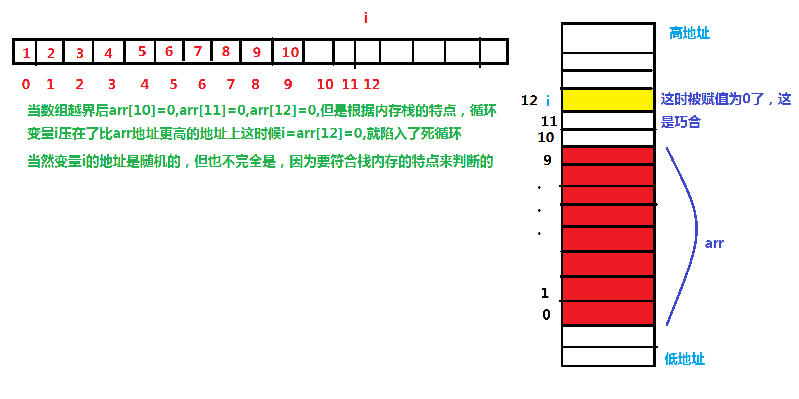

# 内存如何压栈

代码执行时函数栈的变化

```c
#include <stdio.h>
int main(void) {
	int i = 0;
	int arr[10] = {1,2,3,4,5,6,7,8,9,10};
	// 这行代码是错误的,但是在有些编译器上这个代码是死循环
    // 因为到i=12的时候,arr[i]的内存地址就变为了i的内存地址,然后赋值为0
    // i和arr是局部变量，局部变量是放在栈区上的
    for (i = 0; i <= 12;i++) {
		arr[i] = 0;
	}
	return 0;
}
```



注意：

1. 栈区的使用习惯是：先使用高地址，在使用低地址空间

2. 数组随着下标的增长地址是由低到高变化的

